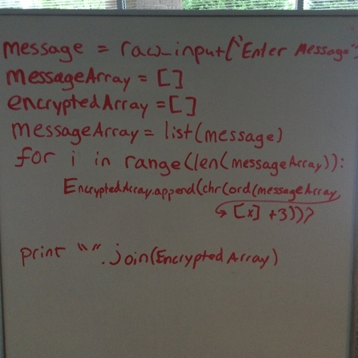
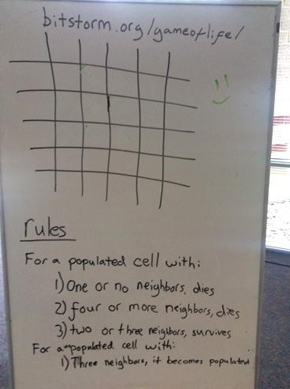

Title: Create Em Fall 2016       
Authors: Davis Mohar, Chris Kefalas, Josef Seiler      
Date: 2016-10-21    
category: Classes  
Tags: raspberry pi, create, coding, github, slack

### Day One  

`9/14/2016`  

#### Intro to Raspberry Pi  
Create Em started out with discussions on objectives, or desired projects. Since the Raspberry Pi is so versatile, allows for easy manipulation, and provides a mecca for machine learning, we will be completing a slew of projects with this device.  

The Raspberry Pi is essentially a mini computer (pocket-sized). It is a device for non-experienced and experienced programmers alike. By working through projects associated with the pi, its user can learn programming in a hands-on/interactive way. The pi's introduction started with an activity on all of its parts that come with it and what those parts do. For this class we are using the Raspberry Pi 3 model B. The pi is a single board computer with all the components on one board. The point was made that these components are very similar to traditional computers and cell phones, just on a smaller scale.  

***  

#### Morse Code History Lesson  and Puzzle Decoding  
Morse code is a type of code that is used to send telegraphic information using rhythm. Morse code uses dots and dashes to show the alphabet letters, numbers, punctuation and special characters of a given message. When messages are sent by Morse code, dots are short beeps or clicks or flashes, and dashes are longer ones.  

 [^1]  

Morse code is named after Samuel Morse, who helped invent it. Teletypewriters were invented in the early 20th century with their own codes and gradually replaced Morse code. Other types of technology that are easier to use for communication became even more common. Though it is not widely used, Morse code is still used to communicate on some amateur radios.  

We learned how to encode and decode morse code, first with a pencil and paper, then by writing programs in Python on the pi; being able to decode it through text or by sound! Here is a setup with the pi connected to a breadboard (easily manipulated tool for conveying circuits) and a speaker. By connecting two jumper wires and a button on the breadboard, students wrote programs in Python to relay messages in morse through the speaker!  

  

***  

Here is a fun morse code translator on the [SCPhillips](http://morsecode.scphillips.com/translator.html) site.  

***  
### Day Two  

`9/21/2016`  

#### Binary  
##### more on cryptography  
We reviewed what we learned of Morse code last week and how it relates to binary i.e Encoding, and decoding. Think of Binary, 0's and 1's, as the language computers 'speak'. When you break a computer down, it is basically a whole lot of 1010101011000's. Something needs to decode this into text so that humans can easily read and understand it. Sure, "only real programmers code in binary", but that would make learning programming a little off-putting!  

There are plenty of ways to learn the Binary Number system, a base two number system. In other words, this number system uses two digits: one and zero. The number system we are most familiar with, the Decimal Number system, a base ten number system. So, this system uses ten digits: 0, 1, 2, 3, 4, 5, 6, 7, 8 and 9. Students were introduced to binary by learning binary magic tricks, a binary 'piano', and binary flashcards.

Below is an example of the number 21 (in the decimal number system) and 10101 (in the binary number system) using binary flashcards and a binary piano:  

  

***  

### Day Three  

`9/28/2016`  

#### Cryptography  
A formal definition from wiki of Cryptography: the art of witting or solving code. [^2] To dive into what this means, we used a Caesarian cipher, where the letter place is moved by three. This is a great tool to help understand the important concept of abstraction in computer science. Encoding and decoding this caesarian cipher exercises skills in abstract thinking where you use a symbol to represent something. [^3][^4]  

Here is an example bit of code we wrote using the Pythonista app:

  

Here is a link to Instructor, Davis' [GitHub](https://github.com/davismohar/CesarCipher) with a little more on the python program file.

***  

### Day Four  

`10/05/2016`  

#### The Game of Life  

The game of life is a cellular automaton devised by the British mathematician John Horton Conway in 1970. The "game" is a zero-player game, meaning that its evolution is determined by its initial state, requiring no further input. One interacts with the Game of Life by creating an initial configuration and observing how it evolves, or, for advanced "players", by creating patterns with particular properties. [^5] -Just dipping our feet in artificial intelligence. We are always trying to get computers to become as intelligent as humans. Apple's Siri and Amazon's Alexa a couple examples of our attempts.  

The game of life is 'turing-complete', which means that technically, anything that could be computed, could be computed using the game of life.  

An example on the Tech Em whiteboard of the Game of Life:  

  

***  

### Day Five    

`10/12/2016`  

#### Artificial Intelligence and The Turing test  
Intelligence and computers are not exactly related. On the other hand, computation and computers do. Humans have been working for a long time at bridging the gap between intelligence and computers. You are probably familiar with that work by using Apple's "Siri", Microsoft's "Cortana", or Amazon's "Alexa". Though, if you have used these devices, you've probably noticed that each one can get a lot of things wrong, or cannot perform every action you want it to. So, you can see we still have some ways to go with bringing intelligence to the "minds" of computers. Artificial Intelligence (the field), "is the study of computer systems that attempt to model and apply the intelligence of the human mind." [^7]    

A British mathematician, Alan Turing is famous for inventing the mathematical model, the [Turing Machine](http://www.aturingmachine.com/) (no matter the complexity, a machine that can calculate anything that is computable) in 1936. Turing asked the important question: "Can machines think?". According to him, we eventually will be able to make a computer that thinks! [^7] To see if we've reached that point, we have the [Turing Test](https://en.wikipedia.org/wiki/Turing_test). This is a test to determine whether a computer is in fact, intelligent. It is a test to figure out whether a person can be fooled by a computer, into thinking the computer is another person (not a computer). [^6] After ending the discussion we completed a simple [Turing Test activity](http://csunplugged.org/wp-content/uploads/2014/12/unplugged-20-the_turing_test_0.pdf) to see if the computer can fool us into thinking it is a human.  

***  

#### The Future of Computing  
"What can Watson do for you?" Artificial intelligence talks continued with learning what [Watson](http://www.ibm.com/watson/what-is-watson.html) is, pretty much a cognitive assistant. In other words, a machine to help humans make decisions and take action. So, it helps to increase a person's potential. Powerful stuff! It is not only essential to learn where computer science has started to where we are now, but to learn where we are headed. Learning about this, will help prepare us for using [AWS Lambda](https://aws.amazon.com/lambda/) to run code on Amazon's "Alexa" without the use of your own server.  

***   

### Day Six  

`10/12/2016`  

#### Soldering & LED Pendant  
We are going to put together and code a Gemma microcontroller from Adafruit, an 8x8 LED matrix display. We'll use binary numbers, soldering techniques, and patience! Here are some tips from Wray about [soldering](http://blog.techemstudios.com/category/hardware.html) and more detailed information on the [LED pendant project](http://blog.techemstudios.com/led-pendant-follow-up.html).  

Next week, we'll put together a TV-B-Gone Kit by using soldering skills we learned from this class.  

***  

[^1]:https://offgridweb.com/survival/morse-code-why-you-should-learn-it/  
[^2]:https://en.wikipedia.org/wiki/Cryptography  
[^3]:http://rumkin.com/tools/cipher/caesar.php  
[^4]:Zelle, John M. Python Programming: An Introduction to Computer Science. 2nd ed. Wilsonville: Franklin, Beedle & Associates Incorporated, 2010. Print.
[^5]:https://en.wikipedia.org/wiki/Conway%27s_Game_of_Life   
[^6]:http://csunplugged.org/the-turing-test/  
[^7]:Dale, Nell, and John Lewis. "Artificial Intelligence/The Turing Test." Computer Science Illuminated. 4th ed. Sudbury, MA: Jones and Bartlett, 2011. 426-27. Print.  
