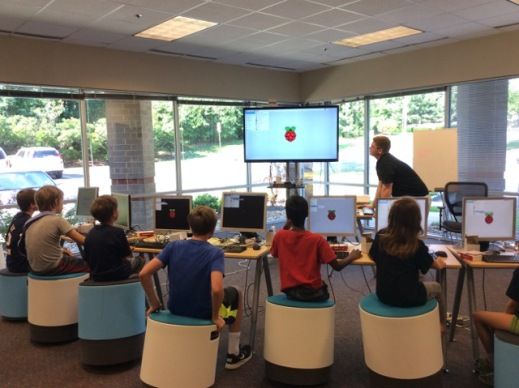
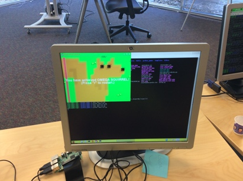

---
Title: Device Camp  
Author: Josef Seiler  
Date: 2016-7-14  
category: Classes  
Tags: raspberry pi, techcamp, minecraft, computer science, terminal  

## Summer 2016 Create your Own Device Camp  

  

The kids are now experts at using Raspbian wih the Raspberry Pis!  

Throughout the Device Camp, we heavily used the terminal and learned useful commands to navigate effortlessly through the pi and to write our programs in Python. On the first day of camp, the campers set up their raspberry pi devices. They wired breadboards and coded in Python 2 in order to turn on a LED light. 

  

Here are just a few cool activitiy examples campers used with the raspberry pi:

#### Morse Code Messages by Connecting LEDs to the Raspberry Pi & Breadboard  

During the second day of camp, the campers learned how to use morse code! First, we hooked up two more LED lights onto their wired breadboards. Then, with a morse code alphabet handy, they wrote a program in Python to have the LEDs perform a series of long blinks and short blinks (or dashes and dots in morse) to display their names and more. 
Using Morse code for telegraphs has come a long way!  

***  

####Using the Pi to Manipulate Minecraft 

The campers also learned how to write a program in Python to instruct their player in Minecraft to have objects built for them. This was done without placing a single block! First, they coded to have a tower of TNT built. Next, they wrote code to have glass blocks appear under their player's feet, wherever they walked, making a glass bridge. Of course, the program was quickly revised to have TNT blocks rather than glass blocks! The lines we wrote for each program in Python to manipulate Minecraft can be found here: <http://blog.techemstudios.com/notes-on-setting-up-pis-to-use-minecraft-api.html>  

***  

#### Engineering the LEDs and Sensor on the Breadboard

We had the Raspberry Pi sense temperature and humidity with a DHT humidity sensor. To make this possible, we added the sensor and several more connections and used the terminal to open Python and write/run the template code for temperature and humidity from an Adafruit DHT22 program. After launching python with nano, we imported the sed template code. Once the code was ran, this file called the method to return the values for celsius temperature, fahrenheit temperature, and relative humidity. Campers tweaked the code using conditional statements to make a particular LED light switch on when one of the returned values being sensed was above a specific number.  

  

Some notes on the sensor set-up: <http://blog.techemstudios.com/some-code-for-rpi-temp-sensing.html>

***  

#### Set-up to Receive Automatic Email From the Sensor  

Here, the campers wrote a python program that would send the measurements the Adafruit DHT22 sensor took to a generic techem student gmail account. After successful testing, they altered the messsage to be sent.  Beyond this, they could potentially send what the sensor measures to another email account. 

***  

#### Engineering the code of Raspberry Pi Games  

Campers were challenged to change the python code for the squirrel.py game, which acheived fascinating results!  

  

***  

It was neat to see how comfortable the kids were with using the Raspberry Pi as the Device Camp progressed. The **'learn by doing'** approach achieved inspiring results. Navigating to and from all the directories, the Python prompt, running Python programs using sudo... -the campers would recall the commands they have been learning and using, so they flew (with ease!) through the process of typing instructions to have the pi carry them out; either to the breadboard containing the sensor and LEDs, or to Minecraft.  

Not only did they master the terminal and Python prompt, the campers obtained proficiency in uniquely engineering the Python language to land the results they wanted on Minecraft, the LEDs, and the sensor.  

**To say the least, witnessing the skills these campers learned was an impressive sight!**    

  

***  

