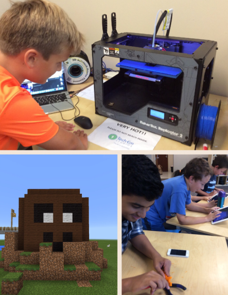
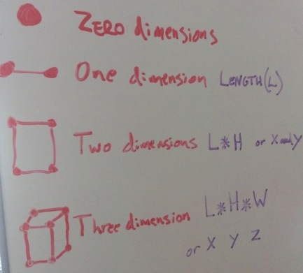
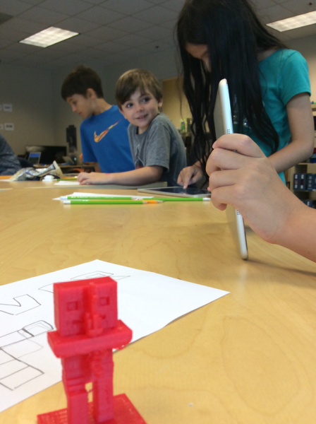
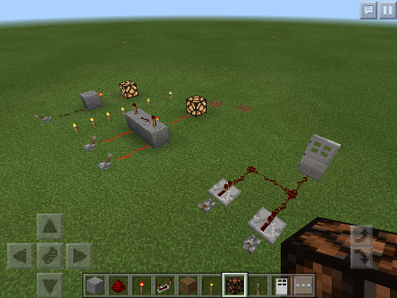
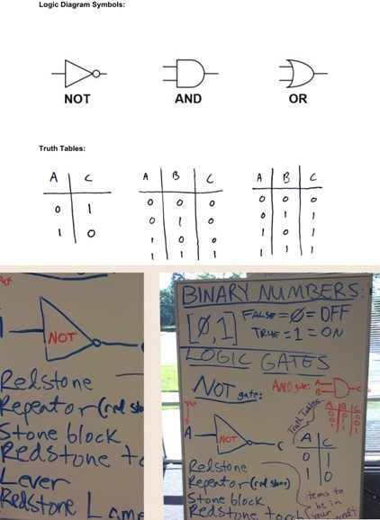

Title: Minecraft in 3D Camp  
Author: Josef Seiler  
Date: 2016-8-19  
category: Classes  
Tags: techcamp, minecraft, computer science, 3d printing    

## Summer 2016 Minecraft in 3D 

The camp entailed Minecraft team-build challenges, 3D design and printing, hunger games bouts on a unique server created by Tech Em, and building computer-like logic gates with redstone!  

***  

  

###Build Challenges  
The camp was kicked off with a couple build challenges to show off minecraft skills. The first challenge: students built their best haunted house in minecraft. These designs made hairs on the neck come to full attention! Then onto a challenge to build a national (or international) monument by working in teams of two or more. Designs included the White House, Abraham Lincoln memorial, the empire state building, the Arc De Triomphe and the National Monument.  

***  

###3D Printing  
To get the '*3D*' in Minecraft in 3D camp underway, the campers learned what 3D printing is all about. A dimension is basically a way to measure something, like height or width. A comprehensive way to understand dimensions by Tech Em instructor, Davis: For something to have zero dimensions, there is really no way to provide measurements for it; think of a drawing a simple dot. Now add another dot next to your original dot and connect these dots with a line. We now have a way to measure this, using length (**OR** height). Now draw a few more dots with connecting lines to make a square with two dimensions; length **and** height. Draw a few more dots with some angled lines to make a cube with three dimensions;length, height, width. 

  

The 3D printing process starts with a 3D model on a computer. In our case, the campers built their 3D model in Minecraft on a laptop and converted that file of the minecraft build to one the printer could understand, STL (for example: My-3D-print-file.stl). This file is then sent to a 3D printer to print out their model as an object they can take home!  

  

***  

###Using Redstone and Other Minecraft Items to Build Switching Devices 
The campers switched gears by learning how to build simple binary logic gates using the famous, redstone in minecraft. To start things off, there was a lecture given on the binary number system vs. the decimal number system.
  
The number system most of us are familiar with, the decimal number system, uses ten digits (0, 1, 2, 3, 4, 5, 6, 7, 8, 9). For the binary number sytem, there are only two digits (zero and one), so it is referred to as Base-2 (hence the 'bi' in binary). Computers store data using these zeros and ones. The more switches you add together, the more 0's and 1's you can render. We learned that 0 is equal to OFF or FALSE, and 1 is equal to ON or TRUE. A binary digit is also known as a "bit" (sound familiar?), this correlates with a *switch* in a circuit of a computer.    

Campers built a few binary logic gates (AND, OR, NOT gates) with redstone, redstone torch, redstone lamp, repeaters, and a lever in their inventory. The lever is used as our *switch*. The lever has two states, ON or OFF (1 or 0) and is used to provide a current or send a signal through the redstone dust. Think of the redstone dust as a place for the current to run, like a wire of sorts. From what was said before, the more switches you add the more 0's and 1's you can supply; consonantly, when we begin to connect these gates together, we can make circuits. In minecraft, increasing the amount of redstone logic gates increases the amount of functions you want it to do (like opening gates or even creating elevators). Mirroring computer logic to increase functionality and memory. Below is an image to show the diagrams and their associated truth tables the campers learned this past week. These truth tables show the switching logic for each gate the campers learned to build.  

  

The levers portrayed the input while the redstone lamp acted as the output -just like a light switch and the light source it controls. *Learning binary logic gates helps markedly in grasping how the hardware in all computers operate and how a computer carries out tasks*. Students were then challenged to incorporate what they learned from the lesson by participating in collaborative team builds!    

Other output types could be used: Doors and gates that swung open or shut close by using the binary switching logic learned earlier. These proved very useful in the team-built zoo challenge!  

***  

###Hunger Games!  
Of course, what would a minecraft in 3d summer camp be without hunger games?    
Tech Em instructor, Chris created a hunger games minecraft server from scratch! By connecting to this server with iPads, campers were able to battle it out on the same server the hunger games way. To say the least, while these games were underway, the studio at Tech Em was bursting at the seems with excitement and fun!  

***  

We hope our campers enjoy their 3D builds and have a great rest of the summer!  

  

