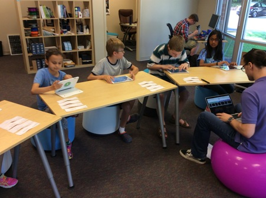
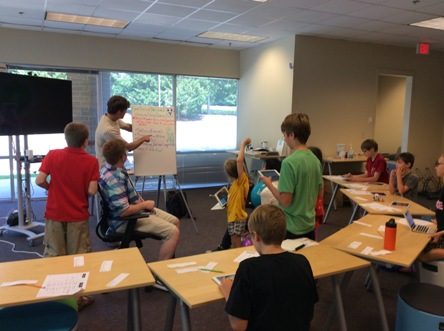
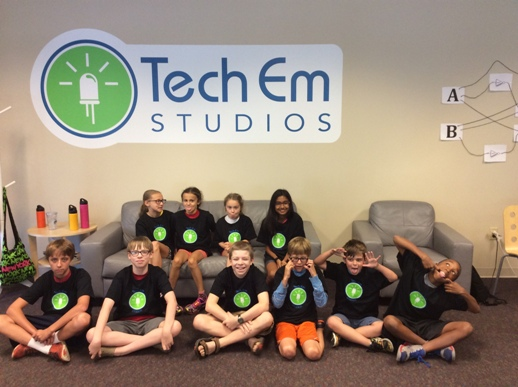

Title: Design Thinking and Gaming Camp  
Author: Josef Seiler  
Date: 2016-7-21  
Category: Classes  
Tags: floors, hyperpad, hopscotch, coding, game design, design thinking, techcamp,  

**Everyone did a great job designing their games!**  

The campers focused on the design thinking process to make their games. This is a user-centered approach to design a game. This process is not only used to come up with solutions for challenges relating to game design, but challenges of all types as well. A link for a more detailed look at the design process we utilized: <http://blog.techemstudios.com/design-thinking-outline.html>    

To begin the design process, the campers completed a mini "Design Thinking Question" sheet after playing published games on Floors, Hopscotch and Hyperpad. They wrote down at least three things they liked in the games, and at least three things they would leave out of the game that they would soon create.  

We explored the apps, Floors, Hopscotch, and Hyperpad. 

Floors is built around the "run-and-jump" platformer genre -think of mario.   

Hyperpad is a very detailed game design app; however, being very detailed, this means there can be a lot of work involved (but, well worth it!). After learning some basic techniques, campers were able to desin their games with a little more ease. This app and Hopscotch, allowed the campers to really dive into computer science concepts, in terms of how programs function.If your child decides to continue with exploring Hyperpad, the 'Manual' that is included in the app under 'Learn' is extremely useful.  

While working from these game design apps, the campers learned various concepts of computer science; such as, logical thinking, conditions(if this, then..) and creating variables. 

***  

###The Design Thinking Interview Activity     

The campers broke up into groups of two. Each partner shared their answers from the "design thinking q's" sheet. They were then challenged to design a game for their group partner by following guidelines derived from each of their answers to the design thinking questions. Based on what app their partner wanted their game created on, they would create the game either on 1 of 3 apps the campers have been introduced to so far during the camp: Floors, Hyperpad and Hopscotch.

To further the design thinking approach, the group members switched iPads to play the games they have been creating for one another. After testing out the games, they provided feedback. They recorded their feedback responses on the "Design Thinking Interview Exercise" sheet. They used this feedback to incorporate changes in the design of the game. Repeating this is key for continuing the design thinking process to design a great game (or any project).  

***  

###The Design Thinking Challenge  

During this challenge, the campers aimed at designing a game for a particular user. On the whiteboard, the user stated what they wanted in a game. The campers designed a game either on Hopscotch or Hyperpad, because these are the apps the user wanted to play their game on. They would switch iPads periodically to provide one another feedback for further tweaking. This resulted in intricate and well-designed games! The winner of the challenge recieved a 3D printed prize.  

Here are some tips to view the games your camper created:  

* If your child published a game on Floors or Hopscotch,  
    + The links for the game(s) are in the content of the follow up email.  

* If your child published a game on Hyperpad, you can find it by going to the Hyperpad website:  
    + create a login  
    + click Hub located on the navigation bar  
    + scroll down to Most Recent  
    + click the View All  
    + select the game  

The campers can play their created games on either Floors or Hyperpad with an iPad.  

"Branching" is enabled for games on Hyperpad. Once you are on the app they will be able to edit their game by clicking Branch (Located next to the Play button by the game). This downloads their game on the account that you can create and it allows them to continue to edit and further publish.  

Publishing on Hyperpad can be tricky. This is due to the images for the required screenshot and icon have certain size specifications. I used the iPhoto App to edit these images to become the correct sizes.  

Feel free to contact me for help if you have any questions with any of this process or editing the game on either app.  

Published games on either of the apps will have the option for users to play the game, like or dislike, and/or leave comments for feedback. This is a great aspect, because it further exemplifies the design thinking process we used to create these games. They can choose to use this feedback to continue with the design thinking process while editing their published game.  

Enjoy the rest of summer!  

