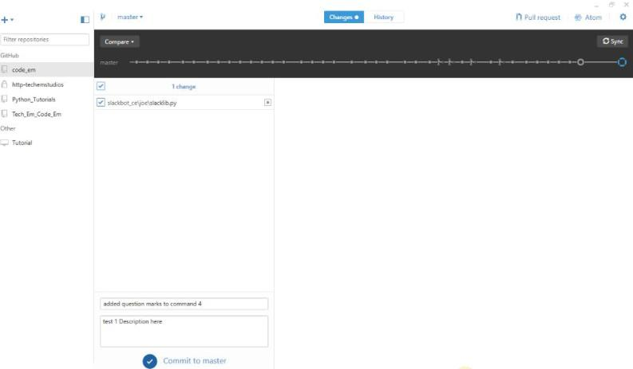

Title: GitHub Part Two          
Author: Josef Seiler  
Date: 2016-11-07    
category: Notes  
Tags: github, python, coding, slack  

***  

### Using GitHub Desktop  

So, you've just downloaded/cloned the "folder" code_em (or wems ase) onto your computer. Now you have a 'local' repository named code_em. In other words, you have a folder on your computer saved as code_em (wems ase), in the location where you chose to have it saved.   

### Making Code Changes  

If you navigate to the code_em/wems ase folder on your computer, you will find a subfolder called "slackbot_ce" (or "slackbot_wems") This contains directory for the class. You can make changes to the files under *your* directory. In other words, you are able to work on the "slacklib.py" Python file that is located in *your* folder.  

To make code changes, you can use a text editor or edit with Python's IDLE by right-clicking the file and select "Edit with IDLE" and be sure to save your changes.  

If you do not already have Python 2.7, go ahead and download it [here](https://www.python.org/downloads/)  
Remember to edit your slacklib.py with Python 2.7 (not any other version).    

### Committing Your Code Changes    
Your saved changes do not show up on the GitHub website just yet. To see your changes on the website, open GitHub Desktop and make sure you are on the "Changes tab" -it will be highlighted in blue. Here, you will see a list of all the changes you have made:    

  

Once you give a short Summary and Description of the changes you had just made, you can click the 'Commit to master' at the bottom of the screen! Essentially, this sends your updated changes to the code_em/wems ase repository on GitHub. Now you will be able to see your updates (a detailed view of what you have changed) on the GitHub repository as well as on your 'local' repository.  

### "Sync early, sync often" -Wray  

**Before you commit**, be sure to always "sync".    

This gets the latest and greatest commits to the repository. Think of it as updating your 'local' repository.    

### See Slack BOT run  
Once you have committed your changes i.e. your new Slack Bot commands, sign into Slack and test them out! Though, it will take several minutes for the process to finish, before your Slack Bot responds to your commands correctly. There will be another blog post explaining the process in more detail.     

[Return to the Slack intro blog here](http://blog.techemstudios.com/slack.html)  
