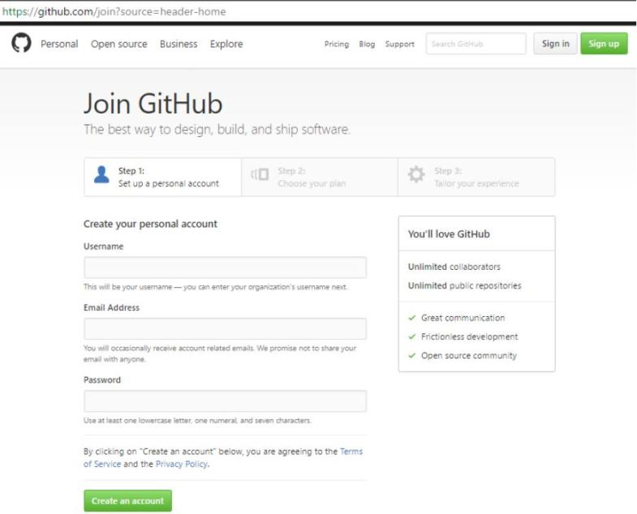
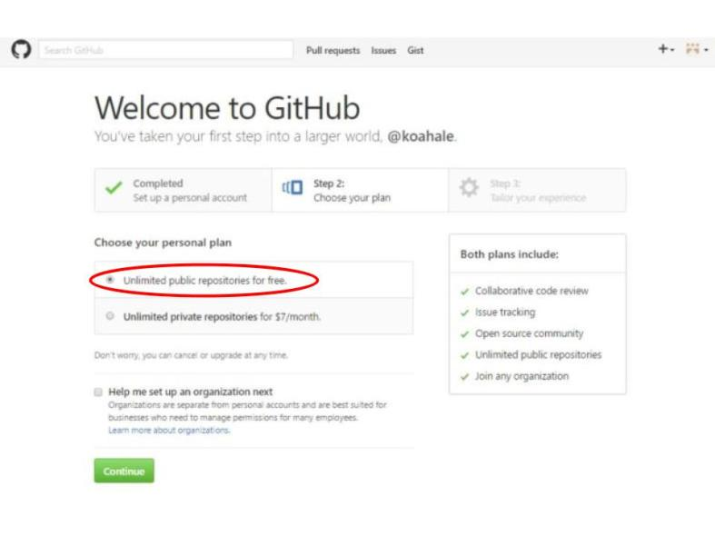
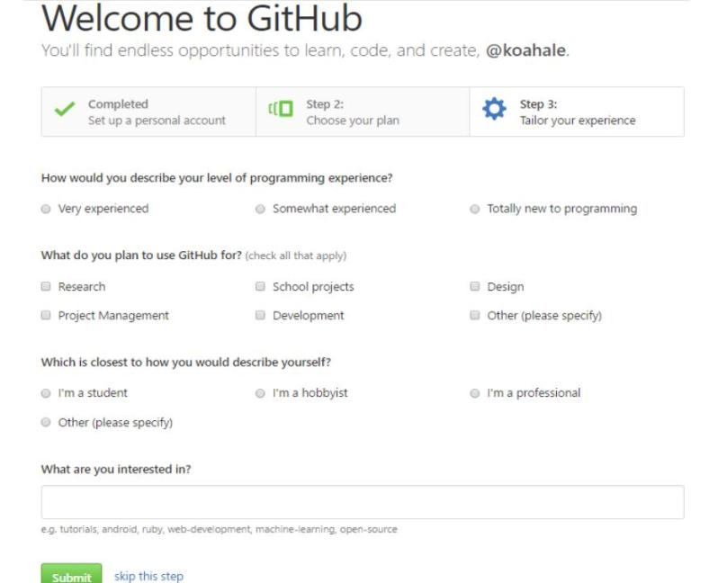
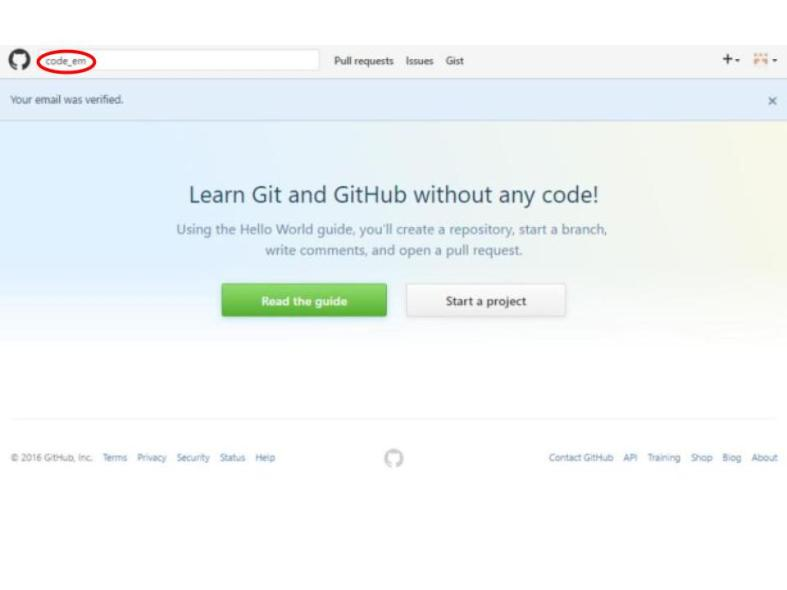
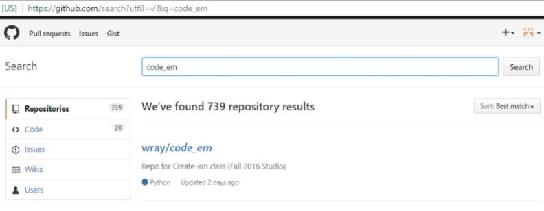
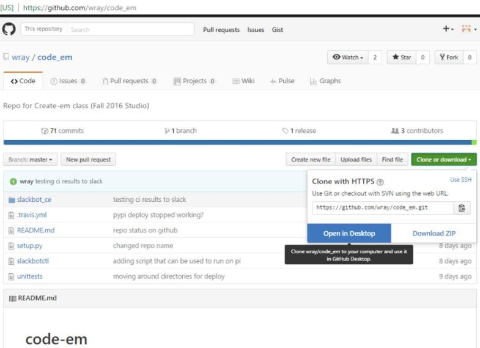
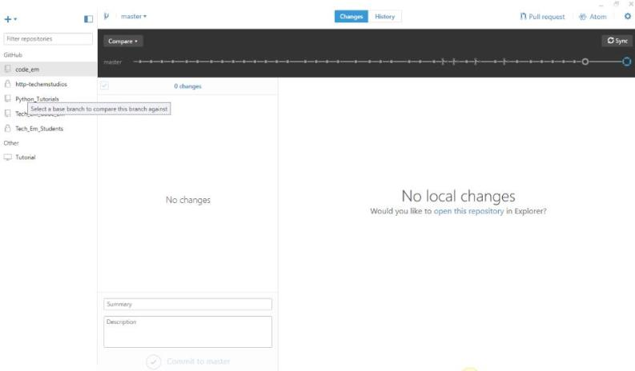
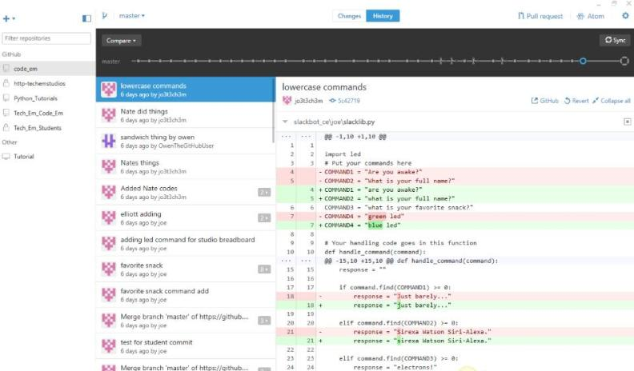

Title: GitHub Part One    
Author: Josef Seiler  
Date: 2016-11-07    
category: Notes  
Tags: github, python, coding, slack   

***  

### Sign Up for GitHub!  
"GitHub is a code hosting platform for version control and collaboration. It lets you and others work together on projects from anywhere." [^1]  

### Step 1  
Start up your web browser and go to https://github.com/    
   

***  
### Step 2  
Create an account (You must have an email to sign up for GitHub).  
  

***  
### Step 3  
You can just select the "free" plan.
  

***  
### Step 4
You can answer a few questions about yourself or just click 'skip this step'  

  

***  
**Be sure to verify your email that you used to sign up for Slack. In the slack channel for your class, notify either Wray (@wray), Chris (@chk) or me (@joe). Then Look in your inbox for a recent email from GitHub, and follow the steps in the email to accept the GitHub invitation.**     

***  
### Step 5  

If you are in the WEMS ASE class: In your GitHub search box, type "wems ase" or click this link: [CODE EM](https://github.com/wray/code_em)   

If you are in the Code Em or Homeschool class at Tech Em Studios: In your GitHub search box, type "code_em" or click this link: [WEMS ASE](https://github.com/wray/wems)    

This will take you to the Tech Em repository for your class's Slackbot. For WEMS ASE students, substitute "code_em" in the following screenshots for "wems ase".  

   

  

***   
### Step 6  
Think of the repository as a shared folder. Once you are in your class's repository, select 'clone or download'.  

Then select 'Open in Desktop'  

You will then be directed to desktop.github.com to download the GitHub Desktop.

This saves the code_em (or wems ase) repository on your computer, labeled, code_em (or wems ase).   

   

***  

### Step 7  
Once you download GitHub Desktop, and cloned your class's repository, this is what you should see:  
   

Above, are the changes you have made "locally". Meaning it shows you what code_em (or wems ase) files you have edited and saved on your computer. Right now, it should say no local changes.  

The "History" tab shows you all the changes you and others have made to files in the code_em (or wems ase) repository:    
  
It will show several changes already made to the repository. In the coming weeks, the number of those changes will grow!  

[Move on to the next GitHub steps here](http://blog.techemstudios.com/github-part-two.html)  

[^1]: https://github.com/
