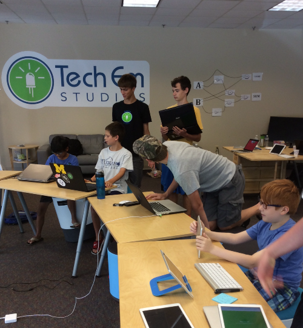
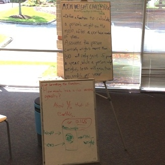
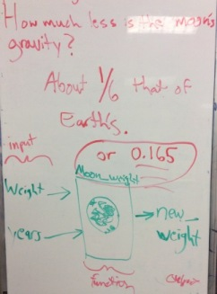

Title: Hardcore Programming Camp Summer 2016     
Authors: Josef Seiler  
Date: 2016-8-29    
category: Classes  
Tags: techcamp, computer science, python, hackathon   

###Summer 2016 Hardcore Programming Camp  

The camp started with discussions on coding experience.. and hacking of course! This included their own written programs, refining programs, programming languages they are learning or use most and game design.

Campers started on the iPads using Pythonista, an app that provides an evironemnt for developing Python code. For campers that brought in their own laptop, they started on Python 2.7. We wrote our code on Python's editor, IDLE. We used this to create and modify programs.  We learned general terms/syntax to describe parts of our program (identifier, keyword, literal, expression, statement, conditional, function, etc.).    

***  
####Get Familiar with Using Comments!    
Students were reminded to use comments in their code as much as possible! It is important to make your program easy to understand when someone else is reading it. Using a simple 'pound sign' or 'hashtag' (#) helps to explain what you were thinking when writing your code. Additionally, using comments helps the original writer understand what exactly they were up to, or trying to achieve at the time they were writing their program. Programming is all about managing data in a computer and solving problems. Leaving comments behind for yourself or for others helps the fluidity of the whole programming process. It is easy to leave your program, come back to it, and lose the idea behind what you were attempting to accomplish! See how leaving comments can be useful?!  
Example: `print("Game Over")  #here, I'm trying to use the print function to have the program say, Game Over.`  

To break the code ice, The programmers were challenged to write a program using pythonista to have the program ask the user for input on what numbers they wanted to add, subtract, multiply or divide.  
  

***  

During the challenge, campers received a lecture on fundamental syntax for Python. Here are some examples:  

| Mathematical | Comparison | Assignments | Logical |
|------:|:-----|---------|:------:|
| Basic mathematic operations (plus, minus, multiply, and divide) | These are used when comparing two values for extent | These are used to assign values to variables | For comparing two values for logic |  

Mathematical: `+, -, *, /`  
Comparison: `>, <, ==, !=, >=, <=`  
Assignments: `=, +=, *=, /=, %`  
Logical: `AND, OR, NOT`  

***  
###Calculator and Random Sentence Code Challenge  
####HTTP Requests and Assigning Values  
This review and learning of syntax helped to uniquely tweak their code for the calculator and the next challenges, like the Random Sentence Code. During this challenge, campers were exposed to or reminded of the useful tool, lists. Lists are a great transition to understanding the concept of values and assigning certain values to variables. You can house a whole list to be assigned as one value and/or make your items in your list each have a unique value. After running the Random Sentence code, the campers noticed that we would get a lot of repeats of the nouns and verbs from our lists. We would then try to tweak the code to omit certain nouns, or try not to include any repeats. This approach would only get us so far! We learned that we can import a whole other library that contains a huge list of animals! This is also known as making an HTTP request from a site. The random sentence code we ran through is outlined below. This is from a blogpost by Wray, from the programming class [blog](http://blog.techemstudios.com/programming-spring-2016.html) this past Spring [^4]:

  

***  

###Moon Weight Code Challenge  
####Defining Functions  

  
If you have a few lines of code that can be reused to perform a certain task, then create a function! Think of the print function: `print("Hello World")` -this returns `Hello World`. It is a function to print any argument or string in the parentheses. Campers were challenged to define a function to calculate a person's weight on the moon after a certain amount of years. Assuming that a person who currently weighs more than 150lbs will gain 0.5lbs per year, while a person who weighs less will gain two pounds a year. The first few lines would like this:  
`1 def moonweight(weight, years):`  
`2   if weight > 149:`  
`3     print("you would gain 0.5 pounds every year on the moon")`    
`4   if weight < 149:`    
`5     print("you would gain 2 pounds every year on the moon")`  

***  

###Choose Your Own Adventure  
####Essentially Making a Decision Tree
A "Decision Tree" is one of many ways to display an algorithm, a step-by-step process for reaching a result or solution to a problem. The first decision "branches" into two possibilities, each of which is another decision. By looking at the whole, it forms a tree, a decision tree! The procedural flow of traveling down the tree from the very first decision is nicely implemented with the Choose Your Adventure challenge camper completed using Python/Pythonista. You can compare this to a series of game books, Choose Your Own Adventure by [Edward Packard](https://en.wikipedia.org/wiki/Choose_Your_Own_Adventure) and the text adventure, [Zork](https://en.wikipedia.org/wiki/Zork) or tons of other written books where the reader commandeers the actions of the protagnoist; leading to distinct endings.  

To get the challenge underway, the camp discussed how a decision tree works and explored examples. Students started their program by sketching on paper their ideas for their game's procedure flow to ultimately implement in their program. This challenge applies advanced branching logic and allows students to design their algorithm by literally drawing their program flow. The nodes in the tree are decision points -rooted in the very first decision. A first decision point could be, you land on Mars and you spot something in the distance. From here, you may have a few choices (or nodes) to choose from: Leave Mars, Go to Object, or Scan the Object. You can choose Go to Object, and you arrive at another decision point or node in the tree and the flow continues. Take a look at this example displayed on paper and translated into an interactive Python program. Try contrasting the decision tree on paper to the written program on python.  

  

[^4]  

This exercise replicates modeling decisions and their outcomes. These outcomes can also include chance event outcomes. Campers mapped out all the paths based on the decision made at each node.  

Decision trees are used in the real world all the time. Call Center Reps use these as print-outs or portrayed in apps. For example, tech hotlines, their script will start with "is the computer plugged in" and if the person answers yes, they take one route or if "no" they take another route. They follow the decision tree to help them assist the customer in troubleshooting problems.  

Another system that models a decision tree, identifying bugs. Really?? Yes. A dichotomous key, a tool used to identify something in the natural world is a great example to model decisions. Take a look at how a dichotomous key can be used by an Entomologist (someone who studies bugs; let's call him Steve) to identify something they collected from a stream.   

To use this key, Steve starts at the first decision point: is it something that has a shell or does not have a shell? This question knocks either With Shell or No Shell out of contention to be the thing's identity. If the condition is false, it is not a snail or clam, so Steve would then arrive at the next node: Does it Have a Backbone or No Backbone. If that condition is true, then he would arrive at another subnode, and his search continues for the bug's identity by following the outcome of each node until he arrives at its most likely identity and, ta-da, Steve knows the identity of the bug. If Steve was so inclined, he could look to another key to determine what Phylum, Class, Order, Family, Genus and finally species that bug belongs to. But, we'll save that story for later! Snapshot of a dichotomous key:  
  
[^2]  

***  
###Object-Oriented Design     
####More on Trees...    
Python is an object-based language. Using objects helps to organize code in a program by putting things into compartments to make complex ideas easier to understand. In Python, objects are defined by classes. So let's now think of Class as being the definition. Classes are a way to 'model' things (or data). We classify things, but the objects are the instantiation of that class. They are actual things that belong to that class. So, in a class hierarchy, everything in the hierarchy (tree) is a class. As you go down (*green arrows in the diagram below*) you are defining sub-classes. And to check yourself, you can trace back "up" (*blue arrows in the diagram below*) the hierarchy using the phrase "is a". So, a dog "is a" mammal, and an animal, etc. But, a dog is still a collection of attributes and behaviours that "define" a dog. We'll see these attributes later. And once you see a dog chewing on a chew toy... the actual "embodiment" of the definition, that is the object.    
  
[^1]  

####Object-Oriented - Lists         
In code, we define a class once. When we want to leverage the code in that class we create an "instance" of that class -the object. We learned that Python does a lot of this on the fly - with the built-in concept of a list, for example. Python has already defined (coded) what a list is, so when we wrote a line of code: l = [ ] . You are actually creating a new instance of a List class... a list object. And with that object you get all the nice pre-coded methods that can be applied to the list. The data within the list is often abstracted within these methods. In the example below, I made a grocery list named, grocery_list as well as some methods I can call on my list.   

###### Note: *the plus signs (+) will indicate the tabs (or spaces!!!) to show indentation for replicating writing lines of code in Python.*  

###### helpful hint: convert tab key presses into spaces  

For example:  

++`>>> grocery_list = [eggs, milk, dandruff shampoo, 1 holy grail, 2 african swallows, 1 coconut]`   
++`>>> print(grocery_list)`  
++`[eggs, milk, dandruff shampoo, 1 holy grail, 2 african swallows, 1 coconut]`   
++`>>> print(grocery_list[3])`  
++`1 holy grail` 
++`>>> print(grocery_list[4:5])`  

***  

####Object-Oriented - Using Classes and Objects     
Let's go back to our dog and chew toy model. Remember, in a class hierarchy, everything in the hierarchy (tree) is a class.  

It might help to look back at the diagram of the class hierarchy <a href="#Object-Oriented Design">here</a>  

So, let's put that model into Python starting from the top. Many objects can be created from a class by The definition (code) given by the class. Just like with function, we only have to define the class once to be used over and over again every time you need an object of that class. To define the class we use the keyword, class followed by the name:  

++`>>> class Things:`  
+ + + + + `def everything_in_the_world`  
+ + + + + + + `print('I am a function of the class Things)`  

Above, we just defined the class 'things' as everything in the world. 

We can add more classes that stem from this top class. Below, we'll add Nonliving and Living:  

++`>>> class Nonliving(Things):`  
++`>>> class Living(Things):`  

We'll do the same for chew toys, which is a sub-class of nonliving:  
++`>>> class Chew_Toys(Nonliving):  
  
And we can go on down the other side of the tree the same way.  

Let's now throw some things into those classes (or add objects to those classes! How about we have a dog named Fighto. Python does not know on its own that Fighto is a dog. So, to have Python recognize that Fighto is one we'll call Fighto an object (or instance) of the class Dogs.  

++`>>> fighto = dogs()`  
  
We just used code to tell Python to create an object in the Dogs class and assign it (=) to a variable known as fighto. Recall that we used the class name followed by parentheses just like a function. To make our objects do things, we must define functions that can be harnessed with the objects in that class -just like we did earlier when we defined our class Things. To make our object fighto of the class dogs do stuff, we'll add characteristics and define functions for the class:  

++`>>> class Dogs(Mammals):`  
+ + + + + `def humans_best_friend(self):`  
+ + + + + + + `print('I am human's best friend')`  
+ + + + + `def humans_best_friend(self):`  
+ + + + + + + `print('I am human's best friend')`  
+ + + + + `def play_fetch(self):`  
+ + + + + + + `print('Get the stick!)`  

Now that we've created the fighto object and defined functions and characterstics for that object, we can call the functions and have fighto actually do stuff! To call the functions on an object, use the dot operator (.) and the function name.[^1] We can even add another object to the class Dogs and that new object will assume the properties of that class w specified earlier:    

++`>>> fighto =  Dogs()`    
++`>>> spike = Dogs()`  

++`>>> fighto.humans_beast_friend()`  
`I am human's best friend`  
++`>>> spike.play_fetch()`  
`Get the stick!`  

To recap a little on object-oriented... Take how we classify 'things'. `Things`, being the `Class`. So, `class Things` is what comprises everything under that; like the classes, living and nonliving (sub-classes of Things). The class Animals is a sub-class of class Living. The class Mammals is a sub-class of class Animals. The class Dogs is a sub-class of class Mammals, and we added a couple objects (fighto and spike) that we added characteristics and defined functions for. Again, to check yourself, you can trace back "up" the hierarchy using the phrase "is a". So, a dog "is a" mammal, and an animal, etc. But, a dog is still a collection of attributes and behaviours that "define" a dog. And once you see a dog playing fetch... the actual "embodiment" of the definition, that is the object. When you created lists and dictionaries (maps) like we did earlier in the camp, object-oriented programming is the same, it is another way to logically manage data and a way to program things to make sense. Remember, Python is an object oriented programming language.[^1][^3]  

***  

###Hackathon    
####Converting More Problems to Programmed Solutions    
Of course, there must be a hackathon to complete the camp! Campers were tasked with a series of challenges using matplotlib. Campers used this as a tool to graph different lists. Specifically to generate a [Fibonacci Sequence!](https://www.mathsisfun.com/numbers/fibonacci-sequence.html)  

  

***  

###Practice Makes Perfect!

Just like other subjects in school, practice makes perfect! So, be sure to continue coding everyday; whether it be using game designing programs or simply running through online tutorials. You can do this outside and you don't even have to do with a computer! Try to think of how things can be classified around you. For instance, try to use object-oriented programming to logically classify plants, animals, and bugs you may encounter. These things do stuff, they have functions! A great resource is the [Tech Em blog](http://blog.techemstudios.com/programming-spring-2016.html) posted during the Homeschool Programming Class from this spring. You can start from the beginning and follow along with the posted assignments. Here you will find similar challenges from the camp like the random sentence code and moon weight challenge. You can also take a look at the books I have cited below. When designing a game, you are essentially writing a program. A useful app to use is Hyperpad, which is now free! This app is great for understanding fundamentals of coding and you can immediately see how well your game will play as you design. This mirrors what we did in Pythonista and Python when we would write our code using IDLE, Pythons editor; we are able to run the code we had just written to see what our code could perform and to see the bugs we need to fix.  

###Be sure to check out our [Fall Schedule at TechEmStudios.com!](http://techemstudios.com/fall-classes.html)  

Have a great rest of the Summer!!!  

[^1]: Briggs, Jason R. "How to Use Classes and Objects." Python for Kids: A Playful Introduction to Programming. 6th ed. N.p.: William Pollock, 2013. 94-108. Print.  

[^2]: http://midmichigannatureandscience.blogspot.com/2013/04/aquatic-ecology-and-mother-earth-week.html  

[^3]: Zelle, John M. Python Programming: An Introduction to Computer Science. 2nd ed. Wilsonville: Franklin, Beedle & Associates Incorporated, 2010. Print.   

[^4]: http://blog.techemstudios.com/programming-spring-2016.html  

  

