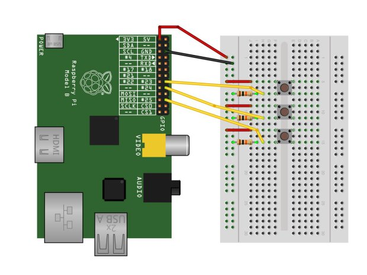

Title: Install Hardware Monitor and Make a Soundboard for Raspberry Pi
Author: Alex Noll
Date: 2017-08-10
category: Notes
Tags: computer science, raspberry pi, hardware, IoT, software

***

### Installing Cayenne

To start, Cayenne is an IoT type hardware monitor in which you can check up on your Pi's status (Temperature, CPU load, GPU load, GPIO pins used, and much more!) from your mobile phone, or any web browser! Installation is as simple as creating an account and then running a few commands in your Pi's terminal.


#### Step-By-Step Instructions for Setting Up Cayenne

For starters, you'll need to create an account at [www.mydevices.com/cayenne](www.mydevices.com/cayenne), after this you'll want to log in, and the click on add new, followed by Device/Widget.


On the next page, you'll need to select Raspberry Pi, under Single Board Computers. The following page will include links to the mobile apps, should you want to setup from the mobile app, or it'll provide you with the commands to run in your Pi's Terminal. For this tutorial, we used the commands in the terminal: ```wget https://cayenne.mydevices.com/dl/rpi_8hg1hglupv.sh``` , followed by ```sudo bash rpi_8hg1hglupv.sh -v``` . Allow your Pi to fully install everything and it should be ready for on-the-move monitoring!


---
### How to Setup a Soundboard

For this tutorial, you'll need a Raspberry Pi, Breadboard, bunches of cables and buttons, and an output speaker (through HDMI or the 3.5mm output). Once you have everything, you're good to go. You'll have a lot of code to input, but you can also find the code here: [http://cdn.makezine.com/make/33/soundboard.py](http://cdn.makezine.com/make/33/soundboard.py)

as for the many lines of code...

```bash
 import pygame.mixer
from time import sleep
import RPi.GPIO as GPIO
from sys import exit

GPIO.setmode(GPIO.BCM)
GPIO.setup(23, GPIO.IN)
GPIO.setup(24, GPIO.IN)
GPIO.setup(25, GPIO.IN)

pygame.mixer.init(48000, -16, 1, 1024)

sndA = pygame.mixer.Sound(".wav")
sndB = pygame.mixer.Sound(".wav")
sndC = pygame.mixer.Sound(".wav")

soundChannelA = pygame.mixer.Channel(1)
soundChannelB = pygame.mixer.Channel(2)
soundChannelC = pygame.mixer.Channel(3)

print "Sampler Ready."

while True:
   try:
      if (GPIO.input(23) == True):
         soundChannelA.play(sndA)
      if (GPIO.input(24) == True):
         soundChannelB.play(sndB)
      if (GPIO.input(25) == True):
         soundChannelC.play(sndC)
      sleep(.01)
   except KeyboardInterrupt:
      exit()
      ```

After putting the code into a text editor, you'll need to get some .wav files to have play each time you hit a button, one place for some funny .wav files is: [http://cdn.makezine.com/make/33/pd_sound_effects.zip](http://cdn.makezine.com/make/33/pd_sound_effects.zip). After downloading, or creating you own .wav files, just put their file names on lines 13, 14, & 15. After completing these steps, you have some wiring to do.



In the diagram shown, no breakout boards were used, but you can see the positive coming off of the 3v3 pin to the positive rail of the breadboard. After the positive, you'll need a ground, in the diagram, it's the 3rd pin on the right. Now you'll want to place down all of your buttons. After placing down all of your buttons, you'll need a positive from the positive rail connect to each button at the top pin of the button. After connecting the positives for each button, you'll need the GPIO cables for each button, as well as a 10K resistor, both of which are connected to the bottom pin of the button. The resistors have to connect to the negative rail, while the GPIO cables connect to pins 23, 24, and 25. After wiring everything up, you can return to the Terminal.


You need to make sure to have all of your .WAV files and your .py file all in the same folder, preferably on your desktop. For this tutorial, we named our folder "soundboard", in the Terminal, you'll need to change your directory to the Desktop, and then to your folder, using: ```cd Desktop``` and ```cd soundboard```, after this, run ``` sudo python soundboard.py```. After running, wait until your Terminal says Sampler Ready and then you're good to go!


---
