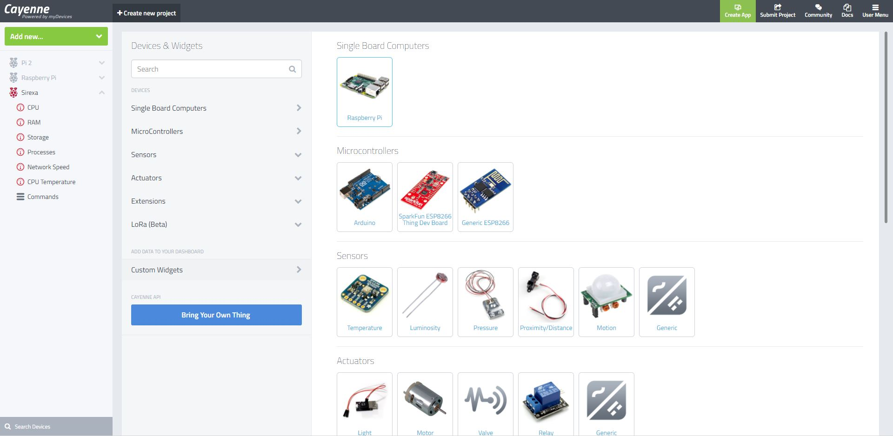

Title: How to Install a Hardware Monitor on the Raspberry Pi
Author: Alex Noll
Date: 2017-08-10
category: Notes
Tags: computer science, raspberry pi, IoT, software

***

### Installing Cayenne

To start, Cayenne is an IoT type hardware monitor in which you can check up on your Pi's status (Temperature, CPU load, GPU load, GPIO pins used, and much more!) from your mobile phone, or any web browser! Installation is as simple as creating an account and then running a few commands in your Pi's terminal.


#### Step-By-Step Instructions for Setting Up Cayenne

For starters, you'll need to create an account at [www.mydevices.com/cayenne](www.mydevices.com/cayenne), after this you'll want to log in, and the click on add new, followed by Device/Widget.



On the next page, you'll need to select Raspberry Pi, under Single Board Computers. The following page will include links to the mobile apps, should you want to setup from the mobile app, or it'll provide you with the commands to run in your Pi's Terminal. For this tutorial, we used the commands in the terminal: ```wget https://cayenne.mydevices.com/dl/rpi_8hg1hglupv.sh``` , followed by ```sudo bash rpi_8hg1hglupv.sh -v``` . Allow your Pi to fully install everything and it should be ready for on-the-move monitoring!


---
