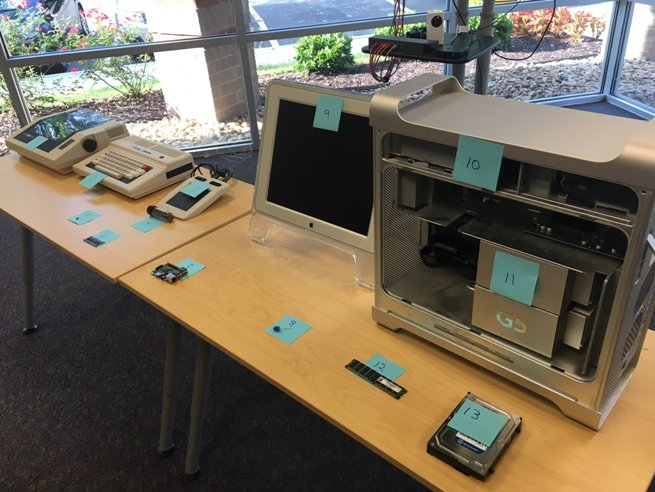
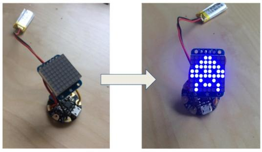
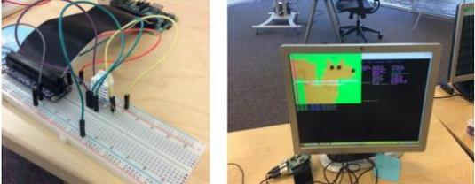
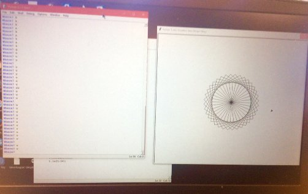
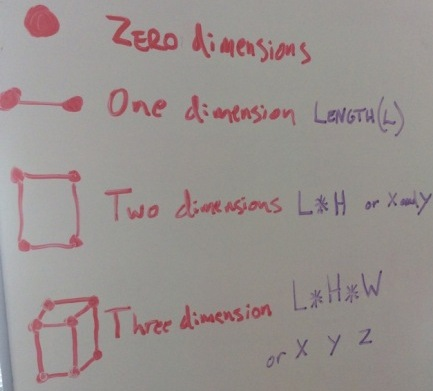
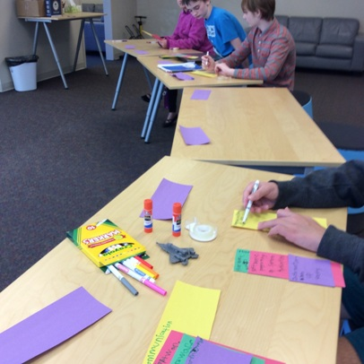
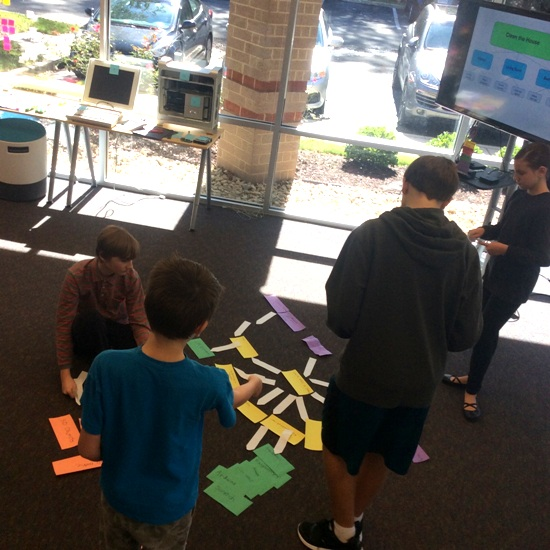
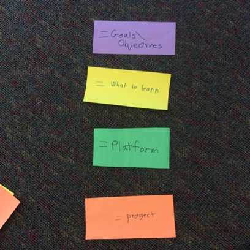
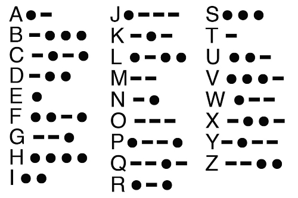
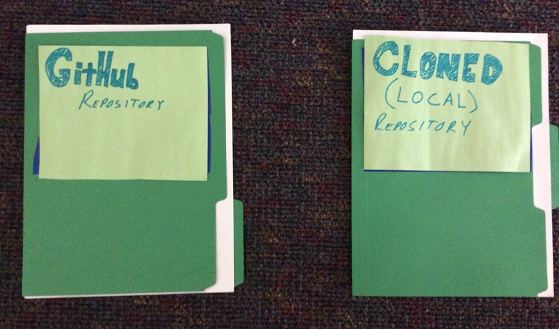

Title: Homeschool Computer Science and Programming Fall 2016       
Author: Josef Seiler  
Date: 2016-12-06    
category: Classes  
Tags: computer science, python, code, github, slack   

### Day One  

`9/13/2016`    
The Homeschool Computer Science and Programming started with icebreaker introductions. Tell the class three truths and a false statement about yourself, including the instructors! Everyone was asked to share their experience with programming and computer science.  

#### Objectives  
The class is filled with new faces as well as familiar ones. Every student has varying experience and interests. To gauge the different levels, we started a discussion on what everyone's interests, or goals for the class were. Interests ranged from 3D printing and Minecraft commands, to animation and advanced programming. Since this class will take a project-based approach, students will learn to merge all of these goals into one project, or projects -from all of the class-shared objectives and set Homeschool curriculum objectives. Students will learn how to create an "objective tree" by using several methods. Think of each objective, or goal as a separate piece that relates to the rest, to fit together making a large puzzle. By using an objective tree, as a class we can break each goal down into smaller definable charactersitics. We will start to interconnect each objective (goal) from these characteristics.

***  

#### Interactive Quiz!  

  

Name that hardware! When the homeschool students walked into Tech Em, they noticed two tables at the front of the studio with a slew of mismatched computer hardware. How could they not notice! Each piece of hardware was labeled with a different number. Students were tasked to write down what they thought each hardware is named and what year they think it was invented our built. When they were finished, we went over what each piece was and when it was invented. Many of the devices' real identities and age came to a complete surprise to everyone. For example, what students thought was just a keyboard, was actually a whole computer, the TRS-80 (or "trash-80", despite the nickname, it is completely respectable)!    

This exercise was an excellent intro to the advancement of computer hardware. The hardware devices from the quiz were from several different decades. A vacuum tube representing the 1940's, and a Raspberry Pi (first generation from 2012).  

***  

#### Brief History of Computing  

To gain a further appreciation for the advancements in computing, learned that a computer does not have to be powered with electricity or by a battery. Even their parent's car is considered a computer. Examples of early computers started with Tally Sticks, at a time when history was not recorded. These were tools (mechanical devices) to aid in counting. Other examples included were the Abacus (~2700 BC to present), Pascal's Calculator (1642-1800's), and the Arithometer, by Charles-Xavier Thomas in 1820[^1]. Then came the introduction of the "Father of Computers", Charles Babbage, who designed the first automatic computing engines and Ada Lovelace, the FIRST computer programmer! She developed programs to be carried out by Babbage's machines. This was a great segue from calculation to computation[^2].  

So, what is hardware? What is software? What is a computer program?  

Engineers are always searching for building faster devices, and developing tools that increase the efficiency of these devices. Students learned that the advancements in computing hardware were categorized into generations. The use of the vacuum tube (about 17,000 of them!) with commercial computers, like the ENIAC.  

The transistor, replaced the vacuum tube as the main component of hardware. The advent of the transistor helped to ring in the second generation with commercial computers that were electric, like the IBM 1401. These computers *only* consisted of about 10,000 transistors, a big improvement from having 17,000 unreliable vacuum tubes. Because transistors were smaller, more durable and more reliable, they were more efficient than its predecessor, the vacuum tube. Think of the transistor as a switch, it can have two distinguishable states, **on** or **off**, it can store two different numbers, **one** or **zero**. These little transistors are the building blocks of computers, combine more than one of these together (with a few more hardware components) and you get a circuit allowing flow, and control of that flow of electricity, which were placed by hand on printed circuit boards (and they still are, but we are a quite better at it!). Controlling electricity flow helps the computer perform actions we specify it to perform.  

The more transistors, the more zeroes, and ones. Computers store data using zeroes and ones. We then started miniaturizing integrated circuits to end up with microchips, reigning in the third generation and one of the first microcomputers. Each year, we were able to have increasingly more circuits placed on a single integrated circuit (Moore's Law) [^3]. These days, we are able to store about 730 million transistors on a 1X1 inch micro chip. [^4]      
By looking into the history of computer progression, we were able to see it in-person at the front of the Tech Em room with the interactive quiz we completed earlier in class.  

***  

#### Example Projects at Tech Em  
To inspire students for project ideas they might complete during this homeschool session, they were presented with many examples of projects performed at Tech Em. These included, Raspberry Pi projects (Morse code w/ LEDs, temp/humidity sensing), publishing designed games with the Hyperpad app, microcontroller and coding with Arduino, 3D designing and printing (even with Minecraft!), building apps, advanced programming -data structures, and making creating a graphical user interface (GUI) with Python.  

  

***  

  
[^6]  

#### Tracking our Projects  
We briefly went over this in class. We are going to be using [GitHub](https://github.com/) as a way to compile and organize everyone's coding projects they have been working on. This site can 'host' their repositories, so it will all be in one place. Once we start typing up code, we will teach them how to upload their projects onto a private repository. Having all of their projects in one place will help with putting together a portfolio from the class if you and your child choose to do so. Students can upload other software projects they work on outside of class (and after this class) onto this site. There are millions of open source projects on GitHub that your child has access to once they create an account!     

***  

  
[^5]  

#### Communication Resources  
We will be using a messaging app called [Slack](https://slack.com/). Tech Em has been using this for some time. We have created a separate Slack 'team', to have all the students from each of the classes join. This provides the opportunity for students to reach out after the class with questions on any of the concepts we learned, discussing projects, or troubleshooting code while at home. While students are using Slack, they will have the opportunity to access feedback from the rest of the Tech Em Studios team!   

***  

#### Assignment One   
For those students that have an email address, please accept the Slack invitation if you have not already done so.  
For those that do not have an email, parents, you have the option of either creating an email with your child with Gmail or another domain, or we can send an invitation to your email.  
After accepting the invitation, your child can create their own credentials for the Slack sign-in.  

During the time until next class, students can create a [GitHub](https://github.com/) account to start getting used to it. As a class we will go through how we will upload our projects.  

***  

#### Certificates  
We are planning on having every student earn an official Tech Em Studios certificate for the course! We will most likely have an 'assessment' towards  the end to make sure each student has understood the fundamental concepts of what we teach throughout this Fall towards the end of the session.  

[^1]: http://history-computer.com/People/ColmarBio.html
[^2]: http://www.computerhistory.org/babbage/
[^3]: P.E. Cerruzzi, A History of Modern Computing (Cambridge, MA: The MIT Press, 1998):217.
[^4]: http://www.intel.com/content/www/us/en/processors/core/core-i7ee-processor.html  
[^5]: http://blogdalu.magazineluiza.com.br  
[^6]: http://www.aha.io/product/integrations/github  

***  

***  

### Day Two    

`9/20/2016`    

We started with a review of what we went over last week: Objective discussions (what our learning interests are for the class and project ideas), using Slack, GitHub, the Interactive Quiz on hardware devices.  

***  
####Turtle Module  
#####Python  

Some in the class are familiar with the programming language Python, while others are not. We used Python version 3. For veterans and 'newcoders' alike, we reviewed and learned how the interpreter works. This is a place where we can quickly test out ideas to see how they work. We also reviewed and learned how to create a new Python file and save; in order to run our program (or code).  

We completed an exercise in Python using the module, 'turtle'. This is a fun way to dive into Python while working with animation techniques. We learned several different coding fundamentals. A module is like library we can pull information from and bring into our program we write. To bring in the turtle module, we first wrote `import turtle` for the first line in our code. By importing a module, we can manipulate a slew of functions previously written. We then created a variable (a placeholder for information) along with the function, Pen, by writing `t = turtle.Pen()`. A function is essentially "reusable code." When we run these lines of code, a new window pops up with a pixelated arrow head (our turtle). This turtle leaves behind a pixelated trail behind itself when we give the instructions to move it, thus making a complete arrow. Because of this, it is helpful to think of the turtle as a snail instead -real-life snails leave trails (mucous trails!).  

Since we created the variable 't', we can tell our turtle to move by calling that variable. We did this by writing `t.forward(100)` (does not have to be 100). We can also create other variables with any name -any, except for 't' since we already named a variable as such.   

***  

Other commands we used:  
`t.backward(100)`    
`t.left(90)` (or any degree amount)  
`t.right(90)`  
`t.up()`  
`t.down()`  

***  

#### Puzzles/Challenges  
After learning the ropes of this module, we challenged ourselves with completed various challenges. These included, making a complete square, a square without corners and an octagon. After writing a couple of these programs, we realized we were typing multiple lines of the same with the same command orientation. To shorten our code, we could use a loop (something that repeats).  

For example, when making a square we initially wrote:  

`t.forward(100)`  
`t.left(90)`  
`t.forward(100)`  
`t.left(90)`  
`t.forward(100)`  
`t.left(90)`  
`t.forward(100)`  
`t.left(90)`   

we can decrease the amount of lines of code by using a loop function. Here is an example:  

for i in range(4):  
__ `t.forward(100)`  
__ `t.left(90)`  

By using this loop function, we decreased the amount of lines we need to write. This still makes the same square! Notice the underscores before the instructions. These are present to show the implementation of the 'tab' key, though in Python, this happens automatically. We learned in class, any instruction under a function that is 'tabbed' will perform that function's attributes.  

***  

#### Assignment Two   
By using the coding fundamentals we learned from class, create multiple 'turtles' that each create a different object or design on the screen. If you are unsure of how to get the right version of Python installed on your computer at home, just ask us in Slack! For instructions on how to get to Slack look to the section on this blog from last week.  

***  
### Day Three    

`9/27/2016`    

#### Review of Turtle Module  
A module is like library we can pull information from and bring into our program we write. These are programs created by writing definitions into a separate file called a *module* or *script*. This is saved on a permanent memory device like a disk, so that it can be used over and over again.[^1] When we type `import turtle` at the beginning of our program we are able to use the tools already written in that program with our program. We also learned and implemented another Python tool, a variable -something of quantity, able to assume varying values. This value you assign to a certain variable can anything, an integer or name, or anything you tell it to be. Once we create our variable, we can reuse it. You may notice there is a *repeating* theme here, **reuse**, **over and over**, etc. This theme boils down to making things more efficient to increase productivity. While we write our programs, we will always strive to make things more efficient. So, if you realize you are rewriting code to complete a similar task, go ahead and make a variable or function -reusable code. When you use tools like this, you can holistically shorten your programs your write and the time frame you write them in. We also used loop functions to write our instructions for our 'turtle' to complete, which also aimed at shortening our program.  

Here is an example of excellent use of variables using the turtle module:  

  

***  

#### Download Python  
To download Python on your computer at home visit [python.org](https://www.python.org/downloads/). Be sure to download the version, 3.5.2 for your particular operating system (Windows, Linux/UNIX, Mac OS X, etc.)  

***  

#### Three Dimensions  
##### 3D Design and Printing  
To further engrain our learning of the what makes a computer, a computer (devices for manipulating information), our understanding of a computer program (a set of instructions that causes a computer to perform a specified task)[^7], a computer's instruction cycle (Fetch, Decode, Repeat); furthermore, to incorporate objectives for the class, we learned what 3D printing is. We also came to understand how 3D printing works and the benefits of 3D printing and 3D designing. We started our 3D print and design lecture with learning about dimensions (1D, 2D, 3D) and what a dimension actually is.  

The lecture on the different dimensions can be summed up with a "screenshot" of the Tech Em whiteboard this evening:
  

***  

#### What is 3D Printing?  

A 3D printer is just like a regular printer that we are used to using, except with an extra dimension. A regular printer (2D) prints in two dimensions (X and Y), whereas a 3D printer prints in three dimensions (X, Y, Z). The Printer we used at Tech Em is a MakerBot® Replicator 2, using a biodegradable thermoplastic called PLA (Polylactic acid) -consisting of nine carbon atoms; however, that is another story! These days, 3D printers have been created to use a slew of other materials; from concrete to chocolate. The 3D printer's extruder heats this material to 230°C (really hot) to spew it out one layer at a time. The plastic cools quickly and hardens, so when the extruder travels to lay the next layer of plastic on top of the previous, it has a nice even-structured surface to print on. The printer repeats this process until you have your object! Of course, the 3D printer does not do this on its own, we have to give the instructions of our model to the 3D printer to carry out.  

***  

#### How do we Design our 3D Model?  

To design our 3D model, students were introduced to the app, Autodesk 123D Design software. This is an iOS app that lets you mold, and create things on the iPad. The challenge was to design something that serves some purpose or solves a problem. With that said, we are essentially printing an object that is considered technology. Once we have finished our 3D design we then save the file as an ASCII STL file (saved as filename.stl), one that the MakerBot software can recognize.  

***  

#### Why 3D Print?    

* Quickly test out ideas in days instead of months  

* 3D Printing can lower your prototyping costs by thousands  

* Making mistakes isn’t costly, and allows you to learn by trial and error  

* Learn using a hands on approach  

“If you use 3D Printing for prototypes, you will simply be able to go to market faster!” – Joris Peels; i.materialise  

***  

#### Assignment 3  
During class, we had discussions on what a 3D printer can do, i.e. 3D printed hearing aids, [prosthetics](http://enablingthefuture.org/tag/3d-printed-prosthetics/), [organs](https://3dprint.com/119885/wake-forest-3d-printed-tissue/), [duck feet](http://www.3ders.org/articles/20160419-philip-the-lucky-duck-is-walking-again-thanks-to-3d-printed-feet.html), and [soap bar holders](http://www.yeggi.com/q/soap+dish/?s=tt). Take a few moments until next class, to figure out a 3D design that would serve some function or make something easier (what's called "a hack" these days).  

### List of Apps Day 3  

* Autodesk 123D Design  

* MakerBot  

***  
[^7]: Zelle, John M. "Computer and Programs." Python Programming: An Introduction to Computer Science. 2nd ed. Wilsonville: Franklin, Beedle & Associates Incorporated, 2010. 12. Print.

***  

### Day Four    

`10/04/2016`  

#### First Prototypes  
We took a look at our newly printed 3D objects we designed last week. We designed our objects serve some function. Designs ranged from door handles and hooks, to pencil/pen holders and phone cases. We recalled that 3D printing allows us to test out design ideas quickly. If we make a mistake, we can quickly redesign and reprint. We discussed any design flaws in our first prototypes. For some, we revisited the design.  

#### Creating Animations  
To incorporate animations objectives, we introduced ourselves with the visual programming language, Scratch. Here, we can create programs and games using a 'drap-and-drop' method. In terms of computer science, "Scratching" means to reuse our code. Reusing code increases efficiency and adaptability of that code. We related this to our experience in the Lightbot app and Python (when we worked with the turtle module). We then took a look at the user interface of Scratch; including, Controls, Events, Motion, etc. Sprites are heavily used in this program and animation in general. A sprite is a graphic made on the computer ( i.e. a character) that can be put in motion and solely changed. To break that definition down, for a character to smoothly run, jump, and turn on the screen, an individual snapshot of that character performing those actions must be created and called upon.  

#### Download Scratch  

Follow the steps to download Scratch [here](https://scratch.mit.edu/scratch2download/)  

#### Assignment Four  
Draw your own character on Scratch.  
Give the character instructions to move by using your keyboard.  
When the character moves, have it move smoothly by creating a sprite for each movement.  

***  

### Day Five   

`10/11/2016`  

#### Problem Solving  
The class took a look at the steps to take to solve a general problem. This served as a precursor to make a rough tree model of student's objectives (or goals) from the first day. We discussed abstraction. In computer science, abstraction is used to rule out details and make the use of code and data a little easier. You can think of abstraction as a way to remove differences and details, so you can see how one solution might work for many different problems. "What?" -essentially, abstraction is the art of breaking down a concept or problem to make it seem more manageable.  

To understand how to approach a problem, we used George Poyla's mathematical view of solving problems. By replacing some of the context within Poyla's "How to Solve It" list, we made it applicable to our hypothetical problem. We started by discussing a hypothetical task: Our house is a mess, and we need to clean the house by a certain time.   

First, we'll understand the problem, then we'll find a connection between the information we are given and the solution. Let's break it down: Adapted from Poyla's How to Solve It list [^7], here are the steps we took to solve this problem as a class:  

* Ask Questions  
    + What is the problem?  
      - the house is a mess  

    + Are there any special cases?  
      - needs to be cleaned by a certain time  

    + How will you know when this problem has been solved?  
      - when the house is clean  

* Look for Familiar Things  
    + the famous saying: "Never reinvent the wheel"  
    + We'll recognize familiar situations  
      - "so, I've had to clean my room before.. What did I do then?"  

* Think: Divide and Conquer  
    + Break up a large problem into smaller objects you can handle  
      - plan to clean one room at a time, to make it more manageable  
      - This is relevant to computing: we break up large problems into smaller pieces that we can solve individually -this approach applies to the concept of abstraction.  

* Make an algorithm  
    + (or make a plan)  
    + make a plan for your solution  
      - then test out your plan to see if solves the problem  

The task of cleaning the whole house is a large abstract problem. This may seem overwhelming at first. But, you can think of it as a large task divided into subtasks, which are defined by cleaning each room separately, hopefully making the original task seem more manageable. For example, we can start with the kitchen. The kitchen can be divided into smaller tasks, or details i.e. washing the dishes, or wiping the counters.  

To summarize: first we ask questions. Second, we look for familiar things. Then, we make the problem more manageable by dividing and conquering. Then we make a plan to solve the problem, or make an algorithm. See if the plan works! [^7]    

***  

#### Making an Objective Tree  
3D animation, designing games, learning Python, learning Java, learning how to create and use mods in Minecraft. These are just a few of the goals for the class. We will strive to relate each interest to work on a class project together. This may seem overwhelming at first, but we can make it more manageable by devising a plan to carry it out. We tackled this as a class by taking what we learned from the problem solving discussion in the beginning of class, and implementing that to make an objective tree with construction paper and other materials:  
   
    
    

***  

#### Assignment Four  
For those interested in animations,   
download [Unity](https://store.unity.com/?_ga=1.139353271.565665585.1476286530) and [Blender](https://www.blender.org/download/) onto your computer.  
Complete the ["Ball Tutorial"](https://unity3d.com/learn/tutorials/projects/roll-ball-tutorial) on Unity and we will go from there next week.  
Unity is more about creating detailed games where Blender focuses on 3D designing animations.  
Next week we will take a look at Unity and Blender.    

[^7]: Dale, Nell, and John Lewis. "Problem Solving and Algorithms/How to Solve a Problem." Computer Science Illuminated. 4th ed. Sudbury, MA: Jones and Bartlett, 2011. 196-200. Print.
***  

### Day Six   

`10/18/2016`  

#### Traveling Down Our Objective Tree  
For students interested in game making and creating 3D animations, we grouped off and took a look at the Unity program. Plenty of 3D games are created by using this platform. Though, the creation process is very detailed and time-consuming, you are able to manipulate countless parts of your project to eventually end up with something very well-rounded.  

For students interested in the LED pendant project, we formed another group to learn the binary number system involving the whiteboard and binary flashcards. There are plenty of ways to learn the Binary Number system, a base two number system. In other words, this number system uses two digits: one and zero. The number system we are most familiar with, the Decimal Number system, a base ten number system. So, this system uses ten digits: 0, 1, 2, 3, 4, 5, 6, 7, 8 and 9. By using binary flashcards, students learned the different place values in the binary number system. This activity is great for quickly understanding how to convert numbers from decimal to binary and vice versa.  

  

For those that are familiar with the LED pendant, we will incorporate unique and functional 3D designs to house our freshly coded LED pendants. We started coding the LED pendants using Arduino by typing zeroes and ones. The LED pendants relay these zeroes as 'off' and ones as 'on'.  

Next week we will finish our pendants and start drawing up plans to design a 3D printed 'house' for the pendants. For those students interested in creating 3D animations, we will start to master the Blender program, which is great for learning what it takes to successfully design 3D animations.  

***  

#### Assignment Five  
For those interested in animations, continue touring Blender and bring your newly acquired animations into the studio next week.  
For those working towards finishing their LED pendants next week, physically draw up ideas (at least three) for 3D design to hold your LED pendant.  
To further master the binary number system, create your own set of binary flashcards. You can use the picture above as a template. Remember, from our problem solving techniques we learned during the previous week, 'never reinvent the wheel'.  

***  

### Day Seven   

`10/25/2016`  

#### Zeroes and Ones  
We reviewed binary with a fun binary quiz! Then jumped into finishing the transfer of our LED pendant designs we drew up last week by converting them into zeroes and ones.  

#### Dots and Dashes  
We were introduced to Morse code; what it is and why it was/is important. Learning Morse code helps us to further our understanding of computer software and hardware; specifically, the 'hidden languages' of computers. Just like when we programmed with Python and in Arduino, a person relays information via a Morse code machine (this can be a range of models, from empty Altoid cases to flashlights) and that information is interpreted by others. All about communication! Morse code works with "short" or "long" blinks, which can be relayed using a flash light or coding in Python on a Raspberry Pi to control LED lights. To show Morse code on paper, we use "dots" and "dashes". In other words, Morse has two possible outputs, like binary, "ON" or "OFF".  

  
We coded our own messages in Morse code, and had each other decode those messages. Then we jumped into an introduction on the Raspberry Pi by learning all of the components of the 'mini computer'.  

[^8]: Petzold, Charles. "Codes and Combinations." Code: The Hidden Language of Computer Hardware and Software. Redmond, WA: Microsoft, 1999. 5-9. Print.  

***  

### Day Eight    

`11/01/2016`  

#### Mechanics of GitHub  
What is GitHub? A Git (a version control system) repository hosting service on the web. [^9] It is a site used by millions of software developers, including large companies like Apple and Google, and small startups like Tech Em. This site allows developers to easily store projects and collaboratively work on projects. [^10] Due to the features of publicly storing projects and tracking the work on these projects, the site acts like a *live* portfolio, so it has become an important part of the hiring process. We will use this site to save and track some of the projects we have been working during the class.  

Students learned the mechanisms of GitHub and how we'll use it. We learned what GitHub repositories are, the difference between commits (local commits vs. GitHub commits), pulling (syncing) and pushing. To wrap our heads around all of this, think of a repository as a folder full of files, a directory containing sub-directories. If we start at a repository (or repo) on GitHub, we can clone (make a copy) of it, to save on our computer. On our computer, the cloned repo is known as the "local" repo. So, a 'branch' was made. We can essentially follow that branch back to its "parent" (or "master"), the repo on GitHub.
  
We can either make changes to files in the repo directly on the GitHub site or on the local repo. When you make a change in the local repo, it does not automatically update the repo on the web. To update your change, you must first pull, or get the latest changes others have made to the repo. The you can "commit" your change, and 'push' that change to the repo on GitHub. Now the GitHub repo shows the changes you have made. There are neat features that show the history of changes, or collection of all the changes made by people collaboratively working on the repository.  

Phew, right? Don't worry, it will all make sense before you even know it.  

#### Using Python, GitHub, a Raspberry Pi, and Slack    
To make our very own (*sort've* intelligent) Slack "BOT". In other words, we are going to work together to make a Siri/Alexa 'machine'. We will harness our computer science and programming skills by using Python to give instructions for the bot to carry out.  

To help explain, we'll write a blog with a nice flow diagram to understand the process. In the mean time, check out the awesome deck made by Wray (using GitHub of course!): http://techemstudios.com/decks/slackpi-to-alexa   

#### Assignment Six  
Sign up for Slack if you have not already. To help get started, visit Chris's blog for an guide/introduction to Slack and the Slack Bot.  

Create an account on GitHub. From the Tech Em blog about Slack, follow the links at the end to direct yourself to the GitHub blogs. These will hopefully help you with setting up your own GitHub account.  

[^9]: https://en.wikipedia.org/wiki/GitHub  
[^10]: http://www.businessinsider.com/github-the-full-inside-story-2016-2  

***  

### Day Nine    

`11/08/2016`  

#### Git Commands using the Pi  
After familiarizing ourselves with creating a command-response program using Pythonsita, we used git commands with the Raspberry Pi, as well as the app, [Git2Go](http://git2go.com/) to push our code changes to the repository for our Slackbot.  

When we made changes and saved those changes to our local directory on the pi, a series of steps followed. To show how we can skip a *fancy* user-interface, we could do all we needed while in the command line on the pi. Here are some commands we learned after we made changes to our files and saved them:  

* `git clone https://github.com/wray/code_em.git` clones the repo to the pi, now we have a 'local working directory'  
  - this allows us to make changes to the GitHub repo right on the pi  

* `git pull` gets the latest updates to the GitHub repo we are working on  

* `git status` shows us what files we changed during our session  

* `git add*` adds the changed files, then ready for a commit  

* `git status` typing this command again just confirms our recent added file  

* `git commit -m "description here"` takes a snapshot of our changes  

* `git log` shows us a 'history' of activity  

* `git push origin master` pushes the snapshot of our changes to be permanently saved to the GitHub repo  

* `git pull` gets the latest  

#### Using Git2Go  
The Git2Go app allows pretty much all of the features you can do on a Raspberry Pi or other computer, on an iPad. We started by cloning the [repository](https://github.com/wray/code_em) for our Slackbot. The looks are a little different on this environment, but overall visually appeasing and easy to use. Students continued their practice in understanding git flow, by making Python code changes to their own directory and performing all the actions listed above (in the command line on the pi) by using this app, Git2go.  

### Assignment Seven  
If you have your GitHub account, try creating commands and responses in your own directory at home. You can do this by cloning the repository to your computer and making the changes using Python or your favorite test editor and committing, then pushing those changes to the repository. Or, if you have not yet received/accepted an invitation to collaborate, you can "fork" the code_em project and do a pull request. Look to the [blog on Slack](http://blog.techemstudios.com/slack.html) and/or ask a question in the Slack team.  

***  
### Day Ten   

`11/15/2016`  

#### 3D Design and Minecraft  
Students continued there practice with the flow of git and started 3D design projects on Minecraft. Students would start by designing an object on a laptop. They kept in mind what they learned from their previous designs (functional designs) of what makes a good 3D print. There are still limitations for 3D printing, so being weary of potential design flaws recognized previously can save time and material. Students used the program, [Mineways](http://www.realtimerendering.com/erich/minecraft/public/mineways/) to render there object designed in Minecraft to a ASCII file (stl file) that the 3D printer could read.  

***   

### Day Eleven     

`11/29/2016`  

#### Project Discussion  
Projects were started using the Raspberry Pi as a machine to relay morse code. For this project, students will use what they learned about morse coding, a Raspberry Pi and use a speaker, to create a *telegraph* machine. Students will write Python code (or set up a switch mechanism) on the pi to relay messages coded in morse!  Projects were also started on Python text-adventure games and continuation of animation projects using Scratch.  

  

***   

### Day Twelve  

`12/06/2016`  

#### Last Day  
Students made final tweaks to the LED pendants using Arduino, continued text adventure programs, and finished up setting up the Raspberry Pi, breadboard, and switching devices to mimic a telegraph to relay messages in morse; a speaker as the output device.  

Check out the [blog](http://blog.techemstudios.com/upload-projects-to-github.html) on how to upload your projects onto your own GitHub repository. You can find some projects you have worked on during this session [here](https://github.com/jo3t3ch3m/TechEmStudents)  

Thanks for a great session, see you in the Winter!

Also, don't forget... We are moving! New address:  
1123 Gaskins Rd  
Suite B600  

Happy Holidays!!!  

***  
