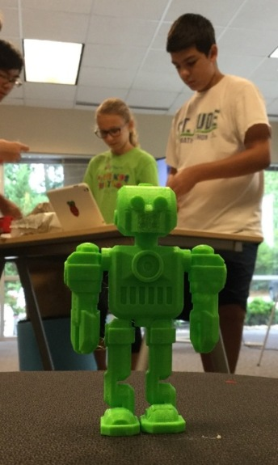
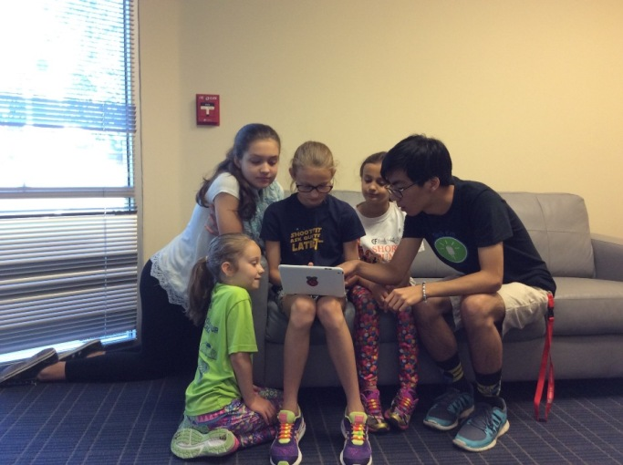
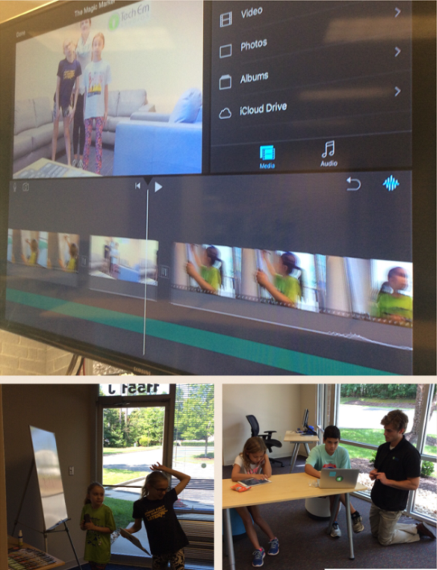

Title: Make a Movie & Media Arts Camp  
Date: 2016-08-05  
Category: Classes  
Tags: techcamp, imovie, media arts, photography, 3Dprinting    
Author: Josef Seiler   
Summary: Follow up Make a Movie and Media Arts Camp  

####Media Arts Camp  

*The response from the Tech Em Team to what the campers created during this camp: "Wow!"*   

The Media Arts Camp is all about creating new ways to channel your inner artist and create amazing content through technology tools. The campers learned what makes art, media art. Artwork dependant on and made from technology. This can include computer animation, digital art, 3D printing, and much more. They learned of some icons that became famous for their Media Arts projects, like Andy Warhol and learned of the practical Applications of Media Arts.  

**3D Design and Printing**  

The campers kickoffed their creativity by completing a challenge to design a 3D object to function in the real-world once printed. From phone cases and charging stands, to 3D printed robot friends; the results were striking. To plan their design, some campers started with a drawing on paper or by researching the correct specifications/dimensions of their conceptualized composition (*big words for big ideas!*). The campers learned how 3D design and 3D printing work together to produce their creations. A 3D printer is like a regular printer (printing in two dimensions, X and Y). Just add another dimension (X, Y, Z) to make 3D objects! Campers had the opportunity to see the process the 3D printer goes through to produce their designs!  

**Logo Design**  
The first challenge was to create a logo that depicted similarity to an already produced logo. Designs featured logos such as, Nasa and FedEx. The campers realized clever implementations logo designs portray: The Nike "swoosh" is rumored to be a tennis swing, the arrow in the middle of the FedEx logo. Campers used this idea of logo creation and the concept of depicting the brand name in the logo to conjure up their very own, unique logo. Unique, meaning they were called to make a logo design that illustrated themselves; i.e., their interests, hobbies, etc. -a logo that describes them. 

  

**Photography**  
After a lesson on guidelines on what to pay attention to when taking a good picture, campers were released to render their inner photographer by completing a scavenger hunt!  

* **Scavenger Hunt!**  
Objective: Take one picture of..  
    + A person (could be whole person, or soemone's hand/shoe etc.)  
    + Something in Nature (bird, plant, rock, bug, etc.)  
    + Food item
    + Hardware (a keyboard, mouse, monitor, iPad, tv, etc.)  
Put these pictures together by making a collage.  

  

* *Guidelines for Taking a Good Picture*  
    + Use Gridlines (a "tic-tac-toe" grid)  
        - Position the camera so your subject appears where two of the lines meet or somewhere close to it.  
    + Pay attention to horizontal and vertical lines
        - keep horizons level and verticals straight  
        
The photography projects were then printed on greeting cards!  
        
**Animation/Comics**  
Using premises of a good story or movie, campers paired up to develop a digital comic. They were first presented with examples and the style of story-creating for comics. Drawings for characters and backgrounds were inputted into a comic making app. Once put together, these designs and templates on the app were assembled. The campers added music and voice-overs to culminate their comic stories! This task was concluded with presentations of their digital comics.  

  

During this camp, imaginations expanded and came to life! Using technology in art creation, more doors open to channel creative minds!  

The apps used: Assembly, 123d Design by Autodesk, Toontastic, iPhoto Editor, Pic Collage  

***  

####Make a Movie Camp  

The campers really came together to make amazing movies using a variety of comprehended techniques! The first day of camp, the campers learned about the schema of the movie making process.  

  

**Creative Project**  
Campers chose to proceed to make a movie with content and genre of their choosing. But first, the campers focused on brainstorming at least three movie ideas; at first individually, then in pairs, or groups of three. Once centered on an idea to make into a movie they presented it to an intern from the Center of Information Technology from Deep Run Highschool or an instructor. The groups discussed more detailed premises of their story; the protagonist (main character/hero) and their story or journey they would embark on. The students put their idea to paper using storyboard sheets. Here, they sketched scene ideas and dialogue to coincide with the scenes. Then... Lights! Camera! Action! The process of filming and editing began! The campers used props from the studio, as well as props they brought from home.  

These students were enthusiastically fast at work creating masterpieces! During the week, they worked on a few more discrete project themes/styles:  

**Books Alive!**  
The students were challenge to bring a book to life by developing a movie for their favorite children's book. The guidelines for making the movie: the movie must follow close to the actual story of the book; however, alterations to the story, scenes, and characters are allowed! Additionally, to score this movie making challenge, they followed the structure taught and actively applied during their first project. Students formed pairs to bring their book to movie form, Tech Em Studios style! Books that came to life during the camp: *There is a Bird on Your Head!*, *Knuffle Bunny*, and *Wizard of Oz*.    

**Stop-Motion Video***
Stop motion is an animation technique to make it appear that inanimate objects are moving on their own. This can be done with drawn pictures of objects and background scenes and/or with physical objects. The object(s) is moved in small advancements admist separate frames of photos. After a short lesson on techniques to use; in order to manage this, the productions were started and the final objective accomplished. Projects ranged from 3D printed salsa videos to Tech Em class commercials!  

  

**Movie Trailers**
Campers chose some of their movies to create a trailer(preview) for, to promote their movies!

Here is our mini lesson on movie making, so your child can refer to when they score more movies:  

* **Our Movie Making General Outline**  
    + Brainstorming to Idea  
    + Idea to Script  
    + Script to Storyboard  
    + Storyboard to Film  
    + Film to Edit (to more film and edit)  
    + To Screening/Showing  
    

During the Make a Movie Camp, we used iMovie, Garageband, and special effects apps, like ActionFX to produce movie gems.  

Check out the movie projects from this camp on the Tech Em Studios YouTube channel: <https://www.youtube.com/channel/UCy9pBQirIqjOpqHkPen2deQ>  

  

***  

  

