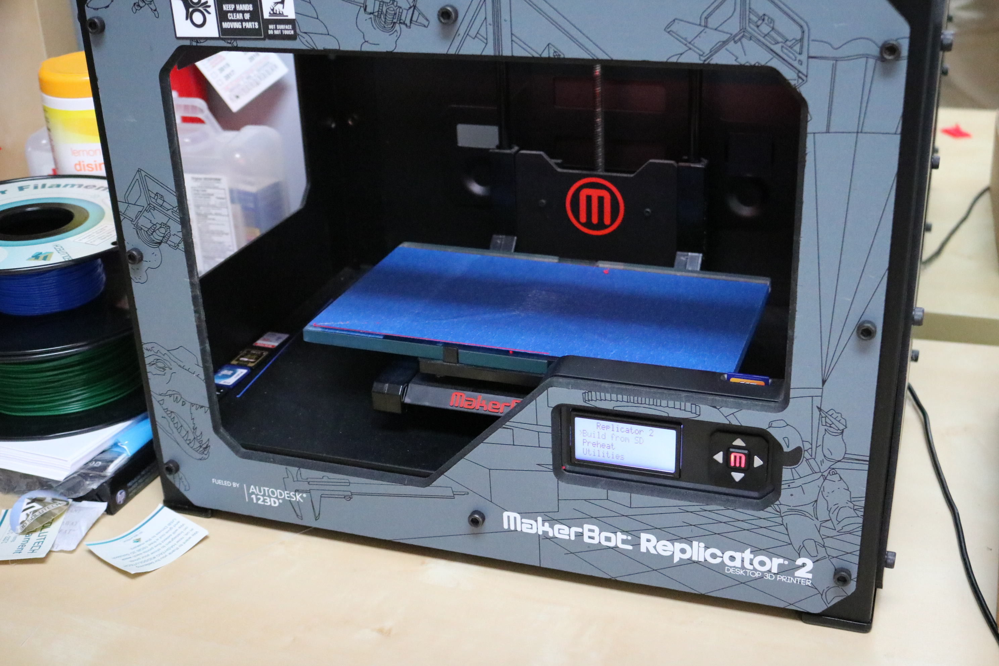
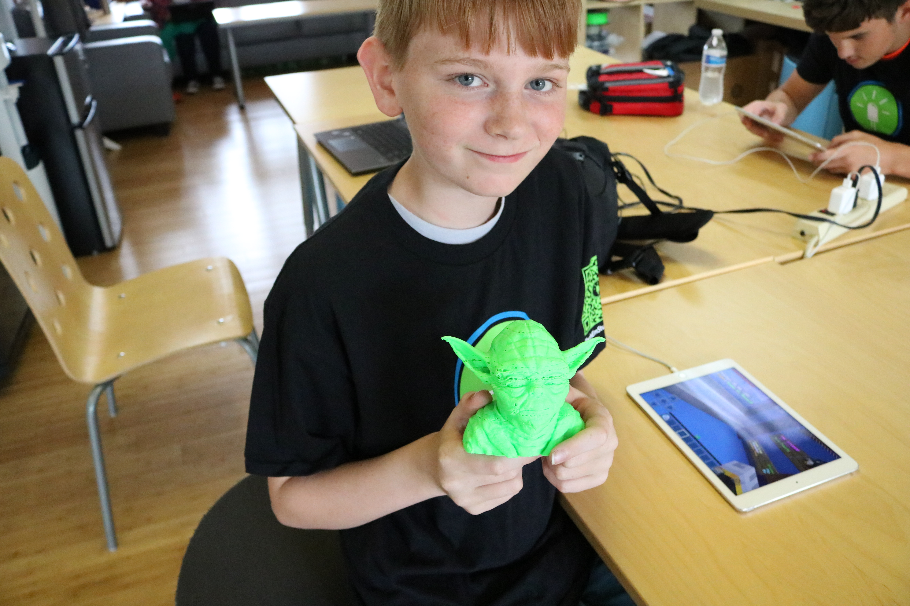
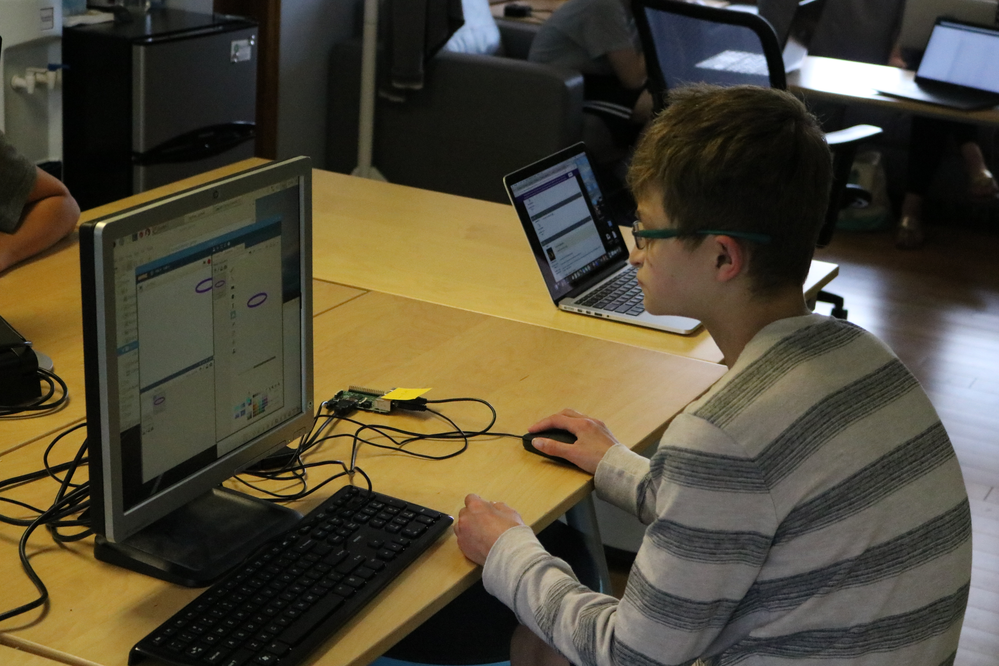
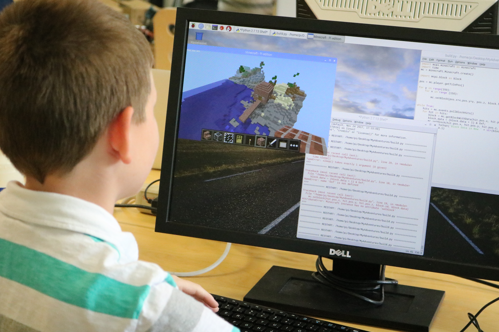
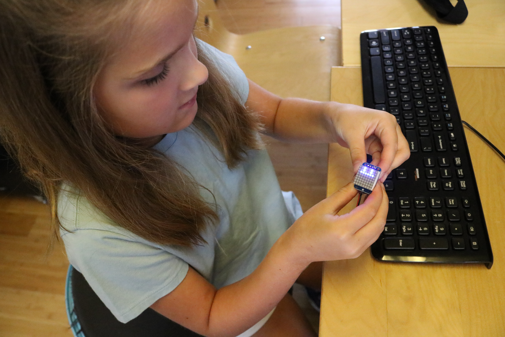

Title: Minecraft 3D & 3D Devices Camp  
Author: Alex Noll  
Date: 2018-7-6  
Category: Classes  
Tags: minecraft, techcamp, 3D printing, computer science  
Summary: Minecraft in 3D, Devices in 3D  

**Build it, Print it!**  

It was a great experience to see creative minds design complex builds in Minecraft and create intricate switching devices in Minecraft!  

Campers learned the basics of 3D printing, including designing and the actual printing process. Below are the steps we completed to perform this:  

***  
* **The 3D Print process**  
    + Campers created their own unique design on Minecraft.    
    + We used the program Mineways to turn their Minecraft creations into a file that the printer can understand.  
    + The file was then sent to the 3D Printer and printed into a unique 3D object that they could take home.

***

From the final camp email: You can get a sample of the projects we did from our site. Login to our secure site from our homepage or from this link: https://secure.techemstudios.com/enrolled_children. If logging in for the first time, use your square receipt id as your password (or use the password reset feature or contact us if you have trouble). You can easily change your password once logged in. From this site, you can download a zipfile containing a 3D Design file or Standard Triangle Language file ("stl") your child created.  
***  
* **3D Devices**
  + We started off the camp on the Raspberry Pis with Python coding on Python Games where campers modified the games to their liking as they saw fit.

  + Next, we took our Python skills to everyone's favorite game, Minecraft! Campers were able to make their own Minecraft Mods and changes to the game.  

  + Finally, we took our skills to LED Pendants where campers were able to program their own patterns onto the LED Pendants to take home with them.

We hope our campers enjoy their 3D builds and devices and have a great rest of the summer!
