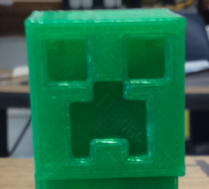
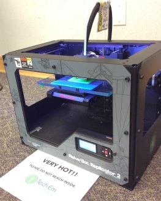
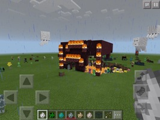
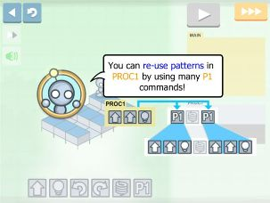

Title: Offsite Summer Camps  
Author: Tech Em Studios  
Date: 2016-7-5  
Category: Classes  
Tags: 3D printing, techcamp, minecraft, computer science, technology, python, coding   

## Weinstein JCC Minecraft in 3D Camp  

**3D Printed Minecraft Objects, Roller Coaster Tree Houses, Binary Logic Gates, Python Programming... These are just a few of the JCC campers' favorite things!**  

It was another great week of technology fun, the Minecraft in 3D camp at the Weinstein Jewish Community Center, was met with enthusiastic minds. Who wouldn't be enthused about 3D printing, computer science and Python code, all covered using Minecraft!  

We started the week by hitting the ground running, with competitive build challenges for team-built tree houses and haunted houses.

Throughout the week, campers tried their creative skills by designing objects in Minecraft to be printed out as a 3D object they could take home. From village houses and minecraft bows and arrows, to 'walking' creeper feet, the creativity from the campers was apparent.  

The campers switched gears by learning how to build simple binary logic gates using the famous, redstone in minecraft. Campers built a few binary logic gates (AND, OR, NOT gates) with redstone, redstone torch, redstone lamp, repeaters, and a lever in their inventory. Learning binary logic gates greatly helps in understanding how the hardware in all computers operate.The levers portrayed the input while the redstone lamp acted as the output. They were then challenged to incorporate what they learned from the lesson by participating in collaborative team builds!  

Other output types could be used: Doors and gates that swung open or shut close by using the binary switching logic learned earlier, proved very useful in the team-built zoo challenge!  

Campers learned the basics of designing for 3D printing. Below are the steps we completed to perform this:  

* **The 3D Print process**  
    + Campers created a design on Minecraft.    
    + The program, Mineways was used to turn the object into a file, recognizable by the 3D printers.  
    + The file was sent to the 3D Printer and printed into a unique 3D object that they could take home.  
    

  
    
To end the last two days of camp, the campers learned how typing up a few lines of Python code can have a cool impact on gameplay. They used Python 2.7 to write instructions to have objects built in minecraft, without actually placing a single block! Python is an intuitive computer programming language.  

***  

## Luther Memorial School Technology Camp  

**Campers at Luther Memorial learned what technology in their world is all about!**    

Pulling concepts from our Tiny Tech lesson plans, instructors and campers discussed the nitty-gritty. Opening the floor with what technology means to us, to more advanced thought, like how we can discover step-by-step instructions, or computer programming to be found right under our noses in everyday processes that are not even technology related.  

-Who knew that the steps we follow in pouring ourselves a bowl of cereal in the morning are like the steps a computer follows to run a program?!  

Some of the apps explored were Lightbot Jr., The Foos and Kodable. All of these apps center around the concepts involved with computer programming, such as understanding sequences and conditions ("If this happens... Then this will happen."). Learning how to critically think was a major part of completing these engaging activities.  

  

We learned the basics of how technology works and how it can help us understand the world around us.  

We hope our campers from JCC and Luther Memorial have a great rest of the summer!  

