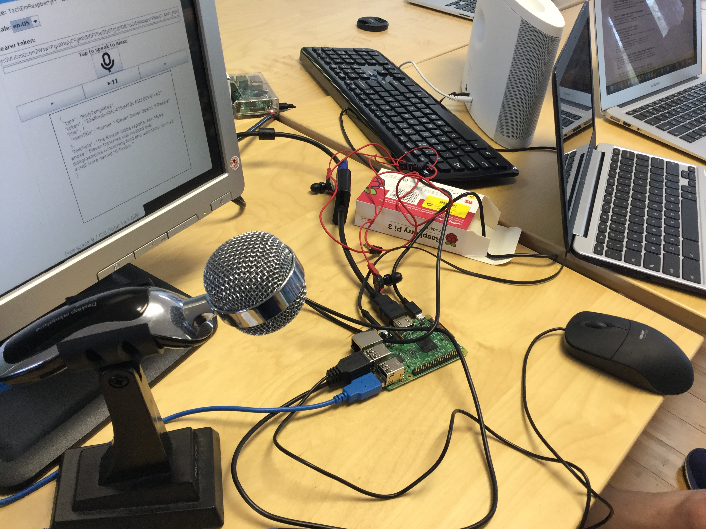
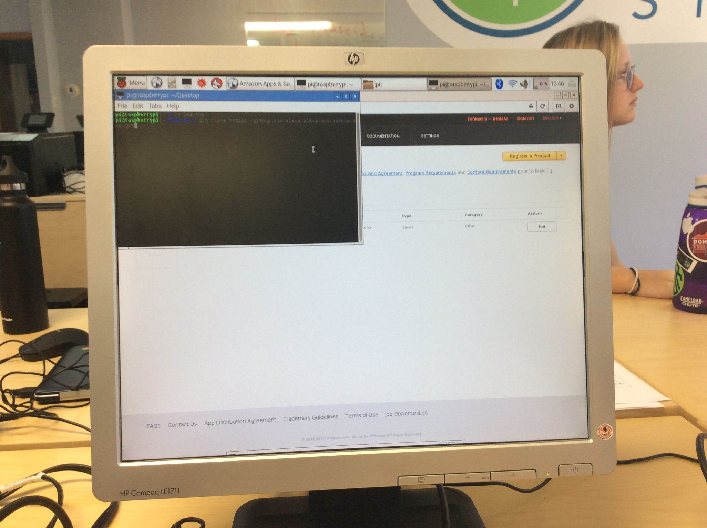
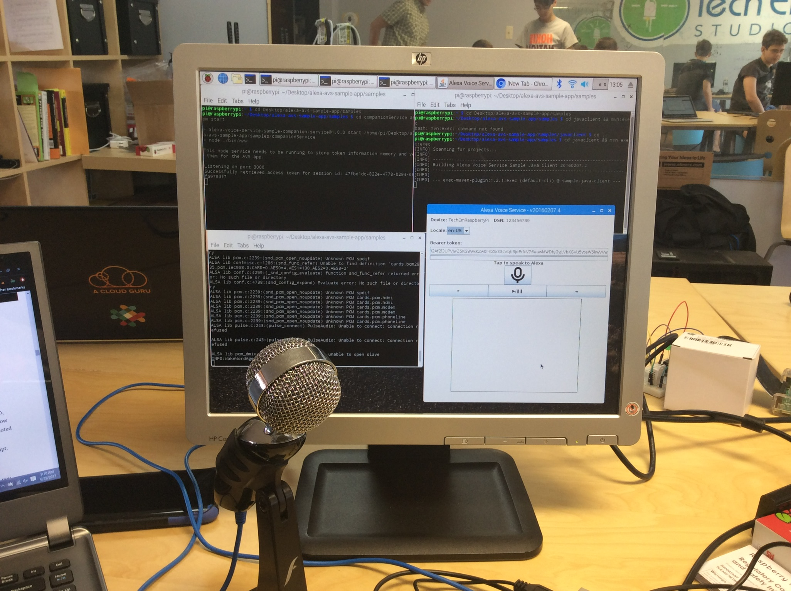
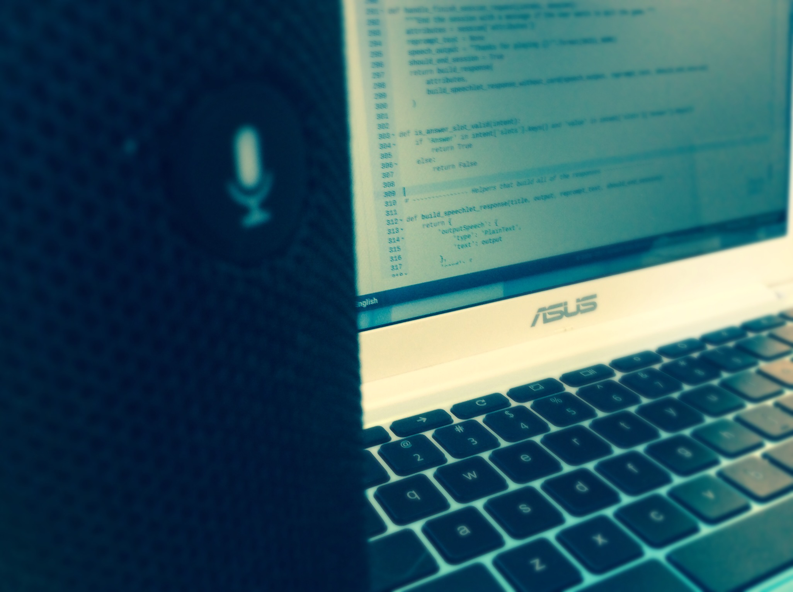

Title: Make a Raspberry Pi Powered Alexa
Author: Alex Noll
Date: 2017-06-29
category: Notes
Tags: computer science, raspberry pi, hardware, Echo, Alexa

***

### Process for Building Your PiLexa

To start, you'll need a USB microphone, keyboard, mouse and speaker (connected via HDMI or the 3.5mm audio connector), and about an hour of time. Just to begin, you'll want to be running the latest version of Raspbian and you'll need an Amazon Developer account as well.


#### Step-By-Step Instructions for Setting Up Alexa

Once you have everything ready, you'll need to be on developer.amazon.com and click on the alexa tab. Once there, you'll then click on the Alexa Voice Service. Next, click on the register a product button and choose device in the subfolder. You can set your Device Type ID and Display Name to whatever you want, but next you'll need to set your security profile description to also, whatever you want. You'll want to take note of your Client ID and Client Secret, as you'll need them later. Next you'll need to configure your web settings with the allowed origin as ```https://localhost:3000``` and then for your allowed return url you'll need ```https://localhost:3000/authresponse```.



Now that you have what you need from Amazon, it's time to get to configuring your Pi. On your Pi, you'll want to open up one terminal for now and type in "cd Desktop" , followed by ```git clone https://github.com/alexa/alexa-avs-sample-app.git``` and press enter. Once that's done, you need to type ```cd ~/Desktop/alexa-avs-sample-app```. After that, type ```nano automated_install.sh``` and press enter.

Next you'll fill in your Product ID, Client ID, and Client Secret. Afterward you'll need to ```cd ~/Desktop/alexa/alexa-avs-sample-app``` and press enter, then followed by ```. automated_install.sh``` and press enter. At this point you should fill in each option that follows as needed.

This following process requires three separate open terminals for each set of commands and must be done in sequential order. For the first terminal, type in ```cd ~/Desktop/alexa-avs-sample-app/samples``` and press enter, then type in ```cd companionService && npm start``` and press enter.

The next terminal will require the following two commands ```cd ~/Desktop/alexa-avs-sample-app/samples``` with Enter, and then ```cd javaclient && mvn exec:exec``` with Enter. You'll want to make sure you're logged into your Amazon account and deal with any Java pop-ups that may occur.

This is the last step, in which we will start the wake word engine so that your Pi will respond when you say "Alexa". To do this, in your third terminal you'll type in ```cd ~/Desktop/alexa-avs-sample-app/samples``` and press Enter. and then, type in ```cd wakeWordAgent/src && ./wakeWordAgent -e kitt_ai``` and Press Enter.



Congratulations your PiLexa should be up and running, should you want to improve your diy echo's ability to understand you, you may want to type in ```alsamixer``` , use f6 to select the audio device, and then adjust volume settings. To save your adjustments hit ESC, and then in a terminal type ```sudo alsactl store``` and press Enter.  

For even more information on the subject, definitely check out this article on LifeHacker, it provides visual demonstrations and a bit of trouble-shooting as well :http://lifehacker.com/how-to-build-your-own-amazon-echo-with-a-raspberry-pi-1787726931

***  

### Stay Tuned for the Chromebook-Ubuntu Powered Alexa!  

  
