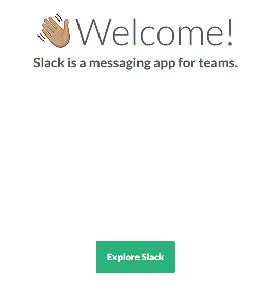

Title: Slack        
Author: Chris Kefalas    
Date: 2016-11-08      
category: Notes    
Tags: slack, github, python, coding, code em, homeschool, create em, game em    

### Why Slack?  

Slack has come onto the scene in the last couple years as a way for groups of people to communicate, in a chat room like setting. What makes Slack stand out from similar pieces of software is it's ease of use, and simplicity. At Tech 'Em Studios we use Slack to talk amongst each other, and share ideas. The real fun with Slack comes when you
dive into all of it's features, and the many different types of textual bots you can have feeding your Slack channel with information.  

Our goal with using Slack with the students is firstly to be able to allow them to ask questions to the instructors when they aren't in class. But also as part of an activity
that involves using the Python programming language to create, and program your own Slack bot! With the knowledge that the students learn from class they will be able to commit changes to the class bot, and make it talk back depending on what is said to it. We like this activity because it's fun, as well as gets the kids thinking about artificial intelligence! My plan for this blog post is to talk about getting signed up, joining Slack, and bit more about it features.  

### Signing up  

In order to get signed up with the Tech 'Em Student's Slack channel you will need to provide us with your  email either in class, or by sending us an email at [info@techemstudios.com](mailto:info@techemstudios.com). If your child doesn't have an email, I suggest creating one via Gmail, or having them use yours. Email is simply needed to sign up for Slack, and as a method of resetting, or recovering your password.  

  

You will receive the invitation in your inbox. By click the big green button you will start the registration process. Things that has been **underlined in red** is the identifying parts for you to be able to verify you have received the correct invitation, and your child will be joining a Slack channel controlled, and administered by Tech 'Em Studios.  

**Please note**, you will be invited by either Joe Seiler, Chris Kefalas, or Wray Mills. If one of those names isn't listed, you know someones 'a phishing!  

    

If you have any other questions about getting signed up, please don't hesitate to reach out to us at [info@techemstudios.com](mailto:info@techemstudios.com)    

### Joining Slack  

After you have click the big green button you will be prompted to type in your name, and choose a username. This user name can be anything, granted it is appropriate, and within Slack's guidelines for user name creation.  

  

You will than be prompted to create a password for your account. We always recommend using a Great password!    

  

The next screen you will see will look like the one below. It will offer to walk you through a tutorial of how Slack works, and is set up. It's super quick and gives you a basic idea of the layout.  

  

### Slacking?  

Slack is set up as a system of chat rooms known as channels that are always prefixed with a octothorpe (#). Everyone is automatically joined into the channel known as #general. Currently we have configured Slack so that all our students are in #general, and can read, and write. The purpose of #general is for dialogue between everyone, as well as relaying the latest messages from Tech 'Em Studio headquarters! From there we have created private channels named after each class that only the particular students in that class can join. The goal with the private channels is to allow each class to interact with their bot, as well as let them talk amongst themselves. We hope that by creating these class channels the students will be able to better interact with other students, and help each other out.  

  

The channels you see on the side will be different depending on what class the student is in. Everyone though is automatically joined into #general, and #random, and their respective class channels as well.  

Students can also create private messages with other students that are part of the Slack channel.  

Slack is available for Windows, macOS, and Linux operating systems. As well as Android, iOS, and you can even use Slack in a web browser by navigating to https://techemstudents.slack.com.  

### Slack bot  

Just as much as the Slack craze has been sweeping the nation, the Slack _bot_ craze has been steadily gaining traction. A Slack bot is a textual bot that can be programmed to provide a certain function. People have created hundreds of these bots to do anything you can think of! Taco Bell even has one called [Taco Bot](https://www.tacobell.com/feed/tacobot) that lets you order tacos straight from Slack!  

The main ones you will see hanging out in our channel are Twitter bot, Github bot, Travis bot, and our work in progress #general Python bot. Some bots you can interact with via typing in certain commands. Other bots will just feed information into your channel based on certain circumstances. For instance, whenever we post a tweet to our Twitter account, it will relay that message into the Slack channel for everyone to see. In a similar manner, the Github bot will post a message whenever someone has made a new commit to the repo!  

The students will be working with the Python programming language to create their own Slack bots! Either for their own use, and experimentations, or as a general bot to hang out in their class channel. They will than be able to program that bot to respond to certain commands with just text, or make a query to a certain data set online. It really is a lot of fun, and the possibilities are endless when thinking of different ways you can interact with the bot.  

These bots can either be ran on a Raspberry Pi, your PC, or even in the cloud! Slack is a free service up until a certain amount of users. So at the end of the session, students can create their own Slack channels, and start crafting their own bots to hang out in their channels!  

### Final Thoughts  

Slack is awesome, and personally is the only thing I can see replacing e-mail one day. We are hoping that by using Slack, and allowing students to communicate amongst themselves, as well as with teachers outside of the classroom will really help to make all of the classes feel more seamless. Slack is a great way to open the discussion about problems students are having with assignments, and for teachers to provide live help to walk them through issues that might arise. A lot of our classes we only get to spend one hour a week with the students. But with Slack it extends that, and allows them to reach out for help anytime during the week!  

Let us know if you have any questions by emailing us at [info@techemstudios.com](info@techemstudios.com) please.  

Ready to sign up for GitHub? Check out the blog about [GitHub](http://blog.techemstudios.com/github-part-one.html)  
