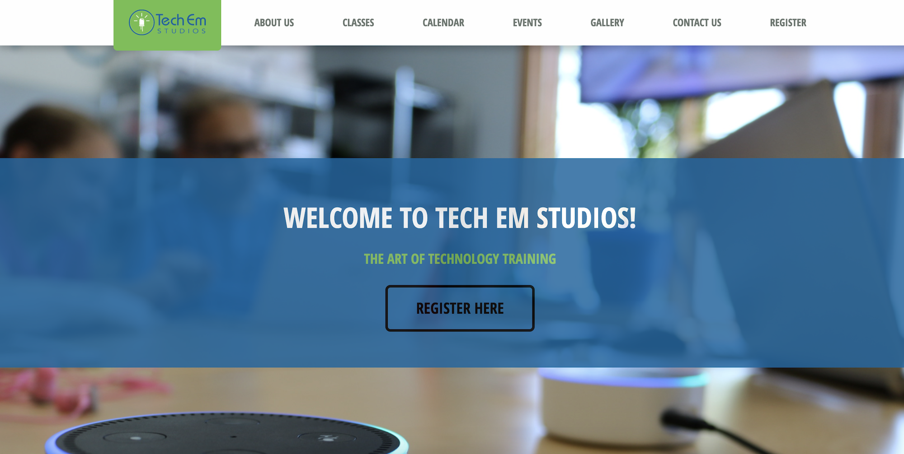

Title: Website Redesign Rishi 2018    
Date: 2018-07-10  
Category: General  
Tags: computer science, coding, github, slack, technology  
Author: Rishi Patel 

## Introduction  

Our interns worked hard over the past couple of weeks to update and redesign Tech Em Studios’ website. To kickoff this redesign, it was all pens and paper; the interns worked to design what they wanted each page to look like on paper. With the plans for the redesign established, they went to work on the code (HTML, CSS, and JS). As a team, they worked using a forked github repo from our old website to make changes without affecting the live site. There were many bugs to fix as modifications were made, and the interns worked as a team to divide and conquer the tasks of the various pages. They worked using Slack to communicate and share resources. Below, our intern Maggie describes her experiences working on this project. We are excited to present our new and improved website!

## Homepage 

  

## Website Redesign

“Anyone on main.css? What about classes.html? How do you implement a modal for the calendar?” These questions (and many more) became the basis for real-world website redesign. But we didn’t start with code – we started with a pencil and notebook! Yes, we knew from the beginning that we were going to start the new website from scratch and needed a foundation for both framework and design; both aspects would be reflected across all pages. We jotted down the biggest and smallest details from the old website to see what needed changing; the net neutrality alert was definitely one of them… After extensively reviewing the old website, we created a design frame for each page.

I have worked in software development projects before in school, but one thing felt different at Tech Em than in the classroom: collaboration. Collaboration is profound in the real-world, and it’s safe to say that communicating with team members at the studio felt more natural – less forced, if you will. Using the power of talk (and Slack, of course), I knew what was expected of this website; already, the team was heading in the right direction.

From there, we were off to the races! We had all previously learned the HTML, CSS, and Javascript basics and were transforming a template that we found to suit our conceived design on paper. Personally, I am more design-oriented and naturally enjoy creative work (a big reason why I enjoy Tech Em!); that being said, I was excited to play with the HTML and CSS to find what looked the best.

There were many hurdles to clear before the website was finished. This was my first time using GitHub for a real-world project, and at first, I was a bit confused by the lexicon of words in the GitHub realm; some of my favorites include “Fork” and “Pull-Request.” Another challenge was waiting for some of the changes to appear, particularly changes made in the main CSS file; nevertheless, the incredible powers of Inspect Element allowed us to see instant changes before committing anything in GitHub. As far as technicality, most issues were in design work (unwanted wrapping of text, positioning text and objects in desired locations, unresponsive elements, calendar modal, logo size, etc.). We never found our challenges to be disheartening (we actually found them quite funny!); we kept striving ahead and used excellent peer collaboration to fix all design and framework flaws.
It’s evident that for every challenge, there indeed was a solution; and not only was there a solution to make it right, but there was a solution to make it right for us. As we neared the end of the redesign, we were nitpicking the smallest details on the site, ensuring that what end-users saw was a completely refurbished Tech Em Studios. Gone were the pictures from 2013, and in came quality photos from recent camps; gone were the old colors, and in came the modern, personalized Tech Em colors; gone was the old framework, and in came a brand new site that reflected a modern Tech Em Studios and expressed “The Art of Technology.”
