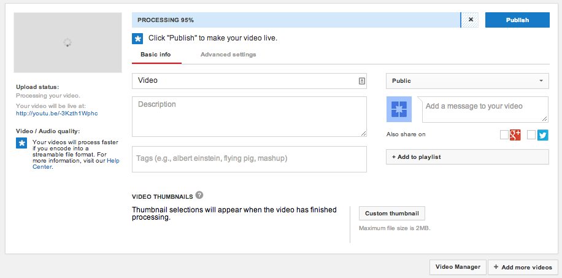

Title: Becoming a YouTube Star and Digital Artist!  
Author: Alex Noll  
Date: 2018-8-24  
Category: Classes  
Tags: Digital Arts, YouTube, Cinematography, computer science  
Summary: Video Making & Digital Arts

**Action!**  

It was awesome to see the campers unleash their creativity through their videos!  

Campers learned the basics of Video Making and Cinematography, as well as the social science of YouTube and how to be successful on the ever-changing platform:  

***  
* **The Production Process**  
    + To start, campers had to brainstorm what they wanted in their videos and then how to implement their ideas in their videos    

    

    + Next, the campers had to either film or screen record their videos. This year, the most common video topics were usually Fortnite or PUBG so often times, campers were using Apple's built-in screen recording tools  

    + After campers got their raw footage, they had to edit them to make them YouTube ready! For this, we used a wide array of tools, however iMovie was a camper favorite.

* **Getting Publishing with YouTube**

Once you have your channel, you'll want to upload your video, uploading is a pretty complex process with many different variables to consider. To start, make sure you've prepared the video you want to upload by editing it and making sure it is the product you want the world to see.  

After ensuring that your video is ready to be seen, you'll have to go to your main page on YouTube, then, in the top right corner of the page there's an upload button (an upward facing arrow) to click.  

  

After going to the upload page, you' be prompted to select the content you want to upload, once selected you have to wait through an uploading process and processing process for your video to actually make its way onto YouTube.  

  

Next, you'll need to decide on a Title, Description, some Tags for your video, as well as the Video Thumbnail. Make sure your Tags are related to your video and that you include enough so that if a viewer searches a relevant term, they can find your video. You'll also want to keep your title short and relevant, while making your description more descript with the information that's excluded from the title.  

For your Video's Thumbnail, it's best to verify your YouTube account by providing a phone number, this will allow you to upload your own Thumbnail pictures instead of using the ones that YouTube selects.  

After deciding on your Thumbnail, you're ready to upload. Just hit publish, and then your video is available for the  world to see!  

***
 **Digital Arts**
  + For digital arts, we focused less on camera-oriented art and more on digitally created artwork such as animation or logos

  + We started off with logo and label design on Assembly as well as LogoMaker.com, the campers were extremely quick to learn how to use the tools to implement their designs

  + Finally, we moved on to Animation where campers designed their own 3D Models on the computers.

We hope our campers enjoy their Digital Artwork and Videos, have a great rest of the summer and good start to the school year!
