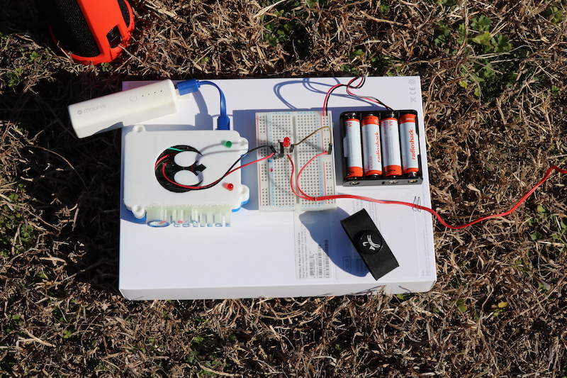

Title: Read about Rockets, Pis and Alexa
Date: 2017-03-31
Category: Startup
Tags: python, aws, alexa, raspberry pi, model rockets
Author: Wray Mills
Illustration: rocket-flow.jpg

***

### Another medium post

Read about yet another cool project we'll be bringing into our classes
and camps. Check out our latest: 

