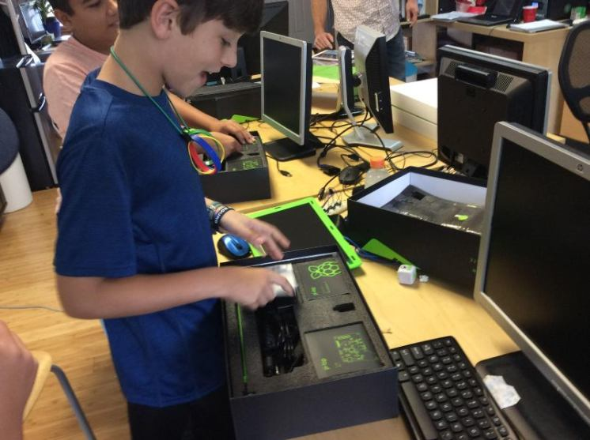
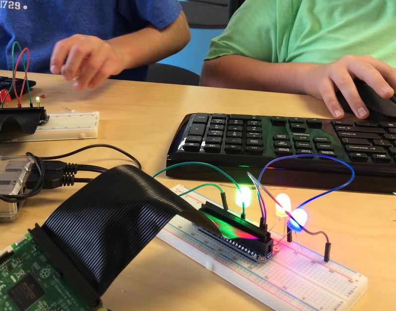
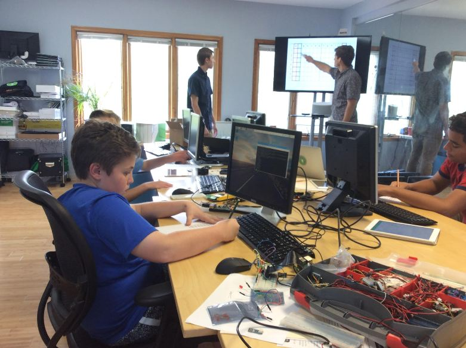
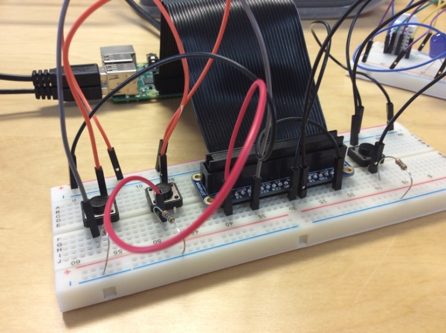

Title: Build Your Own Laptop 2017  
Author: Josef Seiler  
Date: 2017-08-21  
Category: General  
Tags: computer science, raspberry pi, hardware, pi-top  
Illustration: pi-top-unboxing.jpg  

### Build Your Own Laptop  

#### Pi-Top  

The steps we completed to build the Pi-Tops can be found on the Tech Em Studios blog, [__PiTop Build__](http://blog.techemstudios.com/pitop-building.html).  

### Raspberry Pi Projects  

Before we dove into assembling our laptops, we conducted a series of hardware and software projects on the Raspberry Pi. Students used the breadboard to create multiple projects involving LEDs, switch devices (buttons), jumper cables, and resistors.  

Several projects we completed during camp:      
  

***  

#### LEDs & Temperature Humidity Sensor      

After setting up our Pis, we wired up LEDs and jumper cables on the breadboards. Without software (programs, i.e. instructions written for the computer by humans), hardware will not perform any action on its own. To control the LEDs, we created a few programs in Python to turn the LEDs on, and off. The challenge was to determine what code to add, so all LEDs could be controlled in one instance. To keep with the theme of ON/OFF, LED light shows were created. It was great to see all students find different paths to reach the same solution! We learned Morse code and implemented the practice in a Python program to relay messages coded in Morse to output on the LEDs.  

Check out [__Notes on Setting Up Pis for IO Lessons__](http://blog.techemstudios.com/notes-on-setting-up-pis-for-io-lessons.html) for information on Raspberry Pi setup and Breadboard/LED setup and [__RPI Temperature and Humidity Sensing__](http://blog.techemstudios.com/rpi-temp-and-humidity-sensing.html).  

  

***  

#### Minecraft Python Mods  

Of course, camp would not be complete without Minecraft! Campers wrote Python code to change aspects of the Minecraft gameplay experience.  

For the programs we wrote in class and more, go to [__Notes on Setting up pis to use Minecraft API__](http://blog.techemstudios.com/notes-on-setting-up-pis-to-use-minecraft-api.html).  

***  

#### Internet of Things (IoT)  

To introduce machine-to-machine communication through the internet, students installed a hardware monitor on the Raspberry Pi called Cayenne. With Cayenne, we were able to monitor the pi's status on a web browser and mobile application.  

Steps to reproduce at home: [__How to Install a Hardware Monitor on the Rapsberry Pi__](http://blog.techemstudios.com/how-to-install-a-hardware-monitor-on-the-raspberry-pi.html).  

  

***  

#### Raspberry Pi Soundboard  

We used resistors (essentially, controls the flow of electricity in a circuit), and learned how to use switching devices to create a soundboard. We wrote code to have each button on the breadboard produce its own sound.  

More on the project can be found here, [__How to Make a Raspberry Pi Sounboard__](http://blog.techemstudios.com/how-to-make-a-raspberry-pi-soundboard.html).  

  

***  
