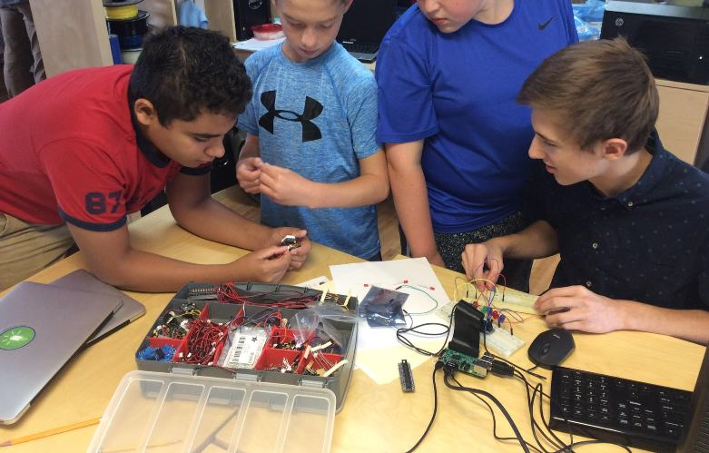

Title: Build Your Own Laptop 2017  
Author: Joe Seiler  
Date: 2017-08-21  
Category: General  
Tags: computer science, raspberry pi, hardware, pi-top  
Illustration: pi-top-unboxing.jpg  

### Build Your Own Laptop  

#### Pi-Top  

The steps we completed to build the Pi-Tops can be found on the Tech Em Studios blog, [PiTop Build](http://blog.techemstudios.com/pitop-building.html).  

### Raspberry Pi Projects  

Before we dove into assembling our laptops, we conducted a series of hardware and software projects on the Raspberry Pi. We learned how to use the breadboard to create multiple projects including LEDs, buttons, jumper cables, resistors.  

Below, a list of some of the projects we completed during camp.    
  

***  

#### LEDs & Temperature Humidity Sensor      

After setting up our Pis, we wired up LEDs and jumper cables on the breadboards. We learned that without software (programs, or instructions written by humans), hardware will not perform any action on its own. To control our LEDs, we created a few programs in Python to turn the LEDs on, and off. The challenge was to figure what code to add so the user control all LEDs at once, and another challenge to create an LED light show. It was neat to see all students come up with different paths to the same solution! Students learned how Morse code works and implemented it in Python to relay messages coded in Morse through LED output.  

Check out [__Notes on Setting Up Pis for IO Lessons__](http://blog.techemstudios.com/notes-on-setting-up-pis-for-io-lessons.html) for information on Raspberry Pi setup and Breadboard/LED setup and [RPI Temperature and Humidity Sensing](http://blog.techemstudios.com/rpi-temp-and-humidity-sensing.html).  

  

***  

#### Minecraft Python Mods  

Of course, camp would not be complete without Minecraft! Campers wrote Python code to change aspects of the Minecraft gameplay experience.  

For the programs we wrote in class and more, go to [__Notes on Setting up pis to use Minecraft API__](http://blog.techemstudios.com/notes-on-setting-up-pis-to-use-minecraft-api.html).  

***  

#### Internet of Things (IoT)  

To introduce machine-to-machine communication through the internet, students installed a hardware monitor on the Raspberry Pi called Cayenne. With Cayenne, we were able to monitor the pi's status on a web browser and mobile application.  

Steps to reproduce at home: [__How to Install a Hardware Monitor on the Rapsberry Pi__](http://blog.techemstudios.com/how-to-install-a-hardware-monitor-on-the-raspberry-pi.html).  

  

***  

#### Raspberry Pi Soundboard  

Students used resistors (essentially, controls the flow of electricity in a circuit), and learned how to use switching devices to create a soundboard. We created a program in Python to have each button on the breadboard produce its own sound.  

More on the project can be found here, [__How to Make a Raspberry Pi Sounboard__](http://blog.techemstudios.com/how-to-make-a-raspberry-pi-soundboard.html).  

  

***  

