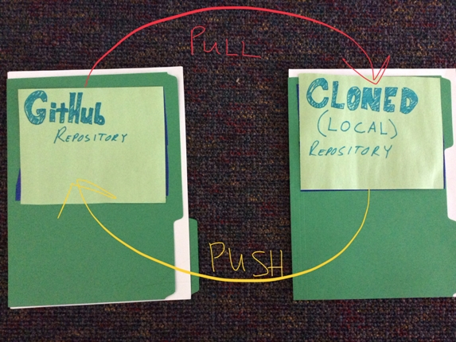
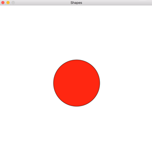

Title: Code Em Fall 2017  
Author: Josef Seiler  
Date: 2017-09-27  
category: Classes  
Tags: coding, github, slack, computer science, raspberry pi  
Illustration: gears.jpg  

### Day One  

`09/21/2017`  

### Code Em Kick Off  

We started with the usual introductions to break the ice. Code Em has newcomers as well as veterans, so we'll work together to get everyone on the same page of our computer science adventures. Throughout the fall, we will learn effective ways to think (best approaches to tackle problems), become affluent with coding via the Python programming language, and we will learn how to apply the same tools, used by software engineers in the real world.  

#### GitHub & Slack  

We will be harnessing GitHub during each class. This is a site used by software developers to collaborate on the build and upkeep of projects. For Code Em, you will *push* all files/projects you are working on to your own repository (folder). Your repository will continuously be updated as we move forward in the class. When you use GitHub, you essentially have a portfolio of your work you can access outside of class. This will be a great start to feel comfortable on how to use GitHub. Especially when we begin working on the same projects together, we'll get a feel for how real software engineers develop applications. Visit [GitHub.com](https://github.com/), sign up with your email account, create a GitHub username/password (write it down somewhere, so you remember it!), and click **Sign Up for GitHub**. GitHub will send you a verification email to the email you signed up with. Click the link to verify and you will be ready to git!  

*More detailed instructions can be found on the [Tech Em blog page](http://blog.techemstudios.com/github-part-one.html)*  

[Slack](https://slack.com/) is a messaging app for teams of large companies, i.e. Google; and small startups, i.e. Tech Em Studios. Slack will be used in class for questions about material we are learning in class, questions on projects, and communicating with your peers. You will not only have the current instructors as your resource, you will have the whole [Tech Em Team](http://techemstudios.com/about-us.html)! You will receive an email from Slack, which holds an invitation to join the Tech Em Students Slack team.  

*More details on joining Slack can be found on the [Tech Em blog page](http://blog.techemstudios.com/slack.html)*.  

### What we Learned  

#### How to Think     

More than learning to code, we will learn how to think, or how to approach and solve problems (in general) in efficient ways.  

#### Quick Computer History    

What are computers? Early computers were "tools" (mechanical devices) people used to them solve math problems. Modern computers are devices that can be programmed to carry out a task. We started at the *prehistory* era with Tally Sticks. We ended with the Babbage Machine (marked transition from calculation to computation) and Ada Lovelace, considered to be the first computer programmer. We discussed the difference of hardware to software and what makes a program, a program.  

#### Python  

Python is a programming language that is easy to write, understand and used for a growing variety of applications. We dove into Python, by creating small snippets of code in the interpreter, a place to quickly test ideas rather than creating and executing an entire program. We explored data types (found in all languages) and created a program with variables.  

##### Download Python

To practice at home, you can download Python for free from [python.org](https://www.python.org/downloads/). On the chromebooks/[crouton](https://github.com/dnschneid/crouton) we are using thi session, we will focus on **Python 2.7**. If you download the latest Python (3.6), there are a few changes we can easily handle for what we are performing in class. So, it is up to you, which version you would like.  

***  

### Day Two    

`09/26/2017`  

### Git  

We made our first repository on GitHub! This will be the place where we can upload all of our projects, so we can get to it beyond the class.  

### Fetch, Decode, Execute  

What happens when you fire up your favorite program? Consider a CD with your favorite game on it. This CD has tons of instructions already written on it, waiting to be read by your computer. When you insert the game, the CPU follows this process: **Fetch** the first instruction; **Decode** the instruction, translated into binary for the computer to understand; and finally, **Execute** The computer carries out the instruction. Since there is more than one instruction, this process repeats to get the rest. The process repeats, from the moment you turn on your computer and does so with lightning-fast speed!  

```python  
# In Python, a line that begins with a pound sign (#)  
# is known as a comment.  
# Comments are ignored by the program and are  
# considered "notes" to the programmer(s).
```  


### Expressions & Statements  

We already saw this last week, but we'll put *names to faces*. `print("Hello World!")` is an example of a statement, a complete thought. A statement is a unit of code that does something, like creating a variable or returning the value of the variable. An expression is a combination of values, variables, and operators.  

```python  
# example of a statement  
>>> n = 17  
>>> print(n)  
17

# examples of Expressions  
>>> 24
24
>>> 5 + 22
27
>>> "lamb"
'lamb'
```  

### Variable and String Concatenation  

```python  
# Set two variables, first_name and last_name each equal to a string:  
first_name = "ada"  
last_name = "lovelace"  
# Now combine the values using string CONCATENATION
full_name = first_name + " " + last_name  
# Next, we'll make a new variable that has a custom message for its value.  
message = "Hello, " + full_name.title() + "!")
print(message)
```  
 The final output:

```python  
'Hello Ada Lovelace!'
# title() is a built-in function we used to capitalize the first letters of the strings in the full_name variable
```

### Assignment One  

Make an account on GitHub, and verify it from the email you received from GitHub. Create another Python program that concatenates variables and strings (similar to what we did above).  

***  

### Day Three    

`10/03/2017`  

We did a quick review of what we've learned so far by typing *snippets* of code into the Python interpreter, to get quick results. At the end of class we went though a brain teaser activity together to summarize everything.  

### User Input  

We can easily take input from the user in a program. This can add a bit of fun while coding and running your program. We have all at one point used an app or game that handles input from the user, i.e. a website requesting your username/email and password, etc. In Python, there is a built-in function to handle user input:  

```python  
# Python 2.7
raw_input()

# Python 3+
input()
```  
This command pauses your program and waits for the user to enter some text. After the user hits enter, we can have Python conveniently store it in a variable to make it easy to work with. Here's the example from class:  

```python  
name = raw_input("What is your name?")
height = raw_input("How tall are you?")
animal = raw_input("What is your favorite animal?")
```
Our challenge was to handle all the information the user types in by returning a set a statements that makes sense of it all using concatenation (what we learned last week).  

```python  
print("So, you are named " + name + ", you are " + height + " tall")
print("and your favorite animal is a " + animal + ".")
```  
When we use the function `input()` or `raw_input()`, Python automatically thinks the information entered by the user is a string. For instance, what if we wanted to add two numbers typed in by the user:  

```python  
number1 = raw_input("Give me a number")
number2 = raw_input("Give me another number")
print(number1 + number2)
```
Let's say the user typed in the number `5` and the number `10`. This returns...
```python  
510
```  
Not quite the answer we were looking for! Instead of adding the numbers, Python *squished* them together. Why? Python thinks the numbers are strings. We can easily fix this by using another built-in function, `int()`, short for integer. Maybe you remember INT from the first day. INT, or integer is one of four data types found in just about every programming language; it is a whole number, so it does not have a decimal point.  

### Assignment Two    

See if you can create a simple program that takes two numbers from the user and adds them together. Use the `int()` function to do this. We'll go over the answer in class next week.  

***  

### Day Four        

`10/12/2017`  

Happy Ada Lovelace Day!!!  

### Computational Thinking  

Essentially, a useful way to approach and solve any problem. We will learn how to take real-world problems and make them "computable", or put them in program form in order to solve it. We started with an example on cleaning a whole house. Let's say your house is a complete mess! You are tasked with cleaning your whole house by a certain time. At first, this may seem overwhelming. However, if we take a computational thinking approach, we can *systematically* begin to tackle this problem. Below are the general steps we took to how we could complete the task of cleaning the whole house.  

* Computational Thinking  

  * Decomposition  
    - Decompose: break down: divide & conquer  
    - Break down a problem into smaller problems  
  * Generalize   
    - Be able to see the big picture  
    - See how the smaller tasks make up the larger task  
  * Recognize Patterns  
    - Look for familiar things  
    - Be able to see parts that repeat  
    - Don't Repeat Yourself --> **DRY**  
  * Algorithm Design  
    - Make a plan to tackle the problem  
    - Carry out the plan  

### Computer System Layers  

When we are working in one layer, we do not need to concern ourselves with the information in the surrounding layers. This way, we can just focus on what needs to be done in the moment. Think of abstraction as a mental model; a way to think about something. Have the unnecessary details hidden, so we can leave only the information we need to complete our goal.  

Abstraction Examples:  

* A Person Driving a Car  
  - The only thing they need to focus on is the road ahead.  
  - It is unnecessary to worry about details of how the engine or electronics of the car work.  

* Fast Food Restaurant  
  - At many restaurants, the names of meals have corresponding numbers.  
  - The food prep has been trained to recognize the meal number, not worry about the full name.  

### Functions     

We've already seen functions in action. For example, one of Python's built-in functions (already made and ready to be used), the `print()` function, which we know returns the information we put inside of the parentheses:

* `print("Hello World")` --> returns, `Hello World`  

* `print(123)` --> returns, `123`  

A function is like a mini program that goes off and performs a specific task. The task of the `print()` function is to display a value, or sequence of values. We can **call** a function by using the function's name, followed by a set of parentheses.  

For another example, when we create a variable that holds a value, we can display that value using the print() function.  

```python  
message = "Greetings!"
print(message)
```  

Same goes for the `raw_input()` function; which we know from Day Three, pauses the program and waits for the user to type in some information. The values we give (or **pass**) to a function inside the parentheses, are called **arguments**.  

### Turtle Graphics  

#### Interface Design  

Python's turtle program (or **module**), is a program that holds a slew of functions waiting to be used. All we have to do is put `import turtle` towards the top of any python file we create and now, we can write instructions that display images using turtle graphics! Rather than explain the turtle module from scratch, take a look at the official python documentation on Turtle Graphics:  

*"Imagine a robotic turtle starting at (0, 0) in the x-y plane. After an import turtle, give it the command turtle.forward(15), and it moves (on-screen!) 15 pixels in the direction it is facing, drawing a line as it moves. Give it the command turtle.right(25), and it rotates in-place 25 degrees clockwise."* -[Python 3.3.7 Doc](https://docs.python.org/3.3/library/turtle.html?highlight=turtle)  

Here's the first program we wrote together using turtle graphics:  

```python  
import turtle

# name your turtle
frank = turtle.Turtle()

# tell your turtle where to go
frank.fd(100)
frank.lt(90)
frank.fd(100)

# so the window doesn't disappear right away, add:
turtle.mainloop()
# or turtle.exitonclick()
```  
*Think of the "turtle" as a pen, marker, etc. We are giving this writing tool instructions to draw lines on a separate window (or piece of paper) --similar to our brain giving instructions to our hand to write or draw*  

Above, we called **methods** to tell our turtle where to go. Methods are like functions, but use different syntax. Calling a method is like making a request (*or command*). You are telling frank (or whatever you named your turtle) to move forward, x-amount and turn, x-amount, and so on.  

### Assignment Four  
The example above creates a right angle. Create a python program that uses turtle graphics to make a complete square. You may at first, find your are repeating a set of instructions. Remember to stay **DRY**, don't repeat yourself. You can use a loop function holding the instructions that repeat; making the amount you type, less.  

***  

### Day Five          

`10/17/2017`  

Solution to assignment four:  

```python  
import turtle
frank = turtle.Turtle()

### With a "for" loop ###
for i in range(4):
  """repeats the indented instructions underneath, 4 times."""
  frank.fd(100)
  frank.lt(90)
turtle.mainloop()

### Get the same solution with a "while" loop ###

while True:
  frank.fd(100)
  frank.lt(90)

# However, this while loop repeats forever
# a while loop runs, as long as...
# we'll learn later a few techniques to stop while loops
```  

### Loops  

A `for` statement is a loop, because the flow of execution runs through the body (anything indented below it), then loops back to the top. In the case above, the loop repeats four times.  

A `while` loop runs as long as, or *while*, a certain condition is *True*.  

### Encapsulation  

This is where we'll practice recognizing patterns. What if we wanted to reuse our code that draws a square, more than once? Our challenge is to put our square code into a reusable function. So, we'll define our own function rather than using a built-in one i.e. one of the "powers" of programming, we can create anything we want! First, we'll start by giving our function a name, "square".  

```python  
import turtle
frank = turtle.Turtle()

# name the function, with a generic parameter so we can use the function for more than one turtle
def square(t):
  """Reusable function to draw a square."""
  for i in range(4):
    t.fd(100)
    t.lt(90)

# call the function, with the name of the turtle as the argument
square(frank)
# create a new turtle to see how we can use the same function
ally = turtle.Turtle()
square(ally)

turtle.mainloop()
```  

Above, we used **encapsulation** by wrapping up a piece of code (or for loop *code block*), then placed it inside a function. Why encapsulate? To stay **DRY**, reuse code. "t" can now be any turtle. We call the same function; except, we pass the new turtle's name as an argument inside the parentheses of the new function. When we get to having more than one turtle use the function we created, we don't need to concern ourselves at this point with the code that makes the function do what it does; we're just happy it works. We only need to concern ourselves with creating multiple turtles which use the same function, and pass the arguments we want. We are communicating just the information that needs to be exchanged. In other words, we *encapsulate* the details *inside* the function. This is a useful tool to keep in mind as we get into larger programs. This idea of **hiding the unnecessary details to focus on the goal at hand** is familiar to us, because it is the idea of abstraction.  

### Generalization  

We added a new parameter, "length" to the `square()` function. Instead of specifying a set length, `100` in the loop, we leave the value open to change. In other words, we'll make the function more "general" and less specific.  

```python  
import turtle

# tell python the names of your turtles
frank = turtle.Turtle()
ally = turtle.Turtle()
albert = turtle.Turtle()

def square(t, length):
  """Reusable function to draw a square."""
  for i in range(4):
    t.fd(length)   # changed 100 to the generic term, length
    t.lt(90)

# call the function like last time, now with two arguments:
# turtle name, length of the line
square(frank, 400)
square(ally, 250)
square(albert, 600)

turtle.mainloop()
```  

Adding a parameter to a function is called generalization. This way, we can use it across more situations. Before, the square was always the same size. Now, we can make it any size we want; moreover, have several different "turtles" to draw several different squares of varying sizes.  

### Assignment Five  
Use turtle graphics to *draw* the answer in a simple calculator program. Here's what the program needs (the "specs"):  

* take the user's input for two different numbers  
* take the user's input on what to do with the two numbers i.e. which operator?
* handle the user's input above with condition statements
* display the answer to the user with turtle graphics  

***   

### Day Six  

`10/24/2017`  

We ensured our programming talents so far by walking through steps to fire up a Python program, display text to screen, create/handle variables, and define our own function.    

### Slackbot  

We briefly saw a demo of the Slackbot, *Sirexa*. We can sum up Sirexa to be a simple command-response program housed in a few python files. We can type commands to the bot via Slack (the messaging app we are using to collaborate) and it will return the response we programmed it to! We will fully dive into this project next week during class.  

Example code for the calculator program using turtle graphics:  

<script src="https://gist.github.com/joetechem/8dab08f959052ea0d13f6285e5bdb1d4.js"></script>  

***  

### Day Seven  

`11/07/2017`  

## Command-Response  

We have all used, heard, or have seen (commercials) devices that are invoked by a user through voice, i.e. Alexa, Siri, Cortana, OK Google, etc. We used what we've learned so far, to create a simple Python program that waits for our own custom commands and responds to those commands.  

```python  
"""
A simple command response program.
"""

# Put your commands here
# Keep the values lowercase
COMMAND1 = "what?"

# Your handling code goes in this function
def handle_command(command):
    """
        Determine if the command is valid. If so, take action and return
        a response, if necessary.
    """
    response = ""
    if COMMAND1 in command:
        response = "Huh?"
        
    else:
        response = "Why thank you, I don't know what else to say."
        
    return response

print ("Hi, I am sirexa, your own personal bot. Awaiting your command.")

while True:
    command = raw_input('\nsirexa -> ')
    response = handle_command(command)
    print response
```  

We can easily have our "bot", respond to more commands by setting new variables, `COMMAND1`, `COMMAND2`, etc. and create new condtion statements in the same way `COMMAND1` is handled.  

So this runs great on our chormebooks! What if we wanted to interact with the bot from anywhere and have our friends try it out too? Enter, "Sirexa", a *Slackbot* we can interact with using the Slack app. Oh, and it runs on a Raspberry Pi! This command-response program is part of our larger project, programming our own Slackbot. The pi is hooked up to a breadboard, which has LEDs that we can tell Sirexa to turn on and off. There is a temperature-humidity sensor hooked up as well, so we can ask the slackbot to return those current values. On top of that, you can ask/tell Sirexa a command created by your classmate and they can ask it yours! We can do this by collaborating on the same repository on GitHub. You just edit your own python file located in your folder of the repo, and send the updated file. [More details on our Slackbot Project](http://blog.techemstudios.com/github-part-two.html).  

We got started by *cloning* the [code_em repository](http://github.com/wray/code_em) onto our chromebooks. You can think of cloning as "downloading"; however, when we clone the repository, we can make edits locally (on our computer) and submit those edits back to the original repository (located on GitHub). This way, we are not limited to editing and sending our changes while we are in class, you can do so outside of class as well. This can be a lot to take in, so we will practice the process during the remainder of the weeks.  

***  

### Day Eight    

`11/14/2017`  

## Temperature Converter Program  

We made a program that converts a celsius temperature to fahrenheit. 

```python  
# Pause the program and wait for user to enter celsius temp
celsius = int(raw_input("Enter the celsius temperature: "))

# convert celsius --> fahrenheit
fahrenheit = 9/5 * celsius + 32  

# return the fahrenheit
print "The fahrenheit temperature is " + str(fahrenheit)
```  

The challenge was to add conditional statements that return temperature warnings based on the value of `fahrenheit`.  

## Update Your Commands to Sirexa  

We talked about in class; we can think of a GitHub repository(repo) simply as a folder. Last week, you *cloned* the repo for our Slackbot project, **code_em** onto the computer you use in class. The picture below can hopefully help visualize what is going on when you clone a repo, make local changes to it, then submit your changes to be updated on the GitHub repo.  

  

After you finish making the changes you want, you'll need to *push* (or send them) to the repository on GitHub. Because we are all working on the same repository, we will need to *pull*, or get the changes others have made.  

### Assignment Six  

From your homebase, create new commands for Sirexa by editing **your** slacklib.py file (either directly on GitHub or by cloning the repo), update your changes, and test out your changes via Slack.  

***  

### Day Nine     

`11/21/2017`  

## Objects  

We learned a little about Object-oriented programming (OOP). The basic idea of OOP is to see a complex system as the interaction of **objects**. Simply, objects *know stuff* and they can *do stuff* (Zelle, 2010). OOP is perfect for modeling the world around us.  

"Do we see any objects in the room?" --Yes! Every**thing** is an object, the world is full of them! You are an object. In other words, you know stuff and you can do stuff, like breath, speak, formulate thoughts, etc. In short, we can model the real-world by telling Python what things are and what they can do.  

Each **object** is contained in a larger **class**. You are an object and you are part of the class, human. Think of a heirarchy: The human class is part of a higher class, Mammals. Mammals is part of a another class, Animate (or Living) and Animate is part of the class, Things.  

Object-oriented can take a minute to get a handle on, so we learned by doing. This was Thanksgiving week, so we practiced by modeling a turkeys. Check out the slides below.  

<iframe src="https://docs.google.com/presentation/d/e/2PACX-1vQmuimfkwZ0Ikv0GHMZHMtSmUGdM1HnzDRqHd64PiO0BAe7HhFmOWFvBOsv5z0sQe-n6VecqNUIr8qJ/embed?start=false&loop=false&delayms=3000" frameborder="0" width="640" height="496" allowfullscreen="true" mozallowfullscreen="true" webkitallowfullscreen="true"></iframe>  

### Assignment Seven  

Try modeling another real-world example of your choice in a Python program.  

***  

### Day Nine     

`11/28/2017`  

## Coding Graphics  

We dove more into object-oriented by programming simple graphics to appear on the screen. In short, we learned how we can line up a few commands to draw shapes and fill those shapes with colors once we execute those commands. We started by drawing a circle to the screen. Luckily, we used our concept of abstraction! We did not have to create any new classes or objects from scratch. All we had to do was pull from a python file, [graphics.py](http://mcsp.wartburg.edu/zelle/python/) that already has everything we need (programmers are lazy, in a good way!).  

```python  
from graphics import *

# Creates a place on the screen where our graphics will appear
win = GraphWin('Shapes')

### Draw a red circle centered at point (300, 300)
### with radius 45
center = Point(300, 300)
circ = Circle(center, 90)
circ.setFill('red')
circ.draw(win)
```  

When we run the program above, this is what we get:  

  

### Assignment Seven  

Draw other shapes to the screen. Just make sure the graphics.py is in the same directory as your program.  

Remember, if you have any questions outside of class on these assignments or the stuff we're learning class, send them in Slack!  

***   

**Sources**  

Zelle, John M. *Python Programming: an Introduction to Computer Science.* Franklin, Beedle & Associates, 2010


