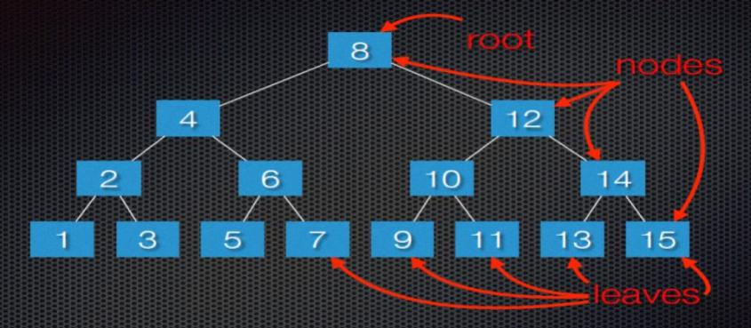
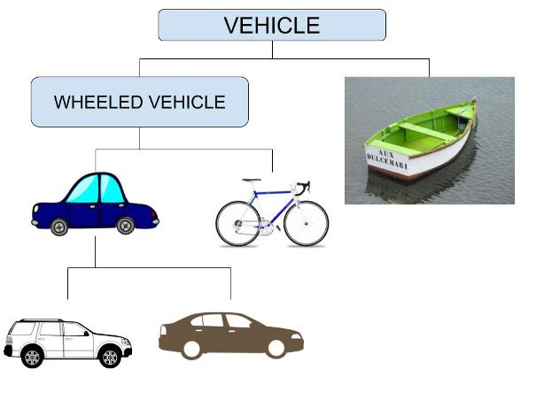
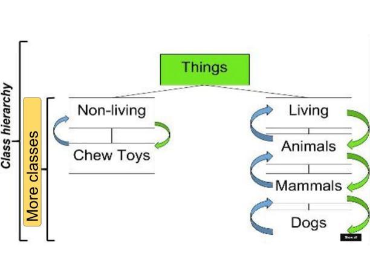

Title: Code Em Winter 2017      
Author: Josef Seiler      
Date: 2017-03-08      
category: Classes  
Tags: raspberry pi, coding, github, slack, computer science
Illustration: gears.jpg

### Week One  

`01/10/2017`  

#### How to Solve a Problem  
###### How to approach, visualize and make a plan to solve a problem  
We reviewed our general approach to solving a large problem with our example of cleaning a whole house. The thought of cleaning each room in the entire house is overwhelming **-not for long!**. Let's make it more manageable. First, *ask questions*: what is the problem? are there any special cases? Next, *look for familiar things*: if you have solved a similar problem, see if that solution can apply to the new problem. Next, *divide and conquer*: to make it seem more manageable, we strategized on how to break up the large task into smaller, more manageable ones. Finally, *make a plan (or algorithm)*: make a plan to tackle the new subsets of problems that make up the larger one; start at a subtask, finish it, then move on to the next; until the whole task is completed.  

#### Binary Search Tree  
##### How computers efficiently search through a sorted list    

I'm thinking of a number... Choose a number between 1 and 20. If your first guess was in the middle, that was a great start! Then I could say if your guess was lower or higher than the number I'm thinking of. If you continue with using that method (start in the middle of the range of numbers), then you will guess correctly, *much* faster than simply guessing : is it one? is it two? is it three? and so on, or guessing numbers randomly. Take a look at the search tree below. The tree has a range of 15.
  
Every node in the tree has a value. Do you see a pattern? The subtree to the right of its node is greater than (*>*) its parent nodes value. The subtree to the left of its node is less than (*<*) its parent nodes value.  

From here, we worked to create a random number guessing game in Python. The computer randomly chooses from a range of values, and the user tries to guess it. The bigger the range of values, the more you see how effective using the binary search method is. So, you can start to see how computers can handle large amounts of data with some simple tricks. Handling data will be a major theme in the coming weeks. Below is the gist:  

We'll come back to this concept later... We will actually build a binary search program!  
  

**Assignment One**: Try making this program continuous by adding a while loop.  

***  

### Week Two  

`01/17/2017`  

#### Python Dictionaries  

A Python dictionary (or MAP) is a collection of key-value pairs. In other words, think of Python dictionaries as glossaries or dictionaries in the real world. In a glossary or dictionary, you have words that each have their own meaning. To relate it to a Python dictionary, the dictionary word is the *key* and the meaning of the word is the *value*. We started with a class exercise to gather our data (or information). We gathered basic information about one another. The keys were categories like "last_name", "favorite_food", "lucky_number", etc. The answers to each question is the value.  

Here's an example:   

To relate the accessibility of Python dictionaries, consider an example in the real-world: You are searching for one word in a very large dictionary, glossary, or encyclopedia. You COULD search each word starting from the beginning (this would take quite a while). OR you could use different search methods: Look up the starting letter of the word (or key); this narrows your search down a bit. Now, you can just search for the word (key) in that selection to get its VALUE.  

**Assignment Two**: Make an interactive program where a user can input their information from prompts by the computer. After the user types in their responses, those values are automatically added to a dictionary.  

***  

### Week Three  

`01/24/2017`  

#### Nesting  
###### More abstraction!
You can 'store' a set of dictionaries in a list or a list of items as a value in a dictionary. Remember lists?! "Yes!"... Good! We stored our freshly made dictionaries for each classmate from last week into a Python list. This method is called nesting. Another neat trick, spreading a program you made across several different programs. You performed something like this when you made the random number game program a couple weeks ago and when we built programs using the turtle module. You simply import your program:  

`from dictionary import *`  
Remember, once you type this in a new program, you can utilize everything you wrote in the program you imported; eliminating having to write the same things over again. I say "more abstraction", because with nesting you can hide certain details of the data inside of each dictionary; moreover, when you import a program, you can use data and functions from that program without having to 'muck up the waters' with code in this new file.  

  

**Assignment Three**: try making a loop to add all your dictionaries into the list. Next week, we'll compare tuples and look into defining our own functions and loops to make things way easier.  

***  

### Week Four   

`01/31/2017`  

#### Python Tuples  

Remember our grocery list program? Python lists are great for storing sets of items that can change throughout a program's life. But, what if you wanted to create a list of items that cannot change (Python calls items that cannot change, IMMUTABLE)? This is what tuples are for! Using tuples is more efficient than using lists when you want to store a set of values that you don't want to be changed. A tuple looks just like a list, except you use a set of parentheses () instead of square brackets []. Just like with a list, once you define a tuple, you can get to each item by referencing its index position. Let's take a look at an example of tuple:  

#### Rectangle Dimensions  

If we have a rectangle that should always be a certain size, we can make sure that its size doesn’t change by putting the dimensions into a tuple. Let's say x (the width) is 200, and y (height) is 50. In other words, `dimensions = (200, 50)`  

We can access each element of the tuple just like we do with lists: `print(dimensions[0])` would return our x value. Seem familiar?  

However, if we try to change one of the values in the same we do with lists... `dimensions[0] = 370` We get an error. Why? Because values in a tuple are immutable, they can't change! What we can do is "replace" the tuple we want to change. We did this by redefining the tuple. We also learned to loop through our tuple, to have all the items in the tuple return.  

#### Tally Sticks  
##### Data  

Here's an excerpt from Wray's [lesson](https://gist.github.com/wray/35e11797609c4adb58dfba37f340ecc1): Data is at the heart of most computation. Remember, the earliest computers helped people "store" their counts - tally sticks. Today's computer systems are excellent data storage systems. So, it makes sense to learn some about how computer programs store and retrieve data.  

We started by storing mock contact records, using a tuple to define the things we want to collect:  

`contact = (‘first_name’, ‘last_name’, ‘mobile_phone’, ‘home_phone’, ‘zip_code’)`  

Well, if we had a lot of contacts to store, writing this over and over again could take a while. Instead, of writing a tuple for each contact, we defined a function to help us create contacts. Recall, **DRY** stands for Don't Repeat Yourself. We then realized we wanted to do a lot more with the items. For example, we'll want to store many contacts, add more records, delete some, and so on. So, a list would work better!  

**Assignment Four**: start trying to get these items into a list. Start with an empty list, then add to it using list functions we've learned.  

### Week Five   

`02/07/2017`  

#### Lists Over Tuples  

Lists over tuples, at least in this case. So, we realized we can do a lot more with a list than we can with a tuple. Remember, we can change items in a tuple, but we can with a list. Here's are starting list:  

`contacts = []` now, we just add to the list.  
`contacts.append(create_contact("John","Doe","804-555-1235","804-555-1236"))` and so on.  

**Assignment Five**: Create a loop to ask for contact data from a user. You may recognize a similar tactic we used when we made our grocery list program. There, we had our program accept input from a user and had the program add to our list, whatever the user typed in.

Next week, we'll go back to nesting, then come back to Wray's lecture on data!  

***  

### Week Six  

`02/14/2017`  

#### Make the Data 'Reachable'   

So, we have our stored data in a list. Now we'll try to use this data, or search it. A list (or dictionary **HINT**) can contain millions of items. Python has a way we can search large amounts of information. We've already tried our hand at loops and conditionals, so let's create a simple search by first name. Take a look at the Gist on GitHub, starting at line 46.  
  

***  

### Week Seven

`02/21/2017`  

#### Nest a List in a Dictionary  
Recall from Week two and three: we have already made a few dictionaries and are familiar with how to access information from them. Anytime you want more than one value associated with a key, go ahead and nest a list inside that dictionary. We completed a good example of how to do this. Consider describing a pizza someone wants to order. Sure if you used a list, you could store a list of the pizza toppings; however, you can use a dictionary to effectively describe absolutely everything on the pizza. For our example, two kinds of information are being stored for each pizza; type of crust and a list of toppings.  

Here's the gist:  

  

Included in the gist is our example of the favorite programming languages poll; now, with nested lists.  

Below, the slides from this class if you want a little review with some nice visuals.  
<iframe src="https://docs.google.com/presentation/d/1dBi-DF9wLJTLOB1OhBlwrP7Ppg8iTO35VROwwCc5j8w/embed?start=false&loop=false&delayms=3000" frameborder="0" width="480" height="299" allowfullscreen="true" mozallowfullscreen="true" webkitallowfullscreen="true"></iframe>  

**Assignment Six**: Make your pizza program interactive. We had nice practice with this last year in our grocery list program. Have your program request user input to build a pizza using while loops. Ideally, you can pass your program to someone to build their own pizza and see the type of pizza they built looped back to them. Next week we'll finish up nesting and become masters at user input and while loops!  

***  

### Week Eight    

`02/28/2017`  

#### User Input  

Most programs are created to solve a problem. This is why we started this session with displaying techniques for solving problems by breaking them down into smaller, more manageable ones. We continue this theme throughout our session together. To understand the problem, we usually look to who has the problem and what their problem is. I'd bring up use-case (just did!), but we'll work up to that. Instead, just think; in order to solve a user's issue, we usually need to get information provided by the user. I personally think it is more fun and engaging to write programs which ask the user for input and you do something with that input. We have already had a little experience writing programs that take user input when we wrote our grocery list and text adventure programs. We started our look towards user input by running through several programs:  

  

 **Assignment Seven**: Now that you have a good grasp on how to get input from a user. Revisit your pizza program once again and add the techniques we learned in class. If you are over pizza, check out the other challenge in the slides from last week's blogpost. Write an interactive program that prompts the user for input on their favorite cities and fill in a dictionary with that input. This is done in a similar style as the pizza program (nesting a list in a dictionary). **BONUS**: taking input is great, but sometimes it ends before you want it to. Try your hand at adding a while loop to keep the program running as long as the user wants it to. Check out the [gist](https://gist.github.com/joetechem/99d51badbd674b0e3d60aefa7170694a) on GitHub to help you get started on while loops.  

#### [New Summer Camp Schedule](http://register.techemstudios.com/)    

***  

### Week Nine  

`03/07/2017`  

#### While Loops  

In most programs, `while` loops are used to keep a program running, as long as certain conditions are true. We started out with a simple counting program that starts counting from a number (adds to the number). Python will keep adding to the number until it is less than or equal to a certain number. Then we added to the program, a `while` loop and `continue`. Once, Python runs through the code in the loop once. When it comes to the `continue` statement, Python again starts from the beginning of the loop. This process is repeated until the number we specify is finally reached. Some of you noticed that this program could be useful to mock as a timer in a game!  

`current_number = 0`       
`while current_number <= 10:`     
`    current_number += 1`    
`	if current_number % 2 == 0:`    
`		continue`    
`	print(current_number)`    

In the counting program, we went over a new operator in Python, modulo. This operation performs division of two numbers, but returns the remainder.  

Check out the slides from tonight's class:  

<iframe src="https://docs.google.com/presentation/d/1l1C7IXf4p9GenKdDELQLLSrPkZULozX1HsvWfYVGwWU/embed?start=false&loop=false&delayms=3000" frameborder="0" width="480" height="299" allowfullscreen="true" mozallowfullscreen="true" webkitallowfullscreen="true"></iframe>  

 **Assignment Eight**: Write a program using a while loop that asks for user input to fill in a dictionary. In class, we did this to fill a list. The dictionary can be anything you want it to be! Look earlier in this post to get some review on dictionaries if you need to. Remember to use Slack if you have any questions!      

***  

### Week 10  

`03/14/2017`  

#### Object-Oriented Programming (OOP)  

Or object-oriented development(OOD) has the main idea of viewing a complex system as being a collection of simpler objects that communicate with each other. This is one of the most effective practices in writing software and is great for modeling occurences in the real-world. We quickly went through some vocabulary we'll find in OOP: Classes, Objects, Attributes, Methods, Instantiation, etc. Instead of getting bogged down in definitions, we took a look at a few examples.  

When you think of the term, "vehicle" you might think of it as something that you can use to take you somewhere, i.e. a car, boat, or bicycle. Well, all these have attributes that are little different, but they are similar in that they are considered a vehicle. When we compare the car and the bicycle to the boat, we can say the car and bicycle are different from the boat, because they are "wheeled" vehicles. We can compare the car to the bicycle and see that one requires gas and the other doesn't. We can go further and compare cars to one another; some are SUVs, others are sedans and so on. Each type of car has their own unique properties and things it can do, but their similarities can be traced back to being a general car, wheeled vehicle (like a bike) and a vehicle (like a boat). So, you can see how we can model almost any real-world thing using this approach. That can be a lot to follow, so here's the same example displayed as picture:  

  

We took a look at another example, where we compared a dog to a sidewalk. How can they be similar?! Well, both are things or nouns. In Python, we call them objects. We categorized this example further using a similar approach as before. We started with the category (or class) "Things" and created sub-classes. When we define a class, we tell Python what general behavior all the sub-classes and objects will have. Objects have their own properties and functions. A dog is living so it is part of the class Animate. A sidewalk or a dog's chew toy are non-living, so it is part of the class Inanimate. We put this example to the test by creating and defining a class for a dog (in general) in Python.   

  

  

 **Assignment Nine**: Try categorizing something you collect or interests you by defining it in a class and use an example to test some of the methods and attributes you made that make up that class. You can model it from the gist example we worked on in class.    

***  
