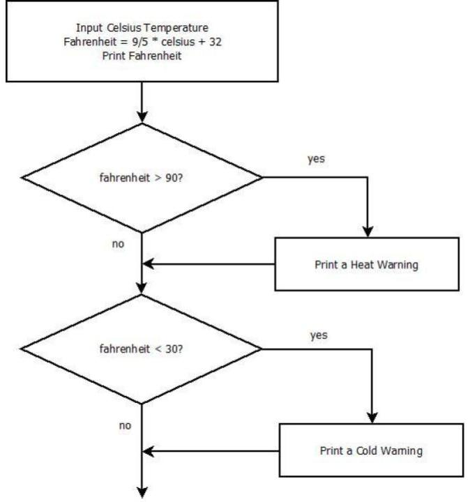

Title: Code Em Winter 2018    
Date: 2018-01-09  
Category: Classes  
Tags: computer science, coding, github, slack, raspberry pi, technology  
Illustration: raspberry-pi.jpg  
Author: Josef Seiler  
Summary: Concepts and Homework  

### Day One  

`Week of January 8th, 2018`  

This blog will be used for both the Tuesday and Thursday night class. I will try to clearly show separations between each night where needed.  

## Happy New Year!  

  

## What We'll Do  

During this winter session of Code Em we will learn by doing! We will learn new concepts and solidify concepts we have come across before by taking a project-based approach during the twelve weeks. To name a few, project topics can include (not limited to): device building and programming with the [Raspberry Pi](https://www.raspberrypi.org/), robot creations, 3D printing, [Pi Soundboard](http://blog.techemstudios.com/how-to-make-a-raspberry-pi-soundboard.html), Python game design with [Pygame](http://pygame.org/news), web applications, ethical hacking with Pi Zero or [Kali Linux](https://www.kali.org/), Minecraft Modding with Java, Alexa skills, [PiLexa](http://blog.techemstudios.com/make-a-raspberry-pi-powered-alexa.html) and visual-based programming projects like [Scratch](https://scratch.mit.edu/) and [Hopsctoch](https://www.gethopscotch.com/).  

The goal is to have one or several awesome projects by the end of our twelve weeks together. After completing projects, we will make sure we are comfortable enough with the stuff we learn to continue beyond the class.  

While working on projects, students will have the opportunity to gain or expand their knowledge through a variety of programming languages and projects based on experience level, building from visual-based languages to text-based, like Python etc. They will learn source code control, software design, reverse engineering, bug resolution, and coding environments. [^1]  

Whether we work in groups or individually during the weeks, we will always work with someone, i.e. instructors/mentors. To ensure this, we will use two key resources for help and teamwork: [Slack](http://blog.techemstudios.com/slack.html) & [GitHub](https://github.com/); both great tools for team collaboration. Slack is a messaging app and GitHub will serve as a place to save and keep track of all project work. We will use Slack to ask questions and collaborate on projects. We will use GitHub to save all our work to, keep track of projects, as well as help one another to solve any issues. **You will need an accessible email account.** Which bring us to our first assignment!  

## Assignment 1  
Create a new account for [Slack](https://slack.com/) and [GitHub](https://github.com/join?source=header-home) --you will need to verify the email address you sign up with for both. Don't forget your usernames and passwords! Once you have your own Slack and GitHub account, email your usernames to class-info@techemstudios.com or joe@techemstudios.com, so we can add you to the class' Slack team. For those that already have both accounts, just make sure you can log into them! For more direction on joing the team on Slack, check out the intro to slack blog [here](http://blog.techemstudios.com/slack.html).  

   

Next week, we will narrow down project ideas and get our hands dirty.  

### The Random Number Game  
#### What is Code?  

On Thursday night, we took the random number game we have all played before and put it into a Python program using the chromebooks. Think of *code* or *coding* as a way to represent something, just in a different way. Here, we simply took a real-world game and used Python to represent it. Code is a way for conveying information between people; in this class, between people and machines. Code helps us communicate. You use code everyday without thinking about it, i.e. when you talk with someone, or when you write or read something --speech and text are considered code. So, you have been coding almost all of your life! Throughout class, we'll learn different ways to *code*.  

We briefly talked about the fastest way to guess the correct number in a random number guessing game. We can divide the range of numbers in half on each guess. If the range is between 1 and 100, we can guess 50 first. If 50 is higher than the number picked, we now know the number is between 1 and 50, so we cut the range of possibilities in half! Then we can divide the range further by asking if the number is 25, and so on. This technique is how computers search through an ordered list, **binary search**.  

***  

```python  
import random

number = random.randint(1, 100)
print("I'm thinking of a number between 1 and 100.")
GameRunning = True

while GameRunning:
    guess = int(raw_input("Guess a number between 1-100: "))

    if guess == number:
        GameRunning = False
        print("You guessed correctly!")
        
    elif guess > number:
        GameRunning = True
        print("Your guess was too high!")
        
    elif guess < number:
        GameRunning = True
        print("Your guess was too low!")
```  

When you begin to write a program, it can seem overwhelming at first. We will learn some techniques in a general software development process and learn how to break up large problems into small parts to tackle them individually. We'll do a deep dive into all the syntax, methods, data types and more, involved with programming languages throughout the session. For now, I'll try to lay out each part of this program in a plain way:  

Looking at the program above...  
`number = random.randint(1, 100)` tells the program to choose a random integer between the range of 1 and 100 and put it into a variable, `number`.  

The next line uses Python's `print()` function. This function tells the program to display to the screen whatever is inside the parentheses. So, when the program is executed, the user understands the computer is *thinking* of a number between 1 and 100.  

`GameRunning = True` is a variable equal to True. We will use this to either end the game or keep playing the game.  

`while GameRunning:` is a loop (something that repeats). Any indented line underneat this will repeat as long as GameRunning is True.  

`guess = int(raw_input("Guess a number between 1-100: "))` Displays to the user what is in between the quotes, pauses the program, and waits for the user to enter an integer.  

The next three *blocks of code* are **conditional statements**. These check whether the user chooses the correct number, a number higher, or a number lower than the random number originally picked. The program will keep waiting for the user to enter a number, until they enter the exact number chosen by the program in the beginning. Then the program will end, because of our condition: **if** the `guess` is exactly equal to `number`, **then** `GameRunning = False`.  

***  

* **Python -** a programming language relatively easy to understand and write.  
* **Variable -** associates a name (variable) to a value (expression), so `<variable> = <expr>`  
* **Loop -** Something that repeats.  
* **Condition -** Tells the program to make a decision based on if something is True or False.  
* **Binary Search -** How a computers searches through an ordered list.  

* **Relational Operators -** Python compares what's on the left to what's on the right; usually used in a condition statement.  

    - Equal to: `==` 
    - Less than: `<`  
    - Greater than: `>`  

Don't worry if this all seems foreign to you (or you feel rusty)! Together, we'll learn by doing and practice, until it becomes second-nature.  


***  

[^1]: [Register.TechEmStudios.com](http://register.techemstudios.com/item/code-em)     

***  


### Day Two    

`Week of January 15th, 2018`  

[MLK Day](https://www.google.com/doodles/martin-luther-king-jr-day-2018)  

## Start Projects  

This week, we started work on a few different goals. As is the case for almost every Tech Em class, there are varying levels of experience. We broke off into groups based on experience level and interest:  

New students (new to Code Em) started work on a *starter* project to create a calculator program in Python with the end goal of using [Turtle graphics](https://docs.python.org/2/library/turtle.html) to *draw* out the result. Students started work on their foundation in computer science and coding with an introduction to coding using the [Python](https://www.python.org/) programming language.  

[Here is a link to the calculator program on GitHub](https://gist.github.com/joetechem/c72df34a62fd416e1a0dc122bffa3335)  

We will be working with Python quite a bit throughout class. It is free and available at [python.org](https://www.python.org/). You can continue to work on this project and/or practice more with Python at home by downloading Python from the link.  

Returning Code Em students grouped up to either work on building a minecraft server on a Raspberry Pi, or started plans for a hands-on hardware project involving the [Raspberry Pi Zero](https://www.raspberrypi.org/products/raspberry-pi-zero/).  

Other students started work on a visual-based coding app, [Scratch](https://scratch.mit.edu/).  

***  

## General Objective Outline    

Every project needs a plan. To ge the most out of each project, each day we will work on following an objective list. Another end-goal for each project is to create an easy-to-follow tutorial on whatever project you are working on. After each project is finished, we will publish these tutorials to the [Tech Em blog page](http://blog.techemstudios.com/) so others can replicate the steps you took!  

Documenting your projects as you work on them will do a few useful things; help you understand what your are doing, keep track of where you are in the process, and help validate your project. The key is to log your work, so that other interested folks can learn what you did by following steps you took to get the same result. Similar to science experiments! --which you may have learned about already.  

***  

## Assignment 2  

Make sure you have a GitHub and Slack account you can log into, and that you have been added to our class Slack Team. If you need help getting on the team, send an email to class-info@techemstudios.com.  

Once on the Slack team, post your first message to break the ice! Post a relevant tech fact or personal experience in the `# code_em` channel (e.g. I have been learning HTML on my own, or I prefer to use an iPad over a laptop, or my basketball team won a game recently, etc.)  

Next week, we'll get started on creating our own GitHub repositories for each group to contribute to.  

Enjoy the snow!!!  

***  

### Day Three  

`week of 01/22/2018`  

## Practice!  

If you do not have access to Python at home, you can download it free from [python.org](https://www.python.org/), or in an internet browser via [PythonAnywhere.com](https://www.pythonanywhere.com/). For either options, you can follow instructions on help setting up your environment to practice at home [here](http://www.allendowney.com/wp/books/think-python-2e/).  

### Project Updates  

* Scratch Project  
    - We continued building our Scratch program portfolio by coding mini interactive games.  

* Python Turtle Calculator    
    - The link to the [GitHub gist](https://gist.github.com/joetechem/e5a213b8d44e8c6ca71fd8224ac64df3). This gist outlines all the steps for the groups working on the Python Turtle Calculator project, completed during class. There are some challenges found here, where the groups from Tuesday and Thursday night can check out for more practice as well. We also took our first steps in learning Version Control via GitHub.  

* Robot Project  
    - We laid out a list of all the materials we need for the project: Pi Zero, pimoroni pHAT, DC motors, wheels, etc. Students create their own sketches of unique design builds. We'll incorporate 3D design and printing for this project  

* Minecraft Pi Server  
    - This group fired up a Raspberry Pi and tested their script setup for a running server. We also tested connecting to the server from other devices; outcome: success! 

All groups continued their documentation of steps taken to help prepare for creation of the project's [README](https://open-source-guide.18f.gov/making-readmes-readable/) and brainstormed their next project endeavour, e.g. website app, minecraft modding, music and sound projects etc.  

***  

<center>  

*to be continued: day four & five*  

</center>  

***  

### Day Six  

`week of 02/12/2018`  

## Quick Review & Look of Python  

Thursday night we did a quick a review and quickly went over some core concepts in Python. Though we only scratched the surface of some, we will get to those in more detail in the following projects. First, we dove into the Python Interpreter, a place where you can quickly try out and test ideas without having to create, save, and run a program. We also introduced some useful built-in functions, like `type()`.  

By the end of our last project, we practiced many of these concepts already. The point of the *quick* review and intro was to ensure we are ready to move on to bigger things, confidently!  

#### Concept Highlights  

* Data Types (found in every language):  
    - Integers (INT)  
    - FLOATs  
    - STRINGs (STR)  
    - Boolean (BOOL)  

* Data Structures:  
    - Lists  
    - Dictionaries  
    - Tuples  

Below, the content we went over during the first part of class:  

<center>  

<iframe src="https://docs.google.com/presentation/d/e/2PACX-1vQOz_zbnRaEQZRCRuZ5f3feEzvudkCIxoRUHkUfhRzgoJloihVmNqVG6kVyfK-p0YV7SI4S06dbE7Uj/embed?start=false&loop=false&delayms=3000" frameborder="0" width="640" height="496" allowfullscreen="true" mozallowfullscreen="true" webkitallowfullscreen="true"></iframe>  

</center>  

## Program Planning  

We talked about pseudocode as a way to plainly write out what is happening, line-by-line in a program. We will get to a point where this is second-nature. We also sketched a quick *program flow* of part of our next mini-project, a temperature converter program complete with temperature warnings, where we will add a user interface to interact with.  

<center>  



</center>  

## Assignment 6  

We started drawing out our program's flow towards the end of class, so finish flow drawing outside of class. See if you can make a program flow for another program you've already created or a new one.  

***  

### Day Seven  

`week of 02/19/2018`  

We picked up where we left off last week, understanding a program's *flow*. The simple temperature program takes input, handles the input, and outputs the result. Instead of laying out formal steps, we checked out how this program would look with *pseudocode*. Pseudocode is simply writing (in English) a desrciption of what a program does.  

```  
Receive user input, a temperature in Celsius.
Convert the celsius temperature into fahrenheit.
Output the fahrenheit temperature.
```  

Looking at a program in plain english can help you begin to write it in a computer programming language, like Python:  

```python  
# A function that takes celsius temp input,
# converts the input into fahrenheit,
# then outputs the fahrenheit temperature.

def main():
    celsius = int(raw_input("What is the Celsius temperature? "))
    
    fahrenheit = 9/5 * celsius + 32
 
    print("The temperature is "+ str(fahrenheit)+ " degrees fahrenheit.")

main()
```  

## Assignment  7  
Add conditionals to the temperature converter program by adding temperature warnings, based on whether the fahrenheit temperature output is hot or cold. Check out the program flow diagram from earlier.  

Part of the pseudocode might look something like: "if fahrenheit is more than 90, then return temperature warning."  

***  

### Day Eight    

`week of 02/25/2018`  

## Mad Libs  

You can create fun, interactive programs! The class got started with an executable program asking input for a series of nouns, verbs, and adjectives. The program then inserts those answers into a story. Students received some funny results! We then changed up the program to make it our own.  

The mad libs program:  

```python  

food =raw_input('Enter a food: ') + ','
adj1 = raw_input('Enter a adjective:') + " "
adj2 = raw_input('Enter another adjective: ') + " "
noun = raw_input('Enter a noun: ') + ','
verb = raw_input('Enter a verb present ending in ing: ') + ','
noun2 = raw_input('Enter a noun plural: ') + ','
noun3 = raw_input('Enter another noun plural: ') + ','

print("\n")

print("With a new beginning and a fresh piece of " + food)
print("Full of inspiration and " + adj1 + " thoughts, ")
print("lets begin this year with a " + adj2 + noun)
print("Gone are the days of regret and " + verb)
print("These rooms full of " + noun2)
print("It's time to move with courage, ")
print("Full of confidence and " + noun3)
print("Let's begin this year with a " + adj2 + noun)
```  

By setting expressions as a value in a variable, we can see how that is useful for when we manipulate them later.  

## Assignment 8  

Create your own version of a Mad Libs in Python. Bonus: save this program in your own GitHub repository.  

***  

### Day Nine    

`week of 03/05/2018`  

## User Interface  

So far our programs' output has been text-based. There are several tools to use in Python to have your programs output be *aesthetically* pleasing. One of which is a [simple graphics library](https://ocw.mit.edu/courses/electrical-engineering-and-computer-science/6-189-a-gentle-introduction-to-programming-using-python-january-iap-2011/assignments/graphics.py) written by John Zelle. Students from the fall session of Code Em probably remember checking this out. This program uses a fundamental concept in programming, **Object-oriented** programming/design (OO). We first dove in by writing a program that registers mouse clicks. Look to [last session's blog](http://blog.techemstudios.com/code-em-fall-2017.html), starting at Day Nine.  

## Adding a GUI to our Temperature Converter  

After reviewing some basics of OO, we started to set up some graphical user interface (GUI) for our simple temperature converter program; complete with text input from a user and clickable buttons.  

We will finish this next week, and move onto final projects.  

### The temp converter gui code  
<script src="https://gist.github.com/joetechem/cecf74583b2ff859ec2a7012a20aaa5f.js"></script>  

## The <span style="color:red">R</span><span style="color:orange">O</span><span style="color:yellow">Y</span><span style="color:green">G</span><span style="color:blue">B</span><span style="color:purple">I</span><span style="color:violet">V</span> Guessing Game  

A fun program where we learned a little more about what we can do with lists, functions, loops, random, and importing modules. Below are the steps in the terminal we took during class to get started. Check out the repo [here](https://github.com/joetechem/roygbiv).  

#### Terminal commands to get started with roygbiv  
```bash  
git clone https://github.com/joetechem/roygbiv  
cd roygbiv
geany v2_roygbiv.py
```  

When we run **v2_roygbiv.py**, we got an idea of how the game works. Then, we added new features to the game with a few lines of code to change the user experience. Inside the **src** folder, you can see each feature added in steps.  

## Assignment 9  

Explore drawing graphics using [graphics.py](https://ocw.mit.edu/courses/electrical-engineering-and-computer-science/6-189-a-gentle-introduction-to-programming-using-python-january-iap-2011/assignments/graphics.py). Make a program or two, which use objects from this file to output any graphic. You can copy and paste the code into a file called, graphics.py. Be sure your program knows where to grab graphics.py (you can save it in the same directory/folder). *AND/OR* If you were not able to take the temp converter gui handout home with you, click the GitHub gist above to get it running at home. You will see it has a basic look to it; tweak the code to add colors, or other features, and upload your file to your own GitHub repo.  

For those that have not created a GitHub account and are not on the Tech Em Students Slack team, please do so! This will be important for saving and keeping up to date with projects, as we are approaching the end. See earlier on this page for more details. In short, once you have created a GitHub account, email your username class-info@techemstudios.com, and you will be added as a collaborator to our class project and added to the class Slack team.  

***  

### Day Ten      

`week 03/12/2018`  

## Python SlackBot  

### Class Project's Starting Steps  

As we continue to merge our project endeavours, we started class this week with a discussion on **voice-controlled personal assistants**. In other words, [Amazon Alexa](https://developer.amazon.com/alexa), [Apple Siri](https://www.apple.com/ios/siri/), [Windows Cortana](https://www.microsoft.com/en-us/windows/cortana), etc. These and others like it, have been developed (and continuing to be developed) to help users (humans) interact with technology a little more naturally, with voice.  

One of our final projects we'll be working on together will follow closely in-line to the above. Instead of voice-controlled, yours will be a *text-controlled* personal assistant, which runs on a Raspberry Pi!! To achieve this, we will learn how to use tools used by **real** software developers!  

*We'll get to know these tools well, during the coming weeks.*    

## Command-Response Program  
### Create your own Local ChatBot  

Our first step in developing our DIY personal assistant, involved us writing a program that receives input (we'll call these *commands*), processes them, then returns a response. In short, you will conduct a program to return a response based on user input.  

--just like the widely used personal assistants (Alexa, Cortana, and Siri) mentioned before.  

#### The starting code for the python command response program  
```python  
# Put your commands here
# Keep the values lowercase
COMMAND1 = "what?"

# Your handling code goes in this function
def handle_command(command):
    """
        Determine if the command is valid. If so, take action and return
        a response, if necessary.
    """
    response = ""
    if COMMAND1 in command:
        response = "Huh?"

    else:
        response = "Why thank you, I don't know what else to say."
    return response

print ("Hi, I am sirexa, your own personal bot. Awaiting your command.")

while True:
    command = raw_input('\nsirexa -> ')
    response = handle_command(command)
    print response
```  

This starter template knows how to respond to only one command, `COMMAND1`. So, when we ran this code, typed in `what?`, and hit the enter key, it would respond with `huh?`. For anything `else` you enter, the program responds with a generic "I don't know" response, because you have not coded it to handle more than one command!  

Just as when a real *user-controlled* personal assistant is powered on, it continously waits for user input to respond to. So, in our program, we have a Python `while` loop which also continously waits for user input/more commands. 

We spent the rest of class making our chatbots *smarter*, by adding more commands and **handlers** to respond to those commands.  

#### Here is an example of how we added more commands and handlers  

```python  

COMMAND1 = "what?"
COMMAND2 = "what are you waiting for?"

def handle_command(command):

    response = ""
    if COMMAND1 in command:
        response = "Huh?"
    if COMMAND2 in command:
        response = "I am waiting for students to add more commands!"

    else:
        response = "Why thank you, I don't know what else to say."
    return response
```  

## Assignment 10  

Voice-controlled assistants are able to stop waiting for user input once they are told to (i.e. *"Alexa, stop"*). Code your command-response program to stop running, by adding a "quit" command that makes the program stop running. Add this code to your own GitHub repository.  

***  

### Day Eleven & Twelve  

`weeks March 19th & 26th`  

# The Power of Python!!!  
## Class SlackBot Project  

### Team Collaboration   

As we discussed during the previous weeks, *we'll be working on together will follow closely in-line to the above. Instead of voice-controlled, yours will be a *text-controlled* personal assistant, which runs on a Raspberry Pi!! To achieve this, we will learn how to use tools used by **real** software developers!*  

Our first steps were to edit code in your individual command-response program *(see the python code from last week)*. The next steps are to aggregate everyone's code onto one single GitHub repository. This will allow us to actively co-operate on our class project while in class, as well as anywhere!  

<center>  

# SlackBot Project Overview  


<iframe src="https://docs.google.com/presentation/d/e/2PACX-1vTjviS2srWmauwn5X6CdoctInRbmr7LY6f2cvzVaMMBVbShVW4GoLTcktoUtzVqFi038tNQOMXaF0_q/embed?start=false&loop=false&delayms=3000" frameborder="0" width="640" height="496" allowfullscreen="true" mozallowfullscreen="true" webkitallowfullscreen="true"></iframe>  

</center>  


