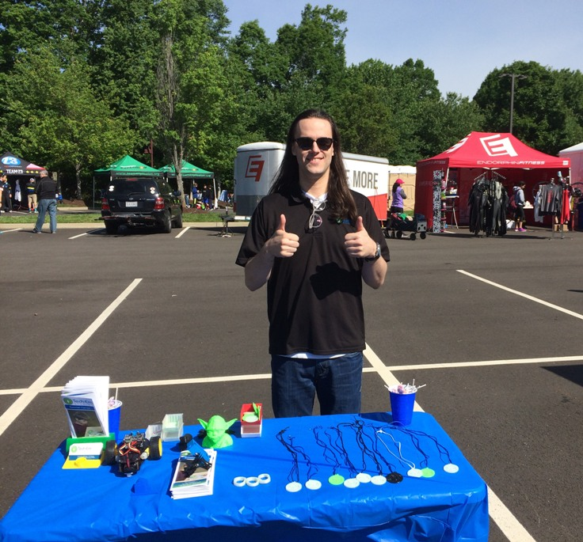
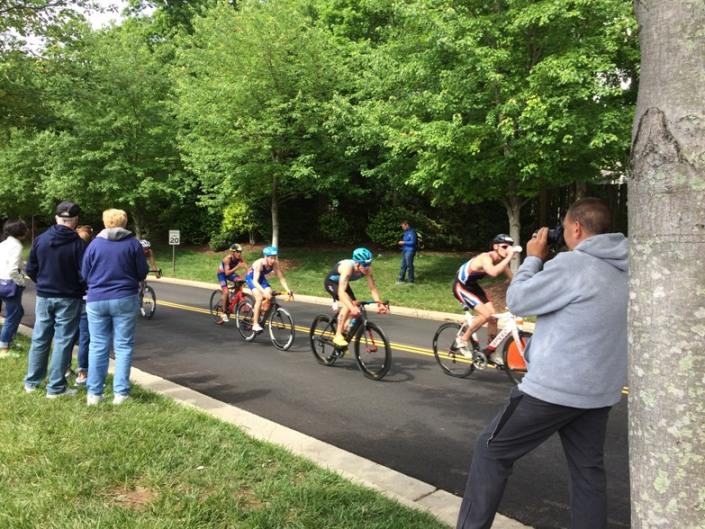
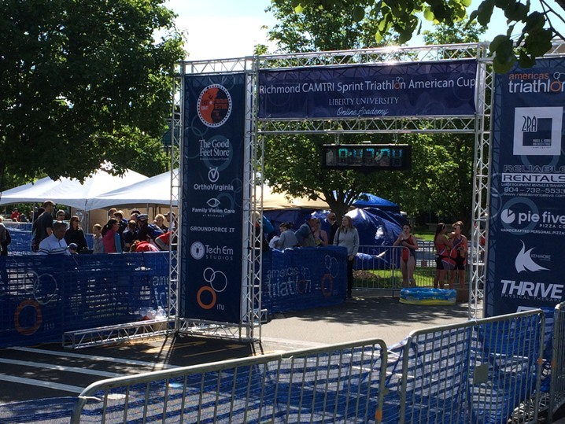
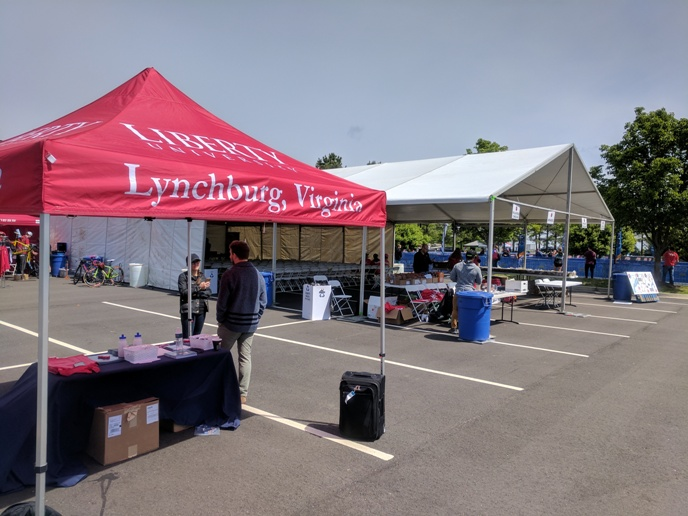
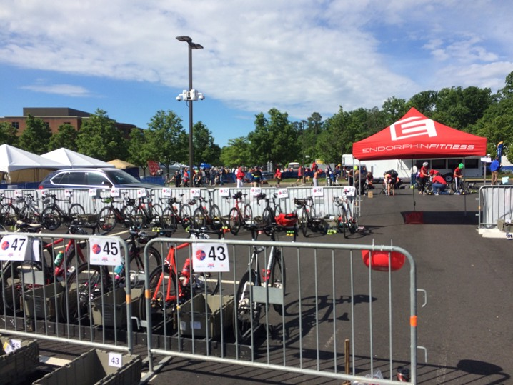
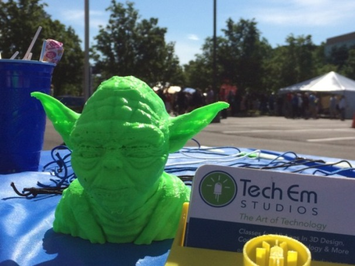
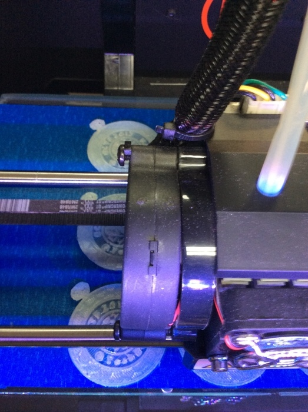
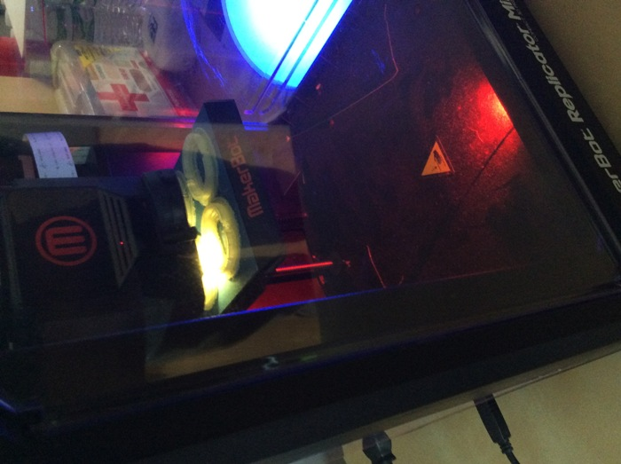
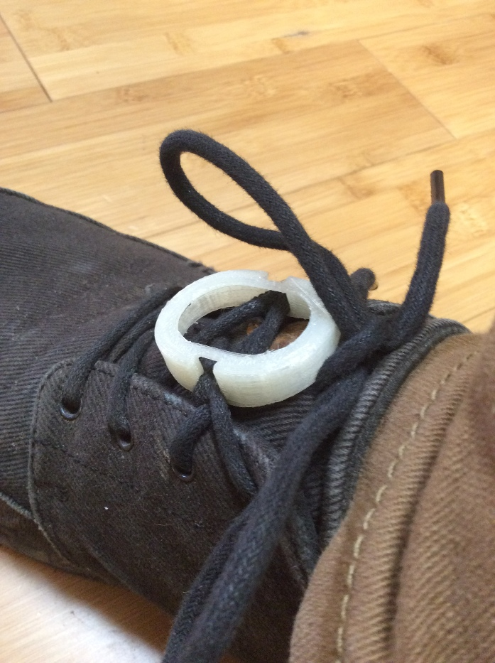

Title: Tabling Event at East Coast Triathlon Festival           
Author: Josef Seiler        
Date: 2017-05-08        
category: General    
Tags: 3D Printing
Illustration: ectf_tent.jpg   

### Tabling Event East Coast Triathlon Festival  

***  

#### Tech Em Studios Sponsors Endorphin Fitness  

On May 7th, Tech Em Studios participated in a tabling event at the East Coast Triathlon Festival (ECTF)! This was a full day event sponsored in part by Tech Em Studios. The endurance competition started bright and early at 7am with the Super Sprint Race Start. Athletes in teams as well as solo athletes competed in classic multi-stage events of swimming, cycling and running. The participants' training for this event was tested and showed true grit, bravo!  

Tech Em had a table set up at the ECTF complete with 3D printed race medals, 3D printed show lace supports, robot projects, business cards, Tech Em Summer camp brochures, and a shout out from the race microphone controller!  

  

***  

More information on the [East Coast Triathlon Festival](http://www.endorphinfitness.com/races-eventseast-coast-triathlon-festival/).  

To see the content of the brochures from the Tech Em Studios table, check out the link [here](http://register.techemstudios.com/).   

***     

Below are a few shots from Studio preparation and shots from Sunday's event:  

### Event Photos  

  

  

  

  

  

### Prep Photos  
#### 3D Printing  

  

  

  
