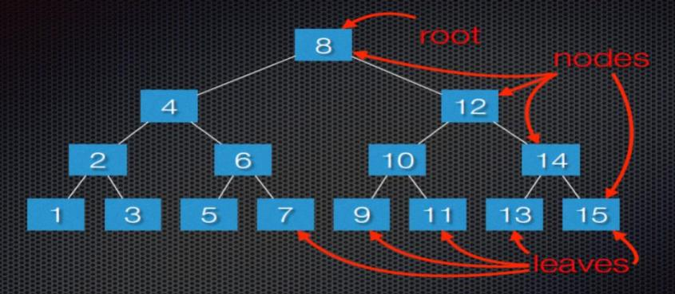

Title: Homeschool Computer Science and Programming Winter 2017       
Author: Josef Seiler  
Date: 2017-02-21      
category: Classes  
Tags: computer science, python, code, github, slack   

### Week One    

`01/12/2017`  

#### How to Solve a Problem  
###### How to approach, visualize and make a plan to solve a problem  
##### As a Class:  

We reviewed our general approach to solving a large problem with our example of cleaning a whole house. The thought of cleaning each room in the entire house is overwhelming, **not for long!**. First, *ask questions*: what is the problem? are there any special cases? Next, *look for familiar things*: if you have solved a similar problem, see if that solution can apply to the new problem. Thirdly, *divide and conquer*: to make it seem more manageable, we strategized on how to break up the large task into smaller, more manageable ones. Finally, *make a plan (or algorithm)*: make a plan to tackle the new subsets of problems that make up the larger one; start at a subtask, finish it, then move on to the next; until the whole task is completed.  

#### Binary Search Tree  
###### How computers efficiently search through a sorted list    
##### Group One:  

I'm thinking of a number... Choose a number between 1 and 20. If your first guess was in the middle, that was a great start! Then I could say if your guess was lower or higher than the number I'm thinking of. If you continue with using that method (start in the middle of the range of numbers), then you will guess correctly, *much* faster than simply guessing : is it one? is it two? is it three? and so on, or guessing numbers randomly. Take a look at the search tree below. The tree has a range of 15.
  
Every node in the tree has a value. Do you see a pattern? The subtree to the right of its node is greater than (*>*) its parent nodes value. The subtree to the left of its node is less than (*<*) its parent nodes value.  

From here, we worked to create a random number guessing game in Python. The computer randomly chooses from a range of values, and the user tries to guess it. The bigger the range of values, the more you see how effective using the binary search method is. So, you can start to see how computers can handle large amounts of data with some simple tricks. Handling data will be a major theme in the coming weeks. Below is the gist:  

We'll come back to this concept later... We will actually build a binary search program!  
  

**Assignment One**: Try making this program continuous by adding a while loop.  

#### What is Technology?  
###### Setting up for Computer Science Talks  
##### Group Two:  

So, What is technology? Is a chair or table technology? How about a sink? The answer is, all those items are technology! Technology are things created by humans to make our lives easier and/or solve problems. Some technology comes with instructions. For instance, new toys (e.g. Legos), bicycles, etc. come with instructions on how to put it together and how it works. Some technology, like phones, computers, iPads come with directions already inside of it. Someone (a person) had to write those directions (instructions) to tell that technology what to do. This is known as a computer program, step-by-step instructions on what to do. Computers only do what they are told to do! We talked about the difference between hardware (the physical stuff) and software (games/programs). We drew a computer on a piece of paper and labeled its parts. We defined which parts of the computer are input devices and which parts are output devices. To get used to telling a computer what to do and to further our learning in computational thinking, we started creating instructions for a robot to carry out, using the app, Lightbot.  

***  

### Week Two  

`01/19/2017`  

#### Making an Algorithm  
###### Step-by-step instructions to solve a task  

We discussed the steps involved to make a peanut butter and jelly sandwich! We talked about how together, these steps make up a sequence of instructions. If these steps are followed, you end up with the result of having a pb&j sandwich. You can also call this an algorithm. An algorithm is step-by-step instructions that are followed to complete a task or solve a problem.  

#### Python Dictionaries  
##### Group One:  

A Python dictionary (or MAP) is a collection of key-value pairs. In other words, think of Python dictionaries as glossaries or dictionaries in the real world. In a glossary or dictionary, you have words that each have their own meaning. To relate it to a Python dictionary, the dictionary word is the *key* and the meaning of the word is the *value*. We started with a class exercise to gather our data (or information). We gathered basic information about one another. The keys were categories like "last_name", "favorite_food", "lucky_number", etc. The answers to each question is the value.  

Here's an example:   

To relate the accessibility of Python dictionaries, consider an example in the real-world: You are searching for one word in a very large dictionary, glossary, or encyclopedia. You COULD search each word starting from the beginning (this would take quite a while). OR you could use different search methods: Look up the starting letter of the word (or key); this narrows your search down a bit. Now, you can just search for the word (key) in that selection to get its VALUE.  

**Assignment Two**: Make an interactive program where a user can input their information from prompts by the computer. After the user types in their responses, those values are automatically added to a dictionary.  

#### Creating an Algorithm  
##### Group Two:  

We started with a jumbled set of steps to complete the task of planting a seed. We arranged the steps in the order that made the most steps. We found that we could omit certain steps, because they did not help in completing the task. We then reviewed procedures form Lightbot. Procedures in Lightbot are just like functions used in computer programming. If you recognize a pattern, go ahead and make that pattern part of a procedure, or function. You can then reuse the procedures to use less instructions to get to the end result thus, making the overall set of steps more efficient!  

***  

### Week Three    

`01/26/2017`  

#### Simulate a Program  

What happens when you fire up your favorite program or game? Fetch, Decode Execute! We simulated what happens inside of a computer by playing the parts of a program, bus, and CPU (central processing unit). The Bus connects all the components of a computer, the program contains a list of instructions that perform some action, and the CPU is the "brain" of the computer; it carries out the program's instructions. This was our *watered down* process: CPU tells the bus to fetch the instructions from the program; the program gives the instructions to the bus; the bus gives the instructions to the CPU; then, the CPU decodes and executes (carries out) those instructions! This Fetch, Decode, Execute cycle happens from the moment you power on your machine. We are able to get the computers increasingly efficient at this process.  

#### Nesting  
###### More abstraction!
##### Group One:  

You can 'store' a set of dictionaries in a list or a list of items as a value in a dictionary. Remember lists?! "Yes!"... Good! We stored our freshly made dictionaries for each classmate from last week into a Python list. This method is called nesting. Another neat trick, spreading a program you made across several different programs. You performed something like this when you made the random number game program a couple weeks ago and when we built programs using the turtle module. You simply import your program:  

`from dictionary import *`  
Remember, once you type this in a new program, you can utilize everything you wrote in the program you imported; eliminating having to write the same things over again. I say "more abstraction", because with nesting you can hide certain details of the data inside of each dictionary; moreover, when you import a program, you can use data and functions from that program without having to 'muck up the waters' with code in this new file.  

  

**Assignment Three**: try making a loop to add all your dictionaries into the list. Next week, we'll compare tuples and look into defining our own functions and loops to make things way easier.  

#### Conditions and Events  
##### Group Two:  

We discussed what conditions and events are in real life and related it to making computer programs. "IF you eat all of your vegetables, THEN you can have desert" -sound familiar? This condition statement follows events and conditions found in programming. We worked on making a program in Hopscotch to touch on the concepts: events, sequence, loops, and ranges!  

***  

### Week Five  

`02/16/2017`  

#### Nesting  
##### Nest a List in a Dictionary  

Recall from Week two and three: we have already made a few dictionaries and are familiar with how to access information from them. Anytime you want more than one value associated with a key, go ahead and nest a list inside that dictionary. We completed a good example of how to do this. Consider describing a pizza someone wants to order. Sure if you used a list, you could store a list of the pizza toppings; however, you can use a dictionary to effectively describe absolutely everything on the pizza. For our example, tow kinds of information are being stored for each pizza; type of crust and a list of toppings.  

Here's the gist:  

  

Included in the gist is our example of the favorite programming languages poll; now, with nested lists.  

Below, the slides from this class if you want a little review with some nice visuals.  
<iframe src="https://docs.google.com/presentation/d/1dBi-DF9wLJTLOB1OhBlwrP7Ppg8iTO35VROwwCc5j8w/embed?start=false&loop=false&delayms=3000" frameborder="0" width="480" height="299" allowfullscreen="true" mozallowfullscreen="true" webkitallowfullscreen="true"></iframe>  

**Assignment Six**: Make your pizza program interactive. We had nice practice with this last year in our grocery list program. Have your program request user input to build a pizza using while loops. Ideally, you can pass your program to someone to build their own pizza and see the type of pizza they built looped back to them. Next week we'll finish up nesting and become masters at user input and while loops!   

#### Hardware Advancements  
##### Group Two:  

To further engrain efficiency and to appreciate advancements of computer hardware, we discussed the first computers, Tally Sticks. Early computers were tools used by humans to help with math. In the instance of tally sticks, these tools helped people count beyond their inherited method (fingers) before history was recorded! Our discussion included more advanced tools from the abacus, to the Babbage machine, to the first commercial computers, like the ENIAC.  

##### Binary Switching Devices  

  

We focused on the main components of computer hardware. The vacuum tube in commercial computers was replaced by the transistor, considered the building blocks of computers. We learned connecting transistors can make circuits. When we miniaturize these, we make microchips, which are the main components of computer hardware today. To gain an understanding of how this works, we learned about different switching devices that make up circuits. These included binary logic gates, AND; OR; and NOT gates. These can only have two possible input and output values, ON or OFF (hence the name binary). We created virtual logic gates using the app, [Circuit Coder](https://itunes.apple.com/us/app/circuit-coder/id492180472?mt=8) and we combined the gates to create circuits. We continued our discussion of binary by learning the binary number system. Think of binary as the language computers "speak". Here's an example of the binary flashcards we made:  

  

##### Writing Our First Program  

We ended the class discussing what we've learned so far about programming (coding). We wrote our first program in a programming language, [Python](https://www.python.org/). The program was the classic, ["hello world!"](https://en.wikipedia.org/wiki/%22Hello,_World!%22_program). When the program is run, we have the computer *say* "hello world!". We related the parts of this program to the apps we have used so far, Lightbot and Hopscotch; highlighting procedures in Lightbot and giving instructions for the computer to carry out, step-by-step. We took this program a step further by adding variables and loops to further relate what we have learned so far in the class.  

Below, is a gist from [GitHub](https://github.com/):  

  

***  

### Week Six    

`02/23/2017`  

#### User Input  
##### Group One:  

Writing interactive programs are fun and engaging! So let's become gurus at this!  

Take a look at the gist we completed during class:  

  

####  Calculator Program  
##### Group Two:  

To familiarize ourselves with more concepts in programming, we made a simple program that takes input from a user and calculates the result. After we finished, we then made a program *draw* out the result using a Python module called, turtle.py  

  

**Assignment Seven**: Now that we know all about user input, revisit the pizza.py program. Make it a goal to pass your program to a friend and have them build their own pizza by typing in what they want. Once they finish, your program should loop through the new nested dictionary to show them the pizza they just built! **BONUS** Make sure you have a GitHub account that you can log in to. Extra bonus: upload your interactive pizza program to your own repository on GitHub. If you need help, check out the blog, http://blog.techemstudios.com/github-part-one.html or ask a question on Slack.    

***  

### Week Seven    

`03/02/2017`  

#### Fill a List With User Input  

  

**Assignment Eight**: See if you can add to the code we worked on in class to have the program ask for each user's name. A bonus would be to have each user's input stored in separate lists.  

***  
