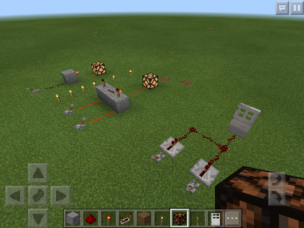

Title: Minecraft & Game Design Camp         
Author: Josef Seiler      
Date: 2018-06-29          
category: Classes  
Tags: minecraft, modding, coding, hyperpad, design thinking, game design, computer science 

# Summer Camps - Minecraft & Game Design  

### `6/25/2018 - 6/28/2018`  

This week was a great start to the Summer Camp season! The Minecraft camp entailed Minecraft Modding and circuit building with redstone, while campers in Game Design put together mobile games and PC games. In both camps, students learned core fundamentals of Computer Science, friends were made, and everyone had a blast!  

  

# Minecraft Camp  

During the Minecraft camp, we learned *software* techniques by learning how to code and use Minecraft mods on Raspberry Pis and laptops. We also learned how computer *hardware* works by learning how to create circuits in the Minecraft iPad app. Below gives a little more detail on what we did to learn both hardware and software fundamentals.   

**Hardware**: campers learned how to use redstone and other items in Minecraft to build working circuits that served a purpose (i.e. setting a trap for creepers, automatic door openers, etc).  

**Software**: campers learned the basics of coding using Python, a programming language to build and tweak mods in Minecraft. As well, some campers learned how to perform Minecraft modding using the Java programming language.  

  

**For more information on Minecraft and saftey tips for your child, check out the blog,** [Minecraft for parents](http://blog.techemstudios.com/minecraft-for-parents.html)  

  

***  

## Creating Minecraft Mods

Enchanted bridges, LEDs that respond to your game, exploding minecarts... These were just a few of the mods from the week! Campers learned the ways of Minecraft Modding by learning core principles of programming. They modified and deployed code written in either Java or Python.  

  

  

  

To use mods written in Python, students used Python and the Raspberry Pi. The Raspberry Pi is an interactive learning tool for modding. Campers wired up their Pi to a breadboard with LEDs. From here they wrote Python code to have their Minecraft character control the physical LEDs!  

Below are steps to mirror the environment (using Python or Java) your child worked on during the modding sessions in Minecraft Camp. Feel free to ask the Tech Em team any questions on the process [class-info@techemstudios.com]().  

  

### Python Modding  

Get started with Python Modding on a computer or a Raspberry Pi (after installing the OS). 
<iframe src="https://docs.google.com/presentation/d/1-7Fdm66mEfuiEAsiZjE_lRD8oTRGe0oDRMhDMjUbSWk/embed?start=false&loop=false&delayms=3000" frameborder="0" width="480" height="299" allowfullscreen="true" mozallowfullscreen="true" webkitallowfullscreen="true"></iframe>  

  

## Minecraft Mods - Java & Forge  

  

### Java Modding    
Most mods written in Java are executed through Eclipse IDE. Check out the slides below to get started.  

<iframe src="https://docs.google.com/presentation/d/19Z8Q7-M_X4YKn52Rlijwlv2zmWInVMudchGzFaxpHt0/embed?start=false&loop=false&delayms=3000" frameborder="0" width="480" height="299" allowfullscreen="true" mozallowfullscreen="true" webkitallowfullscreen="true"></iframe>  

  

## Building Circuits With Redstone  

The campers learned how to build simple binary logic gates using the famous, redstone in Minecraft.  

  

  

  

Campers built a few binary logic gates (AND, OR, NOT gates) with redstone, redstone torch, redstone lamp, repeaters, and a lever in their inventory. The lever is used as our switch. The lever has two states, ON or OFF (1 or 0, hence *binary*). The lever is used to provide a starting point for current, or send a signal through the redstone dust. Think of the redstone dust as a road for the current to run on, like a wire. In minecraft, increasing the amount of redstone logic gates increases the amount of functions you can have it perform (i.e. opening gates or even creating elevators). This directly mirrors computer logic to increase functionality and memory, the more logic gates, the more circuits, the more things a computer can do!    

  

  
*A few logic gates represented in Minecraft.*  

  

***  

# Game Design Camp  

To continue working on your game design from Hyperpad at home, feel free to email [class-info@techemstudios.com](). You will be sent a link to download a zipped file of the game, then prompted to open this up with Hyperpad.   

**Note:** *The above is easier to have Hyperpad already installed; Hyperpad is only available as an iPad app*.  

## Tips on Publishing  

Once you decide to publish your game, go ahead a run though what a user (not yourself) might think of your game as you play it. Ask your yourself questions: is it too difficult? Is it obvious where to go? Is it too easy? Does there need to be more obstacles or traps? etc. Then, get someone else to test out your game, just as in class, and get there feedback. Use this feedback to add or remove from your game. The more you run through this process, the better off you'll be! After you publish your game, you will likely receive feedback from the Hyperpad community. This is great, because it increases the pool of people you can reach to test out your game. Take the community's comments in-stride, but I encourage you to use any feedback to make your game better, and re-publish. You'll end up with an great game!  

## What We Did  

The camp was split into a couple groups. One group worked on the app, Hyperpad, while the other worked wih Unity.  

Hyperpad allowed campers to experience event-driven programming and learn the basics of game logic. The app can feel a little advanced, but we quickly overcame this hurdle with *Design Thinking* in mind. This is a user-centered approach, the basics of it explained in *Tips on Publishing*. Essentially, we approached designing our games with questions and a plan at-hand. An important step in the process is testing. Through testing, the camp helped each other improve their games, as well as learn new tricks from one another.  

Unity has a little more advanced game development environment. In this group a 2D Pong game quickly morphed into a Mario-infused Pong game, multiplayer!  

  

  

  

Please feel free to contact us if you have any issues or need help getting started with the game design tools we used during the week.  

We hope to see you again this summer!  

