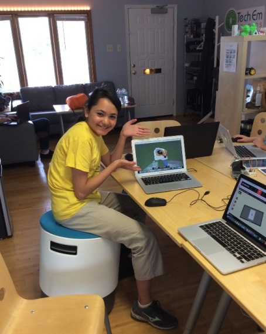
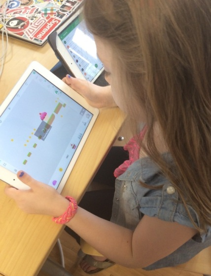
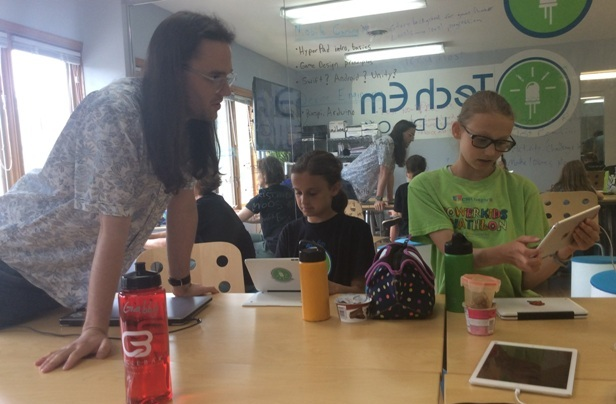

Title: Minecraft Modding & Mobile Gaming Camp        
Author: Josef Seiler      
Date: 2017-06-26          
category: Classes  
Tags: minecraft, modding, hyperpad, design thinking, game design, computer science  

# Minecraft Modding  

Campers learned the ways of Minecraft Modding by learning core principles of programming. There are tons of languages used for programming. Campers modified and deployed code written in either Java or Python.  

Enchanted bridges, exploding minecarts and anvils, coordinate trackers and working Minecraft clocks... These were just a few of the mods written and controlled by campers!  

  

  

  

The campers worked together to complete build challenges incorporating Minecraft mods. The mods worked on during camp produced some great problem solving sessions and exciting results in Minecraft!  

  

  

  

Below are the steps to mirror the environment (using Python and/or Java) your child worked on during Minecraft Modding. Feel free to ask the Tech Em team any questions on the process.  

## Setting the Stage for Modding  

#### Using Forge and Java  

Essentially all mods written in Java, are edited and deployed through the Eclipse IDE.  

<iframe src="https://docs.google.com/presentation/d/19Z8Q7-M_X4YKn52Rlijwlv2zmWInVMudchGzFaxpHt0/embed?start=false&loop=false&delayms=3000" frameborder="0" width="480" height="299" allowfullscreen="true" mozallowfullscreen="true" webkitallowfullscreen="true"></iframe>  

#### Using Forge and Python  

<iframe src="https://docs.google.com/presentation/d/1-7Fdm66mEfuiEAsiZjE_lRD8oTRGe0oDRMhDMjUbSWk/embed?start=false&loop=false&delayms=3000" frameborder="0" width="480" height="299" allowfullscreen="true" mozallowfullscreen="true" webkitallowfullscreen="true"></iframe>  

***  

# Mobile Gaming  

The campers learned a user-centered design approach throughout the camp, to create amazing games! Campers learned what it takes to make a well balanced game. Starting out with figuring what makes a game fun (or not fun!) for the player of the game, then onto using programming concepts, problem solving tools, and testing each other's game to give/receive feedback.  

  

  

  

Campers published their games on the Hyperpad Hub. Hyperpad was the primary app we used to design games.  

Thanks for a great first week of Summer camps!  

The Tech Em Team  

  
