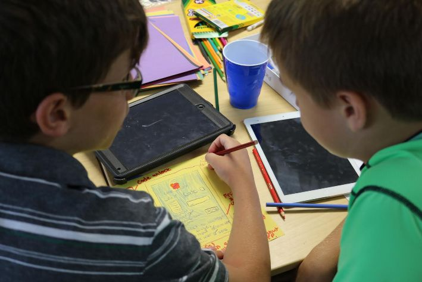
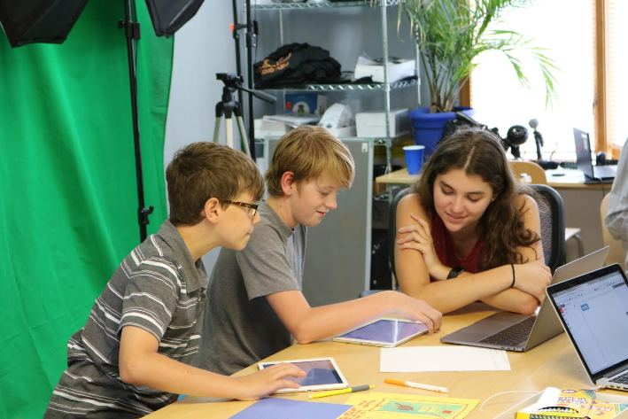

Title: Mobile Apps Summer Camp     
Author: Alex Noll, Josef Seiler     
Date: 2017-08-04  
category: Classes   
Tags: techcamp, coding, computer science, mobile, apps, python, lua, swift  
Illustration: mobile-phone.jpg    

# Mobile Apps  

### There's an app for that  

At the start of the camp, each camper had to think about what they'd want their app's UI to look like, while most campers designed individually, others worked together to make their User Interfaces.  

   

Campers continued their coding progression by moving on to Apple's Swift language, with each camper experimenting with the app, Swift Playgrounds before advancing to Codea.  

The campers moved on to Codea to make their own game. On top of this, campers learned web programming and made their own Hello World posts.  

***  

## Mobile App Design Process  

The process we learned during camp this week was a mixture of a few guides, one written by [Forbes contributor](https://www.forbes.com/sites/allbusiness/2013/10/30/how-to-build-your-first-mobile-app-in-12-steps-part-1/#1915d6383377), Melanie Haselmayr. This offers a versatile and conventional approach to building a mobile app across different operating systems. Another, published by Tim Ferriss on [Mashable](http://mashable.com/2013/07/13/top-selling-app/#dGuCHzh.xZqV). This article was a key one to share, for it had a design thinking approach. In other words, the design process started with asking, the potential audience for your app and what makes the already successful apps, successful. So, focus first on what people already like or don't like; build your initial design off this information.  

  

## Starting Guidelines to Develop a Mobile App  

<iframe src="https://docs.google.com/presentation/d/1I9n3wTS86vCd4Gzfb5I_rBkXhCjuKPwpF8pHvC2IF4k/embed?start=false&loop=false&delayms=3000" frameborder="0" width="480" height="299" allowfullscreen="true" mozallowfullscreen="true" webkitallowfullscreen="true"></iframe>  

Following the guidelines above, students divided themselves up into teams of two, to create at least two ideas for a mobile app. Clever schemes for apps surfaced! Without disclosing too much information, students came up with art sharing, Ebay & Etsy combination, Lego building, and virtual reality apps. At the end of camp, these ideas and more were pitched to their peers and instructors in presentation form, which held descriptions of their potential applications, user interface models, and justification.  

## Programming Languages we Learned  

Most of the campers initially had few or no experience programming. After camp, every student had learned core programming principles using the Playgrounds apps to learn the Swift language, Codea to learn the Lua language, and Pythonista to learn the Python language. Phew! There are plenty more languages out there, we learned about these three.  

### Swift  

*2014*    

Swift is a programming language used widely for thousands of apps already developed, and ones that are currently being developed. Just like the name suggests, Swift produces lightning-fast software. It is a powerful and intuitive programming language for several operation systems, the most popular being iOS and macOS. Students dove into Swift with the Swift Playgrounds app.  

### Lua  

*1993*  

The Lua programming language can be summed up into being versatile, embeddable, fast, portable, powerful, simple, and small. All these terms can be encompassed by one term, efficient. Which is what computer science is always striving to advance for. Students learned how to write lines of Lua code using Codea. We learned how to display simple boxes(buttons) and text to the screen, controlling object moving from tilting a device, and how to get a sprite image to register that it is being dragged and dropped. We then exported our code, packaged for Xcode (development environment for MacOS, iOS, watchOS, and tvOS), and finally to their own [GitHub](https://github.com/) repository (essentially a folder to house their code).  

### Python  

*1991*  

Last, but not least, students compared how they've written code so far (using Swift and Lua) to the Python programming language (a personal favorite amongst Tech Em staff). Campers worked together to create the logic behind a simple calculator program using the app, [Pythonista](http://omz-software.com/pythonista/). We modified Python code to change the look (user interface) of the calculator program.  

  

***  

Please let us know if your child has any questions on how to continue further with learning how to develop mobile applications.  

Enjoy the rest of the summer!  

[One more week of summers camps to go](http://register.techemstudios.com/)  
