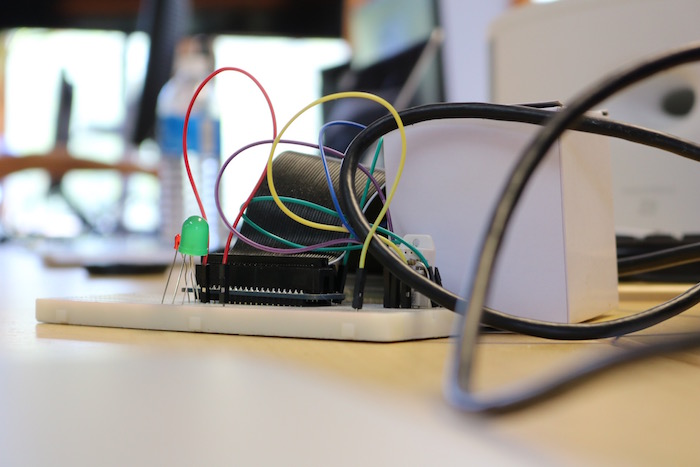

Title: Raspberry Pi Camp & Alexa Camp         
Author: Josef Seiler      
Date: 2017-07-03          
category: Classes  
Tags: alexa, raspberry pi, minecraft, modding, computer science, techcamp    

# Raspberry Pi Camp  

The camp started with students taking their new Raspberry Pi out of the box! To configure their Pi, students executed commands in the terminal. For more information on the terminal commands, check out this [blog](http://blog.techemstudios.com/notes-on-setting-up-pis-for-io-lessons.html).    

  

After configuring the initial setup, campers explored the operating system by checking out the Python gaming module, Pygame. They conducted modding challenges for a few games written in Python, as well as modifying code for [Minecraft (Pi version)](http://blog.techemstudios.com/notes-on-setting-up-pis-to-use-minecraft-api.html).  

We learned how to connect external devices to the Raspberry Pi, using a ribbon cable connected to a breadboard ("plugboard"). From here, campers connected LEDs, temperature humidity sensors, clicking devices (buttons), and more. But, making the connections of these devices and learning to make complete circuits is one thing... We learned quick, hardware does nothing until you program it to do so. Enter, programming with Python!

   

Students wrote several programs to display [messages in Morse code through with the LEDs](http://blog.techemstudios.com/notes-on-setting-up-pis-for-io-lessons.html), return the value of the temperature-humidity sensor, send an [email](http://blog.techemstudios.com/some-code-for-rpi-temp-sensing.html) when the temperature reached a certain value, and have the [LEDs turn on when your Minecraft character reaches a certain point on the map](http://blog.techemstudios.com/notes-on-setting-up-pis-to-use-minecraft-api.html).  

   

Please let us know if you and your child have any questions on repeating the process we completed in camp or other cool projects you can do with the Raspberry Pi.  

## Raspberry Pi Camp Slide Show  
#### https://www.facebook.com/techemstudios/

<iframe src="https://www.facebook.com/plugins/video.php?href=https%3A%2F%2Fwww.facebook.com%2Ftechemstudios%2Fvideos%2F2027288504170339%2F&show_text=0&width=560" width="560" height="417" style="border:none;overflow:hidden" scrolling="no" frameborder="0" allowTransparency="true" allowFullScreen="true"></iframe>  

***  

# Alexa Camp  

### Alexa, can you hear me?  

Students got their foot in the door of Cloud programming by learning how to build skills for Amazon's voice service, Alexa! Students learned the flow of events in order to make Alexa respond to user input. We started by writing down ideas for skills to create, and moved forward with trivia style skills. From testing your knowledge of horses and math, to Star Wars characters and cats, campers developed fun skills and even had one published during the week of camp!

<blockquote class="twitter-tweet" data-lang="en">
<a href="https://twitter.com/hashtag/RVA?src=hash">#RVA</a> has skills! What do you know about cats? Try this Tech Em student&#39;s skill and find out! <a href="https://t.co/7zKPGXa2zq">https://t.co/7zKPGXa2zq</a> <a href="https://twitter.com/AlexaRVA">@AlexaRVA</a> <a href="https://twitter.com/jpfrago">@jpfrago</a> <a href="https://t.co/bBkMt0ob8v">pic.twitter.com/bBkMt0ob8v</a>
&mdash; Tech Em Studios (@TechEmRVA) <a href="https://twitter.com/TechEmRVA/status/880811091827326980">June 30, 2017</a></blockquote>
  

Students went on to designing and coding fact skills to educate the public on the Orioles baseball team, rabbits, soccer and more! Alexa Dots were sent home to show friends and family their amazing skills.    

# Alexa Camp Slide Show  
#### https://www.facebook.com/techemstudios/  

<iframe src="https://www.facebook.com/plugins/video.php?href=https%3A%2F%2Fwww.facebook.com%2Ftechemstudios%2Fvideos%2F2027279167504606%2F&show_text=0&width=560" width="560" height="372" style="border:none;overflow:hidden" scrolling="no" frameborder="0" allowTransparency="true" allowFullScreen="true"></iframe>  

We are so proud of what the Tech Em campers have accomplished this week!  

Please let us know if you or your child have any questions on the steps for publishing their skills.  
