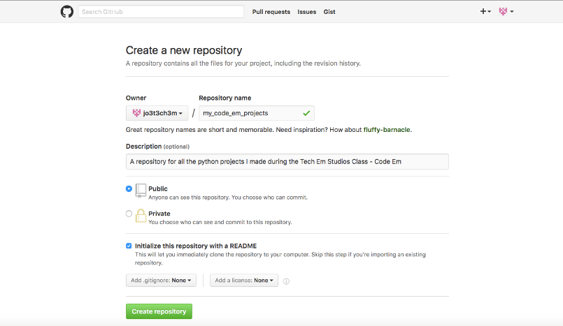
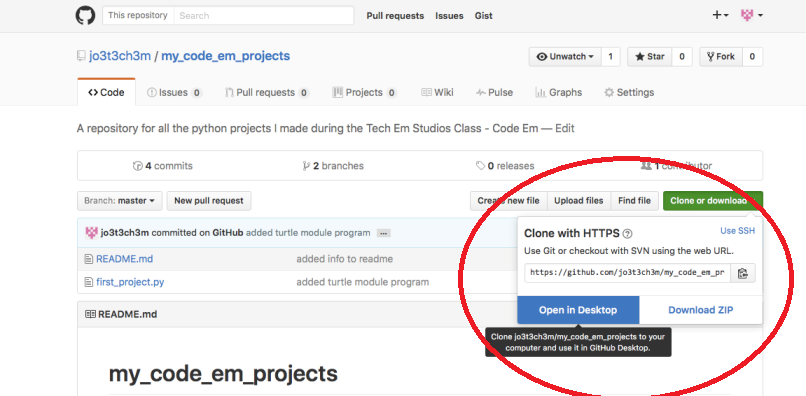
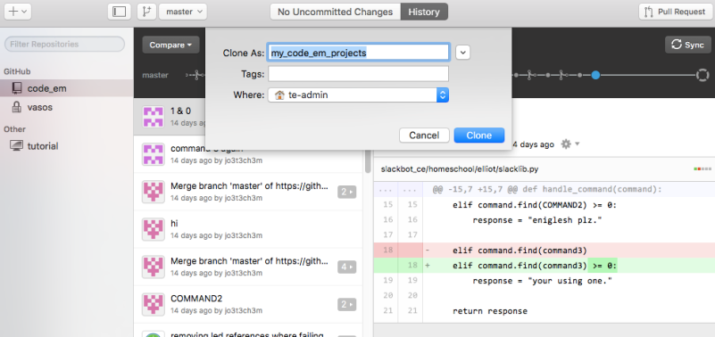

Title: Upload Projects to GitHub         
Author: Josef Seiler  
Date: 2016-11-23      
category: Notes    
Tags: computer science, python, code, github, slack   

***  
During Code Em, WEMS ASE, and the Homeschool classes, we have been writing code in Python to create commands for a [Slackbot](http://blog.techemstudios.com/slack.html) to respond to. We did this by learning the flow of GitHub. Below is an outline of steps to help you create your own GitHub repository and add your code from other projects you have been working on with the class. Don't worry, we'll go over the following steps in class. But, if you want to get started early, hopefully these steps will help, and here you go!   

### How to Upload Your Projects to Your Own Repository  
Okay, so you've written several programs in Python. You may ask yourself: How can I organize them, work on them after class is over, make changes when I am not connected to the internet, keep track of the changes I make, 'permanently' save the changes I make, and share them with good friends?  

I'm glad you asked! You can do all of the things above, with GitHub! This blog will help you "git" going on saving your projects to your own repository on GitHub.  

First, log into your GitHub account, or (if you have not already) create an account on GitHub.  

Though, we'll go over these steps in class hopefully, these will get you started.  

### Step 1  
#### Create a Repository (Repo)    

Once you are logged into GitHub, click the "plus" sign at the top right of your screen  
[^4]    

Next, name your repository. Creating your repository is like creating/naming a new folder on your computer, except you're doing this via GitHub. Below, is just an example of what you might name your repository.  

[^4]    

Essentially, you just made a ".git directory (repository)"  

***  

### Step 2  
#### Checkout the Project    
##### Make a Working Directory  
Clone your repository. In other words, make a copy of your new repository, known as your "Working Directory". To do this click the green 'Clone or download' button.  
[^4]    

There more than a few ways to clone your repository to your computer. In these next steps, I'm going to show you how to clone your repository to open in GitHub Desktop. This will help if you've already downloaded [GitHub Desktop](https://desktop.github.com/). If not, you should be directed to the GitHub site to download the desktop app if you click "Open in Desktop". In contrast, you can clone/download your repository to save as a zip file. Just save and extract it to any of your directories on your computer. Furthermore, if you've downloaded the desktop app already and have it open, you can add the repository by copying the web URL and pasting it into the app. Either way, you will have to choose where you want to save your repository on your computer. You should get something like this:  
[^4]    

When you have your repository cloned to your desktop, you will see a 'History' tab and a 'Changes' tab. The history tab shows the collection of snapshots of changes made to your repository -this will grow with time! The changes tab, shows the current changes you have made in your Working Directory (or your local changes) that you have not committed. Once you commit those changes, you have essentially taken a snapshot of your changes. In order to push those changes, to be permanently saved to the repository on GitHub, you must press the **sync** button, located towards the top-right of the Desktop app (or "git push" in the command line), right above the list of the changes you've made.  

[^4]    

***  

**Remember to always sync!**  
* When you click sync at the top right of the GitHub desktop, you are getting up-to-date with the most recent additions to that repository. This is also known as pulling/pushing. What happens when you sync:  
    - fetches the latest changes made to the GitHub repo  
    - Then those changes are merged to your local repository  
    - now your local repository is updated  

***  

### Step 3  
#### Putting Your Projects Into Your Repository    
You can also do this several ways. First, I suggest you locally (on your computer) set yourself up to be organized. Open your newly cloned repository (or local repository) that has been saved on your computer. Then create a new directory (folder) and name that directory something that makes sense to you. Since you will be uploading several Python programs, it may be a good idea to create a directory labeled "Python". Inside of that folder, you can create subdirectories. For instance, you could make the python folder house folders named "turtle_module", "grocery_list_program", "condition_statements", "loops", etc. -basically an organized collection of what you have been working on; even a directory for your class notes. Then, you can literally copy and paste the python files you have made during the class into those directories you just created -all housed in the parent directory of your cloned (local) repository.  

If you go back to GitHub Desktop, you should see a few files under the changes tab. These are known as stage files. The changes will not be automatically updated to your 'master' repository. To do this, you must commit your changes (taking asnapshot of the changes) by writing a concise title or summary about your changes. For the description of the changes you have made, you can provide more detail. If you are satisfied with your changes, you can click 'Commit to master'. **NEXT**, click he sync button; this function will "push" your changes to the master repository. Once you have pushed your changes, you will find a list of your permanently saved changes under the history tab.  

[^4]    

That's it! You can check out your pushed changes by checking out your master repository on the GitHub site.  

***  

### Practice Makes Perfect  
To help familiarize yourself with the flow of git, try first to perform the steps above on one, or two files at a time. Then, if you feel comfortable, make bigger commits. As in, upload more than two files into the directories of your local repository. Once, you get in the flow of git, it will become second-nature to you.  

* Summary of the steps  
  + create a repository  
  + clone that repository  
    - this makes a (local) working directory on your computer  
  + sync (pull/push)      
  + make changes to your local repo  
  + commit/push those changes to your master repo  

Besides committing (locally), via GitHub Desktop or the command line/terminal, you can also commit changes you make right on the GitHub site.  

So, that's  the *gist* of creating your own GitHub repository, cloning it, and uploading/updating your projects locally (on your device) and committing those changes to then show up (push) in your GitHub repository.  

***  
### Get to Your Projects Here  
If you did not bring in your own laptop to work on during this session, all of your projects have been saved on either the Tech Em laptops or the iPads here at the studio. Lucky for you, I created a repository on GitHub, called [TechEmStudents](https://github.com/jo3t3ch3m/TechEmStudents). Previously we've saved student projects straight on the Tech Em Studios secure site. GitHub makes it a bit easier to get to your projects. You can click that link to see the projects you have worked on during this class! After clicking the link for the repo, just navigate to the directory with your name and you will find your projects. This will help you perform the steps (indicated in this blog) to upload your projects onto your own GitHub repository. If you don't see all of your projects on the repo yet, keep checking, projects are still being added to your directory.  

***  
[^1]: https://git-scm.com/book/en/v2/Getting-Started-Git-Basics  
[^2]: https://techcrunch.com/2012/07/14/what-exactly-is-github-anyway/  
[^3]: https://www.lynda.com/Git-tutorials/Unstaging-files/100222/111284-4.html?autoplay=true  
[^4]: https://github.com/  
