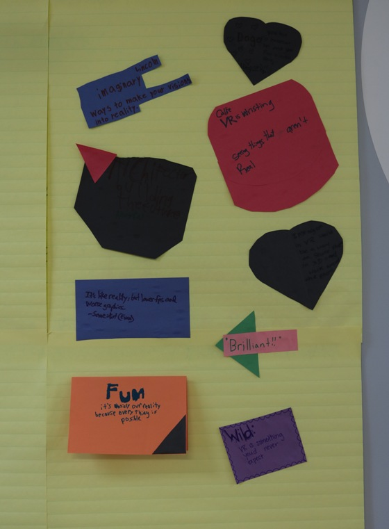

Title: YouTube & 3D Gaming/VR Camp  
Author: Alex Noll & Josef Seiler  
Date: 2017-07-29  
category: Classes  
Tags: youtube, video, content production, 3dprinting, vr, hyperpad, unity, techcamp  

Recap of the YouTube camp and 3D Gaming/Virtual Reality camp.  

# Summer 2017 YouTube Camp  

Ideas on how to become a star on YouTube were shared among campers before the camp even started! We got underway with learning general guidelines on how to create a bolster a YouTube channel. First, by creating a catchy name, thumbnail, avatar, and onto making an impressive banner. We learned that details count. For instance, when it comes to the banner for a channel, it is a good idea to have the image reflect the channel's content and display any social media to further follower traction.  

  

## Design Thinking & Brainstorming  

An ever-present process taught and implemented in a range of classes at Tech Em. This is a user-centered approach to design and is used in a variety of settings. Students began this process by gathering ideas on what makes a good YouTube video and channel by exploring (with guidance) YouTube. Notes were taken on three different videos with a couple general questions: What things would you use in your videos/channels, and what would you leave out. This feedback was shared among campers.  

  

Students were tasked with creating three ideas they had for what videos to share with the world and at least four details on those ideas.  

Group and individual teams formed, followed by channel creations and film making. Some students used the green screen and cameras on tripods, while others used game capture software and animation apps. In all cases, campers learned videography techniques like, proper lighting, sound, and video editing; using iMovie and Windows Live Movie Maker.  

Impressive YouTube channels and videos emerged each day of the camp!  

## Computer & Internet Safety  

YouTube is a wonderful avenue for learning, sharing videos and ideas; however, it is well worth it to be cautious and do your homework before diving in. Technology instructor, Chris shared his useful tips to campers on how to do just that. The computer safety presentation can be found [here](https://docs.google.com/presentation/d/1lJvTJYlD7aN2kW3RDKmoKvHd8Q-TOKdG8H45cWhkQUE/edit#slide=id.p).  

## How to Produce YouTube Content  

### Lights, Camera, Action!  

Once you have your channel, you'll want to upload your video, uploading is a pretty complex process with many different variables to consider. To start, make sure you've prepared the video you want to upload by editing it and making sure it is the product you want the world to see.  

After ensuring that your video is ready to be seen, you'll have to go to your main page on YouTube, then, in the top right corner of the page there's an upload button (an upward facing arrow) to click.  

  

After going to the upload page, you' be prompted to select the content you want to upload, once selected you have to wait through an uploading process and processing process for your video to actually make its way onto YouTube.  

  

Next, you'll need to decide on a Title, Description, some Tags for your video, as well as the Video Thumbnail. Make sure your Tags are related to your video and that you include enough so that if a viewer searches a relevant term, they can find your video. You'll also want to keep your title short and relevant, while making your description more descript with the information that's excluded from the title.  

For your Video's Thumbnail, it's best to verify your YouTube account by providing a phone number, this will allow you to upload your own Thumbnail pictures instead of using the ones that YouTube selects.  

After deciding on your Thumbnail, you're ready to upload. Just hit publish, and then your video is available for the  world to see!  

***  

# Summer 2017 3D Gaming & Virtual Reality Camp  

## HTC Vive  

Creates immersive experiences of all kinds! By rotating in ten minute shifts, campers explored virtual reality using a Vive headset and controllers. Students began with a lecture on what virtual reality is and how it works.

Google Earth VR was the first app explored. We moved onto creating music in VR and designing 3D objects. Creating 3D objects in virtual reality is a lot like sculpting a structure in the real world.  

Needless to say, quiet students became quickly animated once the VR headset was on!

  

  

Since virtual reality is such an immersive experience, students were asked to share their thoughts on the subject, as well as what game or experience in VR would they share with the world. Below are some of their reflections.  

  

## Game Design with Hyperpad and Unity  

## Hyperpad  

[Hyperpad](https://www.hyperpad.com/) is a visual-based game development tool. It is driven with event handling and is great for those new to programming as well as veterans.

Students learned how to create their games by using the Design Thinking process (similar to YouTube camp!). We began work in Hyperpad with sketches on paper of level-design. Campers learned basic game logic and computer programming principles by creating a platformer-style game on Hyperpad.  

  

## Unity  

[Unity](https://unity3d.com/) is a creation engine for gaming. We learned some basics of 3-D game development using this tool. This has become a leading choice for creating games and experiences to deploy in virtual reality. If your child would like to continue exploring this game design tool, contact us for help and check out the [documentation](https://docs.unity3d.com/Manual/index.html).

Campers got started with Unity by creating a 2D Pong game, and on to advanced concepts in 3D by controlling a sphere using camera positioning and learning about 3D terrain.  

***  

Don't hesitate to contact us for any questions!  

Happy video-making and gaming.  
